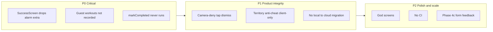

# Awaken Full Codebase & Database Review

**Verdict:** Feature-first clean architecture is mostly intact and territory capture (client + PostGIS) is the strongest subsystem. The highest-severity product bugs sit in the alarm → success path. Dashboard/auth/alarm UI are thinly tested; there is no CI. Live DB RLS for app tables is sound; advisor noise is mostly PostGIS platform limits plus one actionable `rls_auto_enable` grant.

**Live project:** `nankdbntvvopnfvvvaoo` (ap-southeast-1, Postgres 17) — matches [`lib/core/constants/supabase_config.dart`](lib/core/constants/supabase_config.dart). Older docs still mention `fsdfqcnjcjtdmdjshrvu`.

---

## P0 — Critical bugs (fix first)

### 1. Success route drops `AlarmEntity` — alarms never marked complete

[`app_router.dart`](lib/core/router/app_router.dart) builds `const SuccessScreen()` and ignores `state.extra`. [`SuccessScreen`](lib/features/success/presentation/screens/success_screen.dart) only calls `markCompleted` when `widget.alarm != null`.

**Impact:** Completed one-shot alarms stay active and can keep firing; streak/session path may still run when signed in, but alarm lifecycle is broken.

**Fix:** Pass `state.extra as AlarmEntity?` into `SuccessScreen` (and add a regression test).

### 2. Guest / signed-out sessions are discarded

`_recordSession` returns early when `user == null` with comment “local mode, no recording” — despite `LocalSessionRepository` and a composite queue existing for signed-in offline failures.

**Impact:** Core product loop (wake → squat → streak) does not persist for the default unsigned user.

**Fix:** Always write locally; sync to cloud when signed in (align with sessions architecture in CLAUDE.md).

### 3. Docs / config drift

- CLAUDE.md still cites old Supabase project ID in places; live is `nankdbntvvopnfvvvaoo`.
- Package / OAuth comments still say `com.example.awaken`.
- [`docs/awake_full_detail.md`](docs/awake_full_detail.md) §9–10 and [`review.md`](review.md) are partially stale (schema “not created”, riverpod unused, sync missing).

---

## P1 — Product integrity & reliability

| Issue | Evidence | Risk |
|-------|----------|------|
| Camera-denied tap-to-simulate dismiss | `ActiveAlarmScreen` enables taps when permission denied | Undermines “physical movement only”; competitors (e.g. FitAlarmly) score form and require real reps |
| Absolute knee-angle FSM only | `SquatCounterService` ≤100° / ≥150° | Industry research (DEV Community 2026, RepsForReels): 2D perspective breaks absolute angles; prefer relative displacement + direction + hip angle; One Euro filter for overlay only |
| Depth / out-of-frame / bad-form half-built | Phase 4c in docs; constants exist; deepest angle tracked but unused for pass/fail | Weak coaching UX under stress |
| Dual GPS streams during runs | `ActiveRunNotifier` + `myLocationProvider` | Battery / jitter |
| No territory capture retry queue | Failed `finishRun` marks finished with error only | Unlike sessions, captures can be lost offline |
| No local→cloud migration on sign-in | Repo switch orphans SharedPreferences alarms/territories | Data loss perception |
| Background notification tap | `_onBackgroundTap` only `debugPrint`s | Mid-process taps may not open active alarm |
| Android exact-alarm / FSI | Service exists; deny UX still a known gap | Android 14+ denies exact alarms by default; need clear settings CTA + `USE_EXACT_ALARM` Play justification |
| `setState` ~15 FPS on active alarm | Full HUD rebuild per pose frame | Jank on mid-tier devices; isolate overlay via `ValueNotifier` / `RepaintBoundary` |

---

## Architecture & code quality

**Strengths**
- Feature-first `presentation → domain ← data`; alarm/territory repo switching on auth.
- Territory: Kalman, RDP, loop validation, map cancellation, strong `test/territory/` suite.
- Sessions: local-first + `PendingSessionQueue` + flush on sign-in/resume.
- Squat FSM unit-tested.

**Debt**
- God widgets: [`active_alarm_screen.dart`](lib/features/alarm/presentation/screens/active_alarm_screen.dart) (~600 LOC), [`territory_run_screen.dart`](lib/features/territory/presentation/screens/territory_run_screen.dart) (~1400 LOC).
- Layer leaks: ML Kit / Geolocator in domain; `SessionSyncService` imports concrete data types; dashboard hits `Supabase.instance` directly for streaks.
- Dead code: [`app_shell.dart`](lib/features/shell/presentation/screens/app_shell.dart) + unused tab provider (real shell is `_ShellScaffold` in router).
- Raw hex in bottom nav vs `AppColors`.
- Swallowed `catch (_)` / `debugPrint` without structured logging or user-visible retry.
- No `.github/workflows` CI — quality is manual `flutter analyze` / `flutter test` only.

**Test gaps:** auth, dashboard, SuccessScreen, alarm repos/camera UI, PoseOverlay rotation math. Territory domain is well covered; alarm product path is not (would have caught the SuccessScreen bug).

---

## Database (Supabase MCP) findings

**Tables (RLS):** `profiles`, `alarms`, `sessions`, `streaks`, `territories`, `runs`, `territory_captures` — RLS enabled. `spatial_ref_sys` — RLS off (PostGIS platform; cannot ALTER as migration role; low real risk — reference SRIDs only).

**Write boundary (good):** Territories mutate only via `SECURITY DEFINER` RPCs (`capture_territory`, `touch_territory_defense`). Direct INSERT/UPDATE/DELETE policies absent on `territories` / `territory_captures`. Row locking + `ST_MakeValid` + geography area checks present. Min loop **50 m²** enforced server-side.

**Anti-cheat gap:** `capture_territory` does **not** re-validate path speed, point density, or timestamps — a client can POST a forged polygon ≥50 m². Client `RunValidationService` is necessary but insufficient.

**Advisor (actionable):**
- Revoke `EXECUTE` on `public.rls_auto_enable()` from `anon`/`authenticated` (event-trigger helper exposed as RPC).
- Enable Auth “Leaked password protection” in dashboard (not SQL).
- PostGIS in `public` / `spatial_ref_sys` RLS: accept as platform limits unless a maintenance migration is planned.

**Advisor (noise / expected):**
- `SECURITY DEFINER` on capture/leaderboard RPCs — intentional for steal + cross-user reads; `anon` correctly has no EXECUTE on those.
- Unused indexes on alarms/sessions/runs — expected at near-zero row counts.

**Data volume today:** essentially empty product tables (0 alarms/sessions/streaks; 1 territory, 2 runs) — indexes unused is not a problem yet.

---

## UI/UX improvements (research-backed)

Aligned with [`PRODUCT.md`](PRODUCT.md): disciplined, neon, motivating; primary action unmistakable; stress-moment orientation.

### Alarm / active squat
- **Framing coach before first rep:** silhouette + “full body in frame” (ML Kit needs face + body; InFrameLikelihood already available).
- **Separate overlay paint from HUD state** so skeleton stays smooth while counter stays responsive (One Euro on display only).
- **Form feedback copy:** “Go lower”, “Stand taller”, “Body in frame” — Phase 4c; competitors show live form hints.
- **Permission deny path:** deep-link to settings + limited fallback (e.g. accelerometer), not unlimited tap-dismiss — or clearly label “accessibility mode”.
- **Success celebration:** keep typewriter/haptics but throttle haptics; show streak delta even for guests once local sessions work.

### Dashboard
- Reduce “generic fitness dashboard” feel (PRODUCT anti-reference): hero next-alarm CTA larger; stats secondary.
- Exact-alarm / notification permission banners as first-class, dismissible, with one-tap Settings.
- Sign-in prompt that explains cloud sync / leaderboard without blocking local use.

### Territory / leaderboard
- **Neighborhood leaderboard** (you ±5 ranks) + weekly default — Yu-kai Chou / UI-Patterns: global-only boards demotivate newcomers. App already has 24H/7D/ALL + nearby — surface neighborhood + “next rank needs X m²”.
- **Loop-closure progress** as primary HUD (distance-to-start) — Territory-Run / Motera pattern.
- **Safety strip** during run (“stay aware of traffic”) — common in Motera-class apps; outdoor dark theme already helps.
- **Capture result:** celebrate steal/defend with clear area delta; retry CTA if network failed.
- Fog-of-war / explore (Motera) is a future differentiator, not required now.

### Cross-cutting
- Onboarding (Phase 6): permissions, squat demo, first alarm in &lt;60s.
- Accessibility: WCAG AA already a goal; verify HUD neon contrast; don’t rely on color alone for rival vs own polygons.
- iOS alarm parity and background geolocation remain open reliability work.

---

## Future features (prioritized)

| Horizon | Feature | Why |
|---------|---------|-----|
| Near | Wire SuccessScreen + guest local sessions + CI | Correctness / trust |
| Near | Phase 4c: out-of-frame audio ramp, bad-form, depth gate | Alarm integrity |
| Near | Server-side capture validation (path + max speed + point count) or signed run upload | Anti-cheat |
| Near | Local→cloud migration on first sign-in | Retention |
| Mid | Multi-exercise dismiss (push-ups, etc.) like FitAlarmly | Differentiation |
| Mid | Friends / city leaderboards; neighborhood UI | Engagement research |
| Mid | Territory offline capture queue | Parity with sessions |
| Mid | Push for upcoming alarms; decay cron hardening | Retention |
| Mid | Onboarding + permission education | Activation |
| Later | RevenueCat IAP (Phase 6) | Monetization |
| Later | Watch / Health sync; background geolocation | Territory reliability |
| Later | Fog of war / street claim modes | Compete with Motera/INTVL |
| Later | Form quality score (not binary count) | Coaching depth |

---

## Recommended remediation roadmap

### Wave 1 — Correctness (1–3 days)
1. Fix SuccessScreen `extra` wiring + widget test.
2. Record sessions locally when signed out; keep cloud path when signed in.
3. Revoke `rls_auto_enable` EXECUTE from client roles; enable leaked-password protection in Auth dashboard.
4. Add GitHub Actions: `flutter analyze` + `flutter test` on PR.

### Wave 2 — Integrity (1–2 weeks)
5. Harden camera-deny UX; start Phase 4c form/out-of-frame.
6. Extract camera/pose pipeline from `ActiveAlarmScreen`; reduce per-frame rebuilds.
7. Add server checks or run-path payload validation for `capture_territory`.
8. Sign-in migration for local alarms (and document territory offline limits).
9. Fix background notification navigation; exact-alarm deny CTA polish.

### Wave 3 — Product polish (ongoing)
10. Split `TerritoryRunScreen`; single GPS stream; capture retry queue.
11. Leaderboard neighborhood UX; loop-closure primary HUD.
12. Onboarding, multi-exercise, monetization per Phase 6.
13. Refresh stale docs; remove dead `AppShell`; align package ID for store release.

---

## What not to over-fix yet

- Dropping unused indexes (tables nearly empty).
- Relocating PostGIS out of `public` (destructive).
- Enabling RLS on `spatial_ref_sys` without owner privileges (known platform limit).
- Full rewrite of territory geo stack — it is already the best-tested part of the app.
