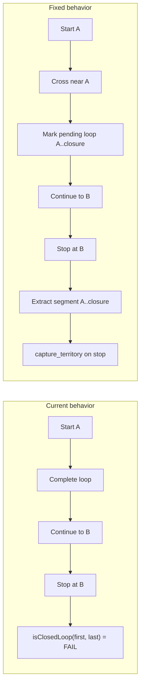
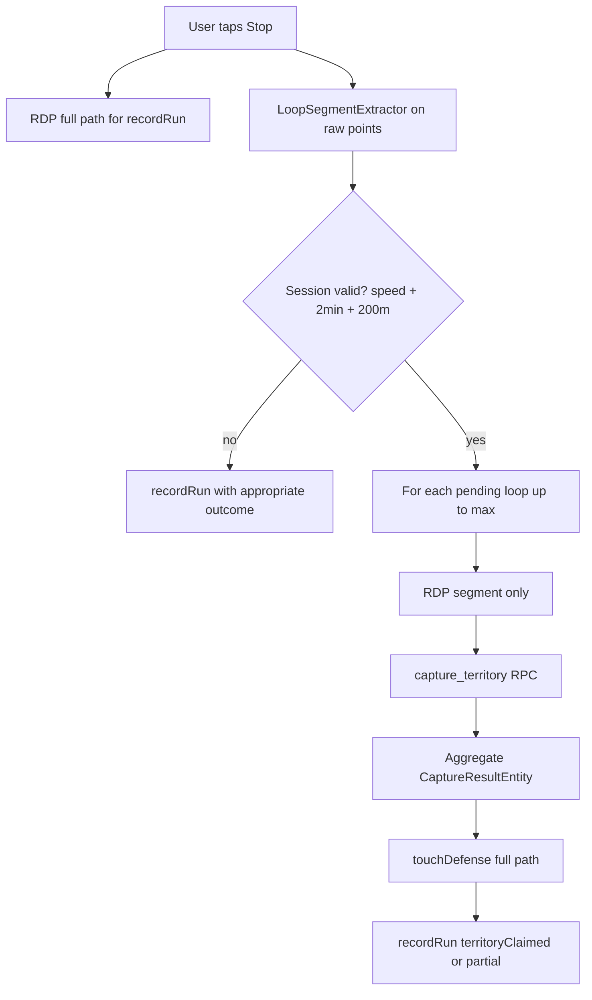

# Multi-Loop Territory Capture Plan

## Problem Statement

Your screenshots show a classic **overrun** case: the runner starts at **A**, completes a block loop, crosses back within ~20m of **A**, then continues to **B** before tapping Stop. The app reports **"Loop didn't close"** even though the path clearly enclosed territory.

### Root Cause

Closure is validated only at stop time by comparing the **first** and **last** GPS points:

```29:33:lib/features/territory/domain/services/run_validation_service.dart
  static bool isClosedLoop(List<GeoPointEntity> points) {
    if (points.length < 2) return false;
    return GeoUtils.haversineMeters(points.first, points.last) <=
        AppConstants.loopClosureRadiusMeters;
  }
```

When the user stops at **B** (far from **A**), this always fails — even though the path already closed near **A** mid-run.



**Product decision (confirmed):** Loops are **marked live** during the run but **captured on Stop only** — session-wide speed/duration checks remain intact.

---

## Refined Real-Life Scenarios

### Must support (P0)

| # | Scenario | Expected behavior |
|---|----------|-------------------|
| S1 | **Overrun after close** (your case): A → loop → cross A → run to B → Stop | 1 loop captured from segment `[start..closureIndex]` |
| S2 | **Stop exactly at start** (existing happy path) | 1 loop captured; backward compatible |
| S3 | **Multiple loops, one session**: close loop 1, keep running, close loop 2, Stop | 2 pending loops → 2 `capture_territory` calls on Stop; server `ST_Union` merges overlaps |
| S4 | **Join owned territory**: new loop overlaps user's existing polygon | Server already merges via `ST_Union` in [`capture_territory`](supabase/migrations/20250702000005_territory_rpcs.sql) — no RPC change needed |
| S5 | **Steal rival land**: loop overlaps rival polygon | Existing `ST_Difference` logic unchanged |
| S6 | **Overrun through owned land** (no new loop) | `touchDefense` on full path refreshes `last_defended_at` (already in [`finishRun`](lib/features/territory/presentation/providers/active_run_providers.dart)) |

### Must reject (anti-cheat)

| # | Scenario | Guard |
|---|----------|-------|
| C1 | **Micro-loop at start** (GPS drift / standing still) | Require segment path distance ≥ `minLoopSegmentDistanceMeters` before closure can arm |
| C2 | **Immediate false close** near anchor at run start | Require runner to travel ≥ `loopClosureGraceMeters` away from anchor before closure counts |
| C3 | **Lingering at closure point** (double-count one loop) | After closure, require exit beyond `loopExitRadiusMeters` before next closure can arm |
| C4 | **Drive-by / vehicle** | Existing session-wide sustained speed cap (25 km/h, 6-ping window) invalidates **all** captures |
| C5 | **Tiny sliver polygon** | Existing server `ST_Area < 50 m²` → `loop_too_small` |
| C6 | **Session too short overall** | Existing `minRunDuration` (2 min) + `minRunDistanceMeters` (200 m) apply to the **whole session** before any capture |
| C7 | **Loop farming** | Cap at `maxLoopsPerSession` (recommend **5**) |

### Edge cases (document + test, handle gracefully)

| # | Scenario | Behavior |
|---|----------|----------|
| E1 | **Out-and-back** (never returns near start) | Workout saved, no territory (unchanged) |
| E2 | **Figure-eight** (crosses start twice) | First valid closure ends segment 1; segment 2 starts at closure index |
| E3 | **Lollipop** (stem + loop, returns to junction not start) | Only counts if junction was the segment anchor |
| E4 | **Poor GPS accuracy** at closure | Optional: skip closure arming when `gpsAccuracyMeters > loopClosureRadiusMeters` |
| E5 | **RDP shifts closure index** | Run extraction on **raw** points; RDP only on extracted segment before RPC |
| E6 | **Partial success** (loop 1 OK, loop 2 too small) | Capture valid loops; report partial result in UI |

---

## Proposed Architecture

### New domain service: `LoopSegmentExtractor`

Add [`lib/features/territory/domain/services/loop_segment_extractor.dart`](lib/features/territory/domain/services/loop_segment_extractor.dart):

**Core algorithm** (single source of truth for live + finish-time):

```
anchorIndex = 0
maxDistFromAnchor = 0
closureArmed = false
pendingLoops = []

for i in 1..points.length-1:
  distToAnchor = haversine(points[i], points[anchorIndex])
  segmentDist = pathDistance(points, anchorIndex, i)
  maxDistFromAnchor = max(maxDistFromAnchor, distToAnchor)

  if distToAnchor >= loopExitRadiusMeters:
    closureArmed = true

  if closureArmed
     AND segmentDist >= minLoopSegmentDistanceMeters
     AND maxDistFromAnchor >= loopClosureGraceMeters
     AND distToAnchor <= loopClosureRadiusMeters
     AND i > anchorIndex + minLoopSegmentPointCount:
    pendingLoops.add(LoopSegment(anchorIndex, i))
    anchorIndex = i
    maxDistFromAnchor = 0
    closureArmed = false
```

**New constants** in [`app_constants.dart`](lib/core/constants/app_constants.dart):

| Constant | Value | Purpose |
|----------|-------|---------|
| `minLoopSegmentDistanceMeters` | `150.0` | Per-loop path length minimum (below session 200m) |
| `loopClosureGraceMeters` | `50.0` | Must leave anchor zone before closure can count |
| `loopExitRadiusMeters` | `30.0` | Must exit this radius after close before re-arming |
| `minLoopSegmentPointCount` | `6` | ~30m of GPS at 5m filter |
| `maxLoopsPerSession` | `5` | Anti-farming cap |

Keep existing `loopClosureRadiusMeters = 20.0`, `minRunDuration`, `minRunDistanceMeters`, speed cap unchanged.

### State model changes

Extend [`ActiveRunState`](lib/features/territory/presentation/providers/active_run_providers.dart):

```dart
class PendingLoopSegment {
  final int startIndex;
  final int endIndex;
  final List<GeoPointEntity> points; // sublist for map preview
  final DateTime closedAt;
}

// New fields on ActiveRunState:
final List<PendingLoopSegment> pendingLoops;
final int currentSegmentAnchorIndex; // for HUD "to segment start"
```

### Live tracking (`_onPosition`)

After each GPS fix:
1. Run incremental closure check against current segment anchor (same rules as extractor, but only evaluate latest point — O(1) per tick).
2. On new closure: append to `pendingLoops`, haptic pulse, reset anchor to closure index.
3. HUD switches from "To start" → "To segment start" for the **active** segment anchor.

### Finish flow (`finishRun`) — revised



Key changes to [`finishRun`](lib/features/territory/presentation/providers/active_run_providers.dart):
- Replace single `isClosedLoop(first, last)` gate with `pendingLoops` list (re-extract on finish as authoritative snapshot — reconciles any missed live ticks).
- Call `captureTerritory` **once per valid segment** sequentially (PostGIS row locks are per-RPC; order is stable).
- Aggregate capture results into extended entity or list for UI.
- `RunOutcome.territoryClaimed` if ≥1 loop captured; `loopNotClosed` only if zero valid segments.

### Validation service refactor

Update [`run_validation_service.dart`](lib/features/territory/domain/services/run_validation_service.dart):
- Keep `isClosedLoop` for backward-compat / simple paths.
- Add `extractLoopSegments(List<GeoPointEntity> points)` delegating to `LoopSegmentExtractor`.
- Update `classify` to accept `pendingLoopCount` or segments — `territoryClaimed` when segments.isNotEmpty.

### UI changes

| Component | Change |
|-----------|--------|
| [`territory_run_screen.dart`](lib/features/territory/presentation/screens/territory_run_screen.dart) | Render pending loop polygons (semi-transparent owned color) via new `_PendingLoopLayer`; "Loop closed!" pulse when `pendingLoops` grows |
| [`run_stats_sheet.dart`](lib/features/territory/presentation/widgets/run_stats_sheet.dart) | Show `Loops: N` counter; dist-to-**segment**-start (not always session start) |
| [`capture_result_sheet.dart`](lib/features/territory/presentation/widgets/capture_result_sheet.dart) | Support multi-loop summary: "2 territories claimed — X m² total" |
| Result banner | Partial capture messaging when some loops fail `loop_too_small` |

### Repository / server

**No Supabase migration required.** Existing [`capture_territory`](supabase/migrations/20250702000005_territory_rpcs.sql) already:
- Validates area ≥ 50 m²
- Merges user's intersecting polygons (`ST_Union`)
- Steals from rivals (`ST_Difference`)

Multiple sequential RPC calls per session are correct — each call is atomic.

### User story alignment

[`territory_capture_user_story.md`](territory_capture_user_story.md) AC says "final GPS coordinate within 20m of starting" — update Story #2 to: **"path returns within 20m of a segment start at any point during the run; captures are finalized on Stop."**

---

## Anti-Cheat Design Rationale

| Constraint | Why session-level vs per-loop |
|------------|-------------------------------|
| Speed cap (25 km/h) | **Session** — prevents "run loop legitimately, then drive" |
| Min duration (2 min) + min distance (200 m) | **Session** — your overrun case adds time/distance after close; still valid |
| Min segment distance (150 m) | **Per-loop** — prevents GPS jitter micro-loops |
| Grace + exit radius | **Per-loop** — prevents double-counting and start-point drift cheats |
| Min area (50 m²) | **Per-loop** (server) — prevents thin slivers |
| Max loops per session | **Session** — prevents automated farming |

**Industry alignment** (research): Territory Run / TerraRun / INTVL all use **15–20m Haversine closure** with **minimum movement thresholds** and **speed caps**. Awaken already matches; this plan adds **segment-based closure** (common in production GPS games but missing from our current end-point-only check).

---

## Files to Change

| File | Changes |
|------|---------|
| [`app_constants.dart`](lib/core/constants/app_constants.dart) | New loop-segment constants |
| **NEW** [`loop_segment_extractor.dart`](lib/features/territory/domain/services/loop_segment_extractor.dart) | Core extraction + incremental checker |
| [`run_validation_service.dart`](lib/features/territory/domain/services/run_validation_service.dart) | Delegate to extractor; update `classify` |
| [`active_run_providers.dart`](lib/features/territory/presentation/providers/active_run_providers.dart) | `pendingLoops` state, live detection, multi-capture `finishRun` |
| [`capture_result_entity.dart`](lib/features/territory/domain/entities/capture_result_entity.dart) | Optional `SessionCaptureResult` wrapper for multi-loop |
| [`territory_run_screen.dart`](lib/features/territory/presentation/screens/territory_run_screen.dart) | Pending loop map layer + closure feedback |
| [`run_stats_sheet.dart`](lib/features/territory/presentation/widgets/run_stats_sheet.dart) | Loop counter + segment-start distance |
| [`capture_result_sheet.dart`](lib/features/territory/presentation/widgets/capture_result_sheet.dart) | Multi-loop result display |
| [`territory_capture_user_story.md`](territory_capture_user_story.md) | Update AC for segment closure |
| **NEW** [`loop_segment_extractor_test.dart`](test/territory/loop_segment_extractor_test.dart) | Unit tests for all scenarios |
| [`run_validation_service_test.dart`](test/territory/run_validation_service_test.dart) | Update classify tests |
| [`territory_e2e_test.dart`](test/territory/territory_e2e_test.dart) | Overrun + multi-loop widget tests |

---

## Test Plan

### Unit tests (`loop_segment_extractor_test.dart`)

1. **S1 overrun**: rectangle loop + 50m extension past start → 1 segment extracted
2. **S2 classic close**: start/end within 20m → 1 segment
3. **S3 double loop**: two block loops in one path → 2 segments
4. **C1 micro-loop**: 30m total path returning to start → 0 segments
5. **C3 linger**: path orbits start twice without exit radius → 1 segment only
6. **C7 cap**: 6 valid closures → max 5 returned
7. **E2 figure-eight**: two closures with exit between → 2 segments

### Integration / E2E

- Mock GPS path matching your Dhaka block scenario (loop + overrun to B) → `territoryClaimed` on stop
- Verify `captureTerritory` called with segment points **excluding** overrun tail
- Verify existing closed-loop-at-stop tests still pass

### Manual device verification

1. Run block loop, overshoot start by ~50m, stop → territory claimed
2. Run 2 loops in one session without stopping between → 2 pending markers live, 2 captures on stop
3. Run through owned land after capture → defense timestamp updates

---

## Implementation Phases

### Phase 1 — Core fix (fixes your bug)
- `LoopSegmentExtractor` + constants
- `finishRun` uses extractor (deferred capture only, no live UI yet)
- Unit tests for S1/S2

### Phase 2 — Live session tracking
- `pendingLoops` in `ActiveRunState`
- Incremental live detection + haptic
- Pending polygon layer on map
- HUD loop counter

### Phase 3 — Multi-loop polish
- Multi-capture result aggregation UI
- `maxLoopsPerSession` cap
- E2E tests for S3, partial failure
- User story doc update

**Estimated effort:** 2–3 focused dev days (Phase 1 alone is ~4–6 hours and fixes the reported bug).

---

## Out of Scope (defer)

- Activity recognition sensor fusion (mentioned in implementation plan, not yet built)
- Immediate server capture on loop close (user chose deferred)
- Self-intersection / bow-tie polygon repair beyond server `ST_MakeValid`
- Fog of War, team mode, fortresses
