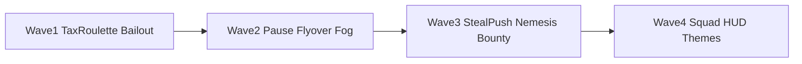
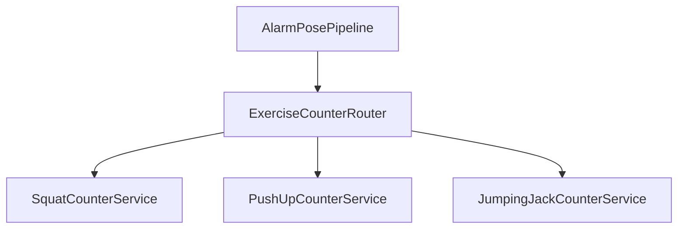

# Awaken new-feature roadmap (with UI/UX)

## Research takeaways

| Insight | Source | Implication for Awaken |
|---|---|---|
| Multi-exercise camera missions are table stakes | IronWake, FitAlarm, PushClock, ZzZlapp | **Tax Roulette** is the highest-priority alarm upgrade |
| Fog-of-war drives exploration retention | Motera | Strongest territory differentiator vs “just polygons on a map” |
| Anti-cheat / no-escape framing is brand-aligned | PushClock “no-cheat”, PRODUCT.md disciplined | **Bailout Penalty** fits Awaken better than soft “streak rescue” |
| Shared suffering is rare | Most apps are solo | **Squad Taxes** is a later moat, not Wave 1 |
| Urban GPS false positives hurt trust | Motera/run UX norms | **Grace pause** before more anti-cheat harshness |

**Default build order (locked):** Wave 1 Alarm → Wave 2 Territory dopamine/retention → Wave 3 Live competition → Wave 4 Social hard mode. Do not start Squad/FCM until Waves 1–2 ship.

---

## What already exists (extend, don’t rewrite)

- Pose pipeline + squat FSM: [`alarm_pose_pipeline.dart`](lib/features/alarm/presentation/services/alarm_pose_pipeline.dart), [`squat_counter_service.dart`](lib/features/alarm/domain/services/squat_counter_service.dart)
- Exercise enum stub: [`alarm_exercise_type.dart`](lib/features/alarm/domain/entities/alarm_exercise_type.dart) (`pushUps`/`sitUps` unused)
- Capture + Realtime territories: `capture_territory`, `territory_captures`, map layers
- Local decay notifs only (no FCM): [`territory_decay_notification_service.dart`](lib/core/services/territory_decay_notification_service.dart)
- IAP stub only: [`iap_config.dart`](lib/core/constants/iap_config.dart)
- No pause status, no fog mask, no squad tables, no theme unlock store

---

## Wave 1 — Alarm engine (implement first)

### Goals
1. **Tax Roulette** — alarm can demand squats, push-ups, or jumping jacks (add jacks; keep sit-ups deferred until FSM is solid).
2. **Bailout Penalty** — force-close / no-complete within window doubles next tax.

### Domain / data
- Extend [`AlarmEntity`](lib/features/alarm/domain/entities/alarm_entity.dart) + models + Supabase `alarms`:
  - `exercise_mode`: `fixed` | `roulette`
  - `exercise_type`: enum (nullable when roulette)
  - `penalty_multiplier` int default 1 (or `pending_penalty_reps`)
- New table `alarm_triggers` (or SharedPreferences for v1 offline): `{alarm_id, fired_at, resolved_at, required_reps, exercise_type}`
- On fire (notification tap / active screen open): write trigger.
- On success session: mark resolved.
- On next schedule / dashboard load: if trigger older than `bailoutWindow` (e.g. 2h) with no session → set `penalty_multiplier = 2` (cap at 2× for v1).

### Pose architecture

- Shared interface: `processPose(Pose) → ExerciseProcessResult` (repCompleted, badForm, depth/cue).
- **Push-ups:** elbow-angle FSM (init → middle → complete), relative torso height; front-camera side/angled coaching copy.
- **Jumping jacks:** wrist–hip vertical separation + ankle spread state machine (arms up + feet out → return).
- Roulette pick: seeded by `alarm.id + localDate` so same morning is stable if user relaunches.

### UI/UX — Active alarm (stress moment)

**Composition (one job: finish the tax)**
- Top instruction bar: exercise name + cue (`DROP AND PUSH`, `JUMP WIDE`, existing squat cues).
- Center: large rep counter `3 / 15` with exercise glyph (not generic fitness icons cluster).
- Border glow unchanged (success/fail).
- **Reveal beat (1.2s) on entry:** full-bleed neon stamp `TAX: PUSH-UPS × 20` then fade to HUD — unpredictability without clutter.
- Bailout state: if multiplier > 1, eyebrow `BAILOUT PENALTY · 2×` in accent/destructive, no modal.

**Setup screen**
- Segmented control: Fixed exercise | Roulette.
- Fixed: exercise chips (only implemented types enabled).
- Microcopy: “Roulette picks at wake. No negotiating.”

**Dashboard**
- Armed alarm hero shows exercise or `ROULETTE` chip.
- If pending penalty: thin banner `Yesterday’s bailout · tomorrow’s tax is doubled` with dismiss for session.

### Tests
- Unit: push-up + jacks FSMs (mirror squat tests).
- Unit: bailout resolution / multiplier logic.
- Widget: reveal stamp + penalty eyebrow.

---

## Wave 2 — Territory retention & dopamine

### 2a. Grace Period GPS Pause
- Add `RunSessionStatus.paused` to [`active_run_providers.dart`](lib/features/territory/presentation/providers/active_run_providers.dart).
- **Auto-pause:** speed ≈ 0 for `N` seconds (e.g. 8s) while tracking → pause elapsed clock; do **not** feed points into speed-cap window.
- **Manual pause** on [`run_controls.dart`](lib/features/territory/presentation/widgets/run_controls.dart).
- Resume: first moving fix restarts; show HUD chip `PAUSED · TRAFFIC GRACE`.

**UI:** bottom controls become Start | Pause/Resume | Finish. Map dim + centered `GRACE` label when paused. Safety strip stays visible.

### 2b. Post-run flyover
- After successful capture in [`capture_result_sheet.dart`](lib/features/territory/presentation/widgets/capture_result_sheet.dart): animate `MapController` fitBounds → slight zoom pulse on claimed polygon (2–3s), then show stats.
- Neon fill flash on claimed poly (opacity 0 → peak → settle). No 3D globe (flutter_map is 2D); sell “cinematic” via camera path + glow.

### 2c. Fog of War (MVP)
- Persist `explored_cells` (H3-like grid or ~50–80m geohash cells) from run polylines locally + sync later.
- Map overlay: dark grid `PolygonLayer` / custom painter covering viewport; subtract revealed cells (Motera pattern).
- First open: almost fully fogged except user location radius.

**UI:** fog is near-black with faint grid; revealed tiles show branded vector basemap. Toggle in overview: `FOG ON` (default). Empty state copy: “Run to chart the grid.”

---

## Wave 3 — Live competition

### Live turf defense (needs FCM)
- On `capture_territory` steal: Edge Function or DB webhook → push to previous owners of intersected geom.
- Client: register device token table `push_tokens`; handle deep link → `/territory`.
- Copy: `TURF HIT · Reclaim within 24h` (align with existing 7-day decay; use 24h as urgency CTA, decay still 7d).

### Nemesis
- SQL view/RPC: pairs with highest mutual steal count from `territory_captures` / geom overlap history.
- Dashboard card (secondary, below hero alarm): `NEMESIS · @rival` + disputed m² bar (you vs them). One CTA: `Hunt on map`.

### Bounty zones
- Table `bounty_zones (geom, expires_at, multiplier, label)`.
- Map: pulsing accent ring; capture that contains zone → badge + streak multiplier flag on session/leaderboard.
- Admin/seed via SQL initially (no CMS in v1).

---

## Wave 4 — Social hard mode + cosmetics

### Squad Taxes
- Tables: `squads`, `squad_members`, `squad_alarms`.
- Realtime channel: squadmate `rep_count` during active alarm (side rail, max 3 avatars + bars).
- Failure rule (v1): any member bailout → all get `+penalty` next day (opt-in squad only; confirm copy on join).

### Unlockable HUDs
- Themes: `cyan` (default), `magenta`, `acid`, `mono` — swap scan-line + skeleton + border tokens via `HudTheme` ThemeExtension.
- Unlock at streak 7 / 30 / 90 (local + cloud streak).
- Gate extras behind existing [`IapConfig.proFeatures`](lib/core/constants/iap_config.dart) when RevenueCat lands.

---

## Design system rules (all waves)

From [`PRODUCT.md`](PRODUCT.md):
- Primary action unmistakable; stress screens stay sparse (brand + one instruction + counter + CTA).
- Neon / dark only; no soft wellness cards, no emoji-spam reward walls.
- Don’t rely on color alone (penalty = icon + text; rival = hatch + color).
- Accessibility: keep camera-deny capped fallback; exercise FSMs must degrade to clear coaching when pose weak.

### Visual language per mode
| Mode | Accent | Motion |
|---|---|---|
| Alarm | Cyan / destructive on fail | Stamp reveal, border pulse |
| Territory | Neon poly + fog black | Flyover zoom, grace dim |
| Social | Magenta squad rail | Live bar ticks |

---

## Wave 1 implementation checklist (concrete)

1. Schema migration: alarm exercise fields + `alarm_triggers` + RLS.
2. `ExerciseCounter` interface; implement PushUp + JumpingJack; wire router in active alarm.
3. Roulette + fixed selection in [`alarm_setup_screen.dart`](lib/features/alarm/presentation/screens/alarm_setup_screen.dart).
4. Active HUD: tax reveal stamp, exercise-specific cues, penalty eyebrow.
5. Bailout resolver service on app resume / next alarm schedule.
6. Dashboard penalty + exercise chips on [`ArmedAlarmCard`](lib/features/dashboard/presentation/widgets/armed_alarm_card.dart).
7. Tests + `flutter analyze`.

**Success metrics:** % alarms completed with non-squat exercise; bailout rate; D1 retention after first roulette morning.

---

## Explicitly deferred

- Sit-ups FSM until push-ups/jacks are accurate.
- Full 3D map / true extruded buildings.
- Accelerometer-only dismiss (camera-deny stays capped taps).
- Friends graph beyond squads.
- RevenueCat wiring (config stub only until Wave 4 cosmetics need it).
