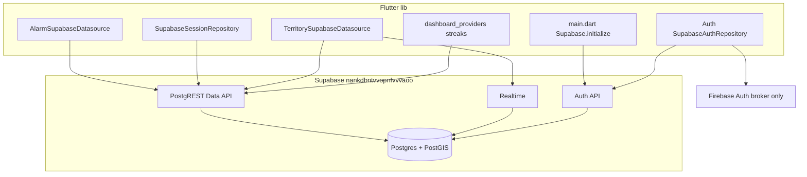

# Awaken Supabase Fresh Migration Plan

## Current State

| Item | Value |
|------|-------|
| **Old project** | `fsdfqcnjcjtdmdjshrvu` (deleted) — still hardcoded in [`supabase/config.toml`](supabase/config.toml) and [`lib/core/constants/supabase_config.dart`](lib/core/constants/supabase_config.dart) defaults |
| **New project** | `nankdbntvvopnfvvvaoo` ("Awaken", ap-southeast-1, Postgres **17**, `ACTIVE_HEALTHY`) |
| **Remote DB** | **Empty** — MCP `list_tables` returns `[]` |
| **App `.env`** | You updated this already; verify it points to `nankdbntvvopnfvvvaoo` |
| **Authoritative schema** | [`supabase/migrations/`](supabase/migrations/) (8 SQL files) — **not** [`docs/awake_full_detail.md`](docs/awake_full_detail.md) §10 (stale) |



---

## Complete Backend Connection Inventory (`lib/`)

### Bootstrap

| File | Connection |
|------|------------|
| [`lib/main.dart`](lib/main.dart) | `Supabase.initialize(url, anonKey)` from `SupabaseConfig` |
| [`lib/core/constants/supabase_config.dart`](lib/core/constants/supabase_config.dart) | `SUPABASE_URL`, `SUPABASE_ANON_KEY`, Google OAuth client IDs via `--dart-define-from-file=.env` |

**Not used:** Supabase Storage, Edge Functions (`functions.invoke`), direct `profiles` / `territory_captures` table access.

---

### 1. Auth (`features/auth`)

| File | API | Backend object |
|------|-----|----------------|
| [`supabase_auth_repository.dart`](lib/features/auth/data/repositories/supabase_auth_repository.dart) | `auth.signInWithIdToken` (Google) | Supabase Auth + Firebase broker |
| same | `auth.signInWithPassword` / `auth.signUp` | Supabase Auth |
| same | `auth.signOut`, `auth.onAuthStateChange`, `auth.currentUser` | Supabase Auth |
| [`auth_providers.dart`](lib/features/auth/presentation/providers/auth_providers.dart) | `isSignedInProvider` | Gates all cloud repos |

**Indirect DB:** `handle_new_user()` trigger (migration `000002`) auto-creates `profiles` on signup from `raw_user_meta_data.full_name` (Google) or email prefix.

**Security note (per Supabase skill):** `user_metadata` is user-editable — never use it in RLS. The app only reads it for display; authorization uses `auth.uid()`.

---

### 2. Alarms (`features/alarm`)

| File | Table | Operations |
|------|-------|------------|
| [`alarm_supabase_datasource.dart`](lib/features/alarm/data/datasources/alarm_supabase_datasource.dart) | `alarms` | SELECT (by `user_id`), UPSERT, DELETE |
| [`alarm_schedule_providers.dart`](lib/features/alarm/presentation/providers/alarm_schedule_providers.dart) | — | Switches to Supabase repo when signed in |

**Columns:** `id` (TEXT PK), `user_id`, `scheduled_time`, `required_reps`, `is_active`, `label`

**Local fallback (offline):** `AlarmRepositoryImpl` + SharedPreferences when signed out.

---

### 3. Sessions + Streaks (`features/sessions`)

| File | Table | Operations |
|------|-------|------------|
| [`supabase_session_repository.dart`](lib/features/sessions/data/repositories/supabase_session_repository.dart) | `sessions` | INSERT, SELECT (aggregate `reps_completed`, `calories_burned`) |
| same | `streaks` | SELECT, UPSERT (`current_streak`, `best_streak`, `last_completed_date`, `updated_at`) |
| [`composite_session_repository.dart`](lib/features/sessions/data/repositories/composite_session_repository.dart) | — | Local-first write + remote retry |
| [`session_sync_service.dart`](lib/features/sessions/domain/services/session_sync_service.dart) | — | Flushes `PendingSessionQueue` on sign-in |

**Columns (`sessions`):** `user_id`, `alarm_id?`, `completed_at`, `reps_completed`, `duration_seconds`, `calories_burned`

---

### 4. Dashboard (`features/dashboard`)

| File | Backend |
|------|---------|
| [`dashboard_providers.dart`](lib/features/dashboard/presentation/providers/dashboard_providers.dart) | Direct `streaks` SELECT; indirect `sessions` aggregates via `sessionRepositoryProvider` |

No dedicated Supabase repository — reads streaks directly, sessions via session repo.

---

### 5. Success screen (`features/success`)

| File | Backend (indirect) |
|------|-------------------|
| [`success_screen.dart`](lib/features/success/presentation/screens/success_screen.dart) | `recordSession()` → `sessions` INSERT + `streaks` UPSERT; `markCompleted()` → `alarms` UPSERT `is_active: false` |

---

### 6. Territory (`features/territory`) — largest backend surface

| File | Object | Type | Operations |
|------|--------|------|------------|
| [`territory_supabase_datasource.dart`](lib/features/territory/data/datasources/territory_supabase_datasource.dart) | `territories_geojson` | view | SELECT |
| same | `runs` | table | INSERT |
| same | `leaderboard_global` | view | SELECT |
| same | `capture_territory` | RPC | CALL (`new_geom` EWKT Polygon) |
| same | `touch_territory_defense` | RPC | CALL (`run_path` EWKT LineString) |
| same | `leaderboard_nearby` | RPC | CALL (`viewer_lon`, `viewer_lat`, `radius_meters`) |
| same | `leaderboard_windowed` | RPC | CALL (`window_hours`, optional geo params) |
| same | `decaying_territories` | RPC | CALL (no params) |
| same | `territories` | table | **Realtime** watch only (`PostgresChangeEvent.all` on channel `territories-changes`) |

**Write boundary:** Client never INSERT/UPDATE/DELETE on `territories` or `territory_captures` — only `SECURITY DEFINER` RPCs mutate them (anti-cheat).

**Local fallback:** `TerritoryLocalRepositoryImpl` when signed out.

---

### Master Object Summary

| Object | Type | Features using it |
|--------|------|-------------------|
| `profiles` | table | Indirect (views, RPCs, signup trigger) |
| `alarms` | table | alarm, success |
| `sessions` | table | sessions, dashboard, success |
| `streaks` | table | sessions, dashboard, success |
| `territories` | table | territory (Realtime) |
| `runs` | table | territory |
| `territory_captures` | table | Written by `capture_territory` RPC only |
| `territories_geojson` | view | territory map |
| `leaderboard_global` | view | territory leaderboard |
| 5 territory RPCs | functions | territory capture/defense/leaderboard/decay |

---

## Migration Execution Plan (Supabase MCP)

**Target project ID:** `nankdbntvvopnfvvvaoo`

### Phase 0 — Pre-flight config alignment

1. **Verify `.env`** matches new project:
   - `SUPABASE_URL=https://nankdbntvvopnfvvvaoo.supabase.co`
   - `SUPABASE_ANON_KEY` = legacy anon key from MCP `get_publishable_keys` (the JWT with `"ref":"nankdbntvvopnfvvvaoo"`)
   - Google client IDs unchanged (Firebase project `awaken-27f39`)

2. **Update repo hardcoded refs** (so defaults and local CLI match):
   - [`supabase/config.toml`](supabase/config.toml): `project_id = "nankdbntvvopnfvvvaoo"`, `major_version = 17` (remote is PG 17; currently says 15)
   - [`lib/core/constants/supabase_config.dart`](lib/core/constants/supabase_config.dart): update `defaultValue` URL/anon key to new project (prevents accidental old-project use when `.env` is missing)

3. **Link CLI** (optional but recommended for future diffs):
   ```bash
   supabase link --project-ref nankdbntvvopnfvvvaoo
   ```

---

### Phase 1 — Apply migrations in strict order

Use MCP `apply_migration` for each file (records migration history on remote). Apply **exact SQL** from each file, in this order:

| # | Migration name (MCP `name`) | File |
|---|----------------------------|------|
| 1 | `enable_postgis` | [`20250702000001_enable_postgis.sql`](supabase/migrations/20250702000001_enable_postgis.sql) |
| 2 | `core_app_schema` | [`20250702000002_core_app_schema.sql`](supabase/migrations/20250702000002_core_app_schema.sql) |
| 3 | `territory_tables` | [`20250702000003_territory_tables.sql`](supabase/migrations/20250702000003_territory_tables.sql) |
| 4 | `territory_views` | [`20250702000004_territory_views.sql`](supabase/migrations/20250702000004_territory_views.sql) |
| 5 | `territory_rpcs` | [`20250702000005_territory_rpcs.sql`](supabase/migrations/20250702000005_territory_rpcs.sql) |
| 6 | `territory_grants` | [`20250702000006_territory_grants.sql`](supabase/migrations/20250702000006_territory_grants.sql) |
| 7 | `realtime_publication` | [`20250702000007_realtime_publication.sql`](supabase/migrations/20250702000007_realtime_publication.sql) |
| 8 | `performance_optimization_fixes` | [`20260705000001_performance_optimization_fixes.sql`](supabase/migrations/20260705000001_performance_optimization_fixes.sql) |

**Postgres best-practices applied by these migrations:**
- Partial/covering indexes: `sessions_alarm_id_idx`, GiST on geometry + geography casts
- RLS initplan optimization: `(SELECT auth.uid())` wrapper on core table policies (migration 8)
- Spatial indexes for `ST_DWithin` geography queries

**If a migration fails:** use MCP `get_logs` (postgres), fix SQL, and re-apply — do not skip ordering (PostGIS before geometry tables, tables before views/RPCs, RPCs before grants, realtime after `territories` exists).

---

### Phase 2 — Post-migration SQL verification (MCP `execute_sql`)

Run read-only checks after all 8 migrations:

```sql
-- Tables exist
SELECT tablename FROM pg_tables WHERE schemaname = 'public' ORDER BY 1;

-- RPCs exist with correct signatures
SELECT proname, pg_get_function_identity_arguments(oid)
FROM pg_proc WHERE pronamespace = 'public'::regnamespace AND proname IN (
  'capture_territory','touch_territory_defense','leaderboard_nearby',
  'leaderboard_windowed','decaying_territories','handle_new_user'
);

-- RLS enabled on all user tables
SELECT relname, relrowsecurity FROM pg_class
WHERE relname IN ('profiles','alarms','sessions','streaks','territories','runs','territory_captures');

-- Realtime publication
SELECT * FROM pg_publication_tables WHERE pubname = 'supabase_realtime';

-- PostGIS extension
SELECT extname, extversion FROM pg_extension WHERE extname = 'postgis';
```

Expected tables: `profiles`, `alarms`, `sessions`, `streaks`, `territories`, `runs`, `territory_captures`.

---

### Phase 3 — Data API exposure check

Per Supabase skill: newly created tables may not be exposed to `anon`/`authenticated` depending on [Data API settings](https://supabase.com/dashboard/project/nankdbntvvopnfvvvaoo/integrations/data_api/settings).

After migration, verify with MCP `execute_sql`:

```sql
SELECT grantee, table_name, privilege_type
FROM information_schema.role_table_grants
WHERE table_schema = 'public'
  AND grantee IN ('anon', 'authenticated')
ORDER BY table_name, grantee;
```

If tables lack `SELECT`/`INSERT`/`UPDATE`/`DELETE` for `authenticated`, add a small follow-up migration:

```sql
GRANT SELECT, INSERT, UPDATE, DELETE ON public.profiles TO authenticated;
GRANT SELECT, INSERT, UPDATE, DELETE ON public.alarms TO authenticated;
GRANT SELECT, INSERT, UPDATE, DELETE ON public.sessions TO authenticated;
GRANT SELECT, INSERT, UPDATE, DELETE ON public.streaks TO authenticated;
GRANT SELECT ON public.territories TO authenticated;
GRANT SELECT, INSERT ON public.runs TO authenticated;
GRANT SELECT ON public.territory_captures TO authenticated;
-- Views already granted in migration 000004
```

(Adjust grants to match actual RLS policies — territory tables are read-only from client.)

---

### Phase 4 — Auth dashboard configuration (manual, not MCP)

Configure in Supabase Dashboard → Authentication:

1. **Google provider** — per comments in [`supabase_config.dart`](lib/core/constants/supabase_config.dart):
   - Enable Google
   - Client ID: `GOOGLE_OAUTH_CLIENT_ID` (client_type 3 from `google-services.json`)
   - **Skip nonce checks: ON** (required for Android `signInWithIdToken`)
   - Authorized Client IDs: add Android client ID (`GOOGLE_ANDROID_CLIENT_ID`)
   - Client secret: only if OAuth errors require it

2. **Email auth** — enable if using email/password flows in [`auth_screen.dart`](lib/features/auth/presentation/screens/auth_screen.dart)

3. **Recommended:** enable leaked-password protection (Auth → Policies)

4. **Redirect URLs** — not needed for mobile ID-token flow

---

### Phase 5 — Security and performance advisors (MCP)

Run both after schema is live:

- `get_advisors` type `security`
- `get_advisors` type `performance`

**Expected / acceptable findings** (documented in [`docs/territory_backend_verification_checklist.md`](docs/territory_backend_verification_checklist.md)):

| Finding | Action |
|---------|--------|
| `spatial_ref_sys` RLS disabled | Platform PostGIS limitation — accept |
| `postgis` in `public` schema | Non-relocatable — accept |
| Territory RPCs are `SECURITY DEFINER` | **Intentional** — verify `anon` has no EXECUTE (migration 000006 handles this) |
| `handle_new_user` is `SECURITY DEFINER` | **Intentional** — trigger-only, not client-callable |

**Optional PG17 hardening** (new migration if advisor flags views):
```sql
CREATE OR REPLACE VIEW public.territories_geojson
  WITH (security_invoker = true) AS ...;
CREATE OR REPLACE VIEW public.leaderboard_global
  WITH (security_invoker = true) AS ...;
```

---

### Phase 6 — End-to-end app verification

Run app with fresh env:
```bash
flutter run --dart-define-from-file=.env -d android
```

| Flow | What to verify |
|------|----------------|
| Google sign-in | Session created; `profiles` row appears |
| Alarm CRUD (signed in) | `alarms` rows sync to cloud |
| Complete alarm workout | `sessions` INSERT + `streaks` UPSERT + alarm deactivated |
| Offline session | Local queue flushes on sign-in (`sessionSyncOnSignInProvider`) |
| Territory run + capture | `runs` INSERT; `capture_territory` RPC returns area; map updates via Realtime |
| Leaderboard | `leaderboard_global` / `leaderboard_nearby` / `leaderboard_windowed` |
| Decay warnings | `decaying_territories()` RPC |
| Sign out | Falls back to local repos (alarms/territory) |

Run existing tests (no backend needed for most):
```bash
flutter test test/alarm/ test/sessions/ test/territory/
```

---

## What Does NOT Need Migration

- **Firebase** (`firebase_options.dart`, `google-services.json`) — unchanged; only brokers Google tokens
- **Local storage** (SharedPreferences alarm/session/territory offline data) — per-device, not in Supabase
- **Push notifications** (`alarm_notification_service.dart`, `territory_decay_notification_service.dart`) — local Android/iOS, no Supabase push
- **ML Kit / camera** — fully on-device

---

## Risk Notes

1. **Data loss is expected** — old project data cannot be recovered; users start fresh cloud sync
2. **Postgres 17 vs local config 15** — update `config.toml` before `supabase start` / `supabase db reset` for local parity
3. **Region change** (ap-northeast-1 → ap-southeast-1) — latency profile changes for Japan-based users
4. **Core table grants** — territory views/RPCs have explicit grants; core tables rely on Supabase defaults — verify in Phase 3
