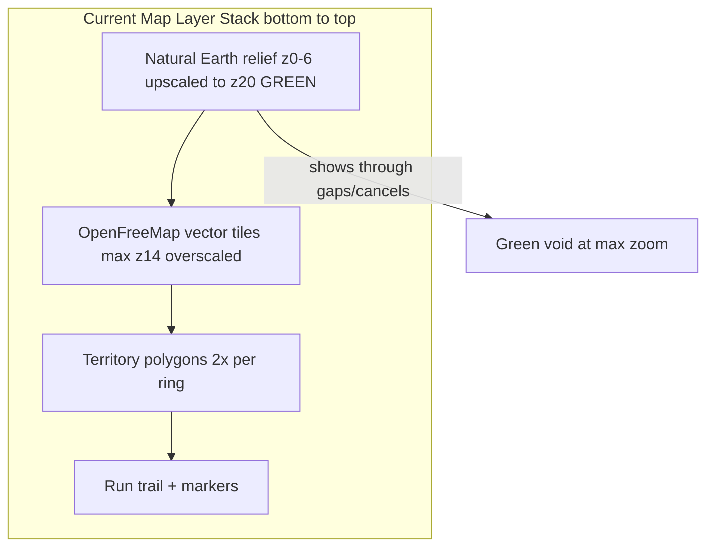
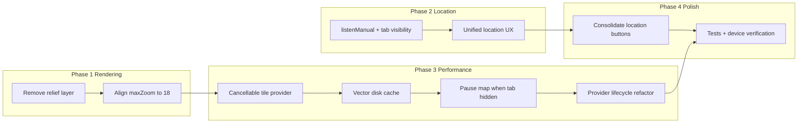

# Territory Map Performance & Rendering Fix Plan

## Executive Summary

Your screenshots match **three distinct root causes** in the current implementation:

1. **Green screen at max zoom** — the Natural Earth relief raster underlay (`ne2sr`) is green/brown terrain imagery upscaled from native zoom 6 to map zoom 20, bleeding through when vector tiles overscale, cancel, or leave gaps.
2. **"Finding your location…" never clears** — auto-centering is gated on `territoryMapReadyProvider` with a fragile `ref.listen` + post-frame race; manual GPS button works because it bypasses the gate and calls `_centerOnCurrentLocation()` directly.
3. **Lag / slow rendering** — vector tiles are CPU-rasterized per tile (`VectorTileLayer` default raster mode), the map keeps working in background via `IndexedStack`, duplicate permission/GPS streams run in parallel, and tile cancellation storms still occur during navigation (documented in [`review.md`](review.md) and [`flutter-run-logs.md`](flutter-run-logs.md)).



---

## Open-Source Stack Commitment

Awaken's territory feature **must stay on free, open-source integrations only**. No paid tile APIs (Mapbox, MapTiler, Stadia, Google Maps SDK, etc.).

| Layer | Current (keep) | License | Notes |
|-------|----------------|---------|-------|
| Map widget | [`flutter_map`](https://pub.dev/packages/flutter_map) ^7.0.2 | BSD-3 | Vendor-free; raster + community vector plugins |
| Vector tiles | [`vector_map_tiles`](https://pub.dev/packages/vector_map_tiles) ^8.0.0 | BSD-3 | Raster-mode rendering (correct for Android FPS) |
| Tile data | [OpenFreeMap](https://openfreemap.org/) public instance | MIT + ODbL data | Free, no API keys, commercial use allowed with attribution |
| Style | Bundled `awaken_dark.json` (OpenMapTiles schema) | Open | Deterministic branding offline-parse |
| GPS | [`geolocator`](https://pub.dev/packages/geolocator) ^13.0.1 | MIT | Industry standard |
| Backend | Supabase + PostGIS | OSS | Already in use |

**Confirmed from OpenFreeMap docs (Context7 + [openfreemap.org](https://openfreemap.org/)):** public instance is free with no view/request limits, no registration, no API keys; commercial use allowed; attribution required (`OpenFreeMap © OpenMapTiles Data from OpenStreetMap`). Self-hosting is also fully open-source ([hyperknot/openfreemap](https://github.com/hyperknot/openfreemap)).

---

## Issue Inventory (by severity)

### P0 — User-visible bugs (your reports)

| Issue | Root cause | Evidence |
|-------|-----------|----------|
| Green screen at max zoom | `_TerritoryLowZoomRasterLayer` uses `ne2sr` relief with `maxNativeZoom: 6`, `maxZoom: 20`; vector tiles cap at z14 | [`territory_run_screen.dart`](lib/features/territory/presentation/screens/territory_run_screen.dart) L549-565, [`app_constants.dart`](lib/core/constants/app_constants.dart) L62-71, [`territory_map_style.dart`](lib/features/territory/presentation/widgets/territory_map_style.dart) L76 |
| Partial green blocks at medium zoom | Same relief layer visible through cancelled/missing vector tile regions | Screenshots 7-8; cancellation mitigations incomplete per [`review.md`](review.md) |
| Auto-location stuck on spinner | `_ensureInitialLocationCenter()` gated on `territoryMapReadyProvider`; `ref.listen` does not fire for already-true state; post-frame ordering race | [`territory_run_screen.dart`](lib/features/territory/presentation/screens/territory_run_screen.dart) L59-105, L170-174 |
| Manual GPS button fixes location | `gps_fixed` button calls `_centerOnCurrentLocation()` unconditionally | L318-357 |
| Map feels slow/laggy | Background tile work in `IndexedStack`, per-tile CPU vector rasterization, no explicit tile cache tuning, polygon double-draw, GPS-driven overlay rebuilds | Multiple files below |

### P1 — Architecture / reliability

| Issue | Location |
|-------|----------|
| Zoom ceiling mismatch (map z20 vs vector z14) | [`app_constants.dart`](lib/core/constants/app_constants.dart), [`territory_map_style.dart`](lib/features/territory/presentation/widgets/territory_map_style.dart) |
| Duplicate `territoryFlutterMapKey` on run screen + capture sheet | [`territory_run_screen.dart`](lib/features/territory/presentation/screens/territory_run_screen.dart) L583, [`capture_result_sheet.dart`](lib/features/territory/presentation/widgets/capture_result_sheet.dart) L249 |
| `myLocationProvider` + `_centerOnCurrentLocation()` duplicate permission/GPS work | [`territory_providers.dart`](lib/features/territory/presentation/providers/territory_providers.dart) L158-204, [`territory_run_screen.dart`](lib/features/territory/presentation/screens/territory_run_screen.dart) L117-141 |
| `keepAlive` providers keep GPS + Realtime alive after first territory visit | [`territory_providers.dart`](lib/features/territory/presentation/providers/territory_providers.dart) |
| Silent location failure (Toronto fallback, no user message) | `_centerOnCurrentLocation` catch block L134-137 |
| Two confusing location buttons (follow-me vs gps_fixed) | Right rail L318-357 |
| No cancellable tile HTTP — wasted bandwidth on pan/zoom | Missing `flutter_map_cancellable_tile_provider` |

### P2 — Polish / future

| Issue | Notes |
|-------|-------|
| No vector tile disk cache (`fileCacheTtl`, `concurrency`) | Context7: `VectorTileLayer` supports `fileCacheTtl`, `fileCacheMaximumSizeInBytes`, `concurrency: 4` |
| Park/wood fills `rgb(14,26,20)` dominate in green areas | [`awaken_dark.json`](assets/map_styles/awaken_dark.json) L204-257 |
| Trail renders all points (no visual decimation at high counts) | [`territory_run_screen.dart`](lib/features/territory/presentation/screens/territory_run_screen.dart) trail layers |

---

## Comprehensive Online Research (Context7 + docs)

Research performed via **Context7 MCP** (`resolve-library-id` + `query-docs`) and official project documentation.

### 1. flutter_map — tile zoom & caching ([Context7: `/websites/fleaflet_dev`](https://docs.fleaflet.dev))

- **`maxNativeZoom`**: Set to the highest zoom your tile source actually provides. Above that, flutter_map **scales existing tiles** instead of requesting nonexistent higher-zoom tiles — prevents failed requests and blank/green gaps.
- **`MapOptions.maxZoom`**: Absolute user zoom cap; recommended only a few levels above the highest native zoom of any layer (not z20 when sources cap at z6/z14).
- **`BuiltInMapCachingProvider`**: Enabled by default on mobile; tune `maxCacheSize` (default 1 GB) via `NetworkTileProvider(cachingProvider: BuiltInMapCachingProvider.getOrCreateInstance(...))`.
- **`tileBuffer`**: Keep modest — high values multiply off-screen tile requests.
- **Offline note**: Built-in cache is not a full offline solution; for robust offline, consider MIT `flutter_map_cache` (josxha) — **not** GPL `flutter_map_tile_caching` (license conflict for proprietary apps).

### 2. vector_map_tiles — rendering & cache ([Context7: `/greensopinion/flutter-vector-map-tiles`](https://github.com/greensopinion/flutter-vector-map-tiles))

- **`maximumZoom: 14`** on `NetworkVectorTileProvider` is the **tile source max**, not the map max. Vector tiles are rendered to larger sizes to support higher zoom (overzoom to ~z18-19 per OpenMapTiles guidance).
- **Default raster mode** (current Awaken setup): tiles parsed/themed client-side but painted to raster buffers per tile — best FPS on low-end Android. Do **not** switch to live `VectorTileLayerMode.vector` without profiling.
- **Performance knobs to add now (v8-compatible)**:
  ```dart
  VectorTileLayer(
    tileProviders: style.providers,
    theme: style.theme,
    concurrency: 4,
    fileCacheTtl: const Duration(days: 30),
    fileCacheMaximumSizeInBytes: 50 * 1024 * 1024,
  )
  ```
- **v10 GPU beta**: Uses `flutter_gpu` on Flutter dev channel — significant perf gains but pre-release; **defer** until stable; stay on v8/v9 for production.
- **flutter_map warning** ([raster vs vector docs](https://docs.fleaflet.dev/why-and-how/how-does-it-work/raster-vs-vector-tiles)): vector tiles can cut FPS due to main-thread UI work; community is actively improving — our raster-mode + isolate concurrency mitigates this.

### 3. flutter_map_cancellable_tile_provider — cancellation ([Context7: `/fleaflet/flutter_map_cancellable_tile_provider`](https://github.com/fleaflet/flutter_map_cancellable_tile_provider))

- **`CancellableNetworkTileProvider`**: Extends `TileProvider` to **abort in-flight HTTP tile requests** when tiles scroll off-screen (pan/zoom). Uses `dio` cancellation.
- Directly addresses Awaken's `CancellationException` flood documented in [`review.md`](review.md) — better than only swallowing exceptions in `main.dart`.
- BSD-compatible; recommended **in scope** for Phase 3.

### 4. geolocator — location centering ([Context7: `/baseflow/flutter-geolocator`](https://github.com/baseflow/flutter-geolocator))

- **Permission-first flow**: Check `isLocationServiceEnabled()` → `checkPermission()` → `requestPermission()` before any position call (already in `LocationPermissionHelper`).
- **`getLastKnownPosition()`** before `getCurrentPosition()` for instant map centering (reduces "Finding location…" duration).
- **Platform-specific `AndroidSettings`**: For run tracking, use `ActivityType.fitness`, `distanceFilter`, and `ForegroundNotificationConfig` when background GPS is needed — aligns with geolocator README best practices.
- **Stream optimization**: Use `distanceFilter` (already 3m idle / 5m run) to avoid flooding UI; throttle camera `move()` calls during follow-me.
- **IndexedStack caveat**: GPS fixes may be delayed when territory tab is hidden — defer stream start until tab is visible.

### 5. OpenFreeMap — tile policy ([openfreemap.org](https://openfreemap.org/), [GitHub](https://github.com/hyperknot/openfreemap))

- Free public instance, no API keys, commercial use OK with attribution.
- Vector tiles from OpenMapTiles schema (maxzoom 14 native).
- Weekly full-planet btrfs/MBTiles downloads available for self-hosting — enables future offline without paid providers.
- Natural Earth relief (`ne2sr`) is also served by OpenFreeMap but is **terrain imagery** (green/brown) — wrong layer for street-level underlay.

### 6. Optional OSS upgrade paths (no paid APIs)

| Package | License | Use case | Recommendation |
|---------|---------|----------|----------------|
| [`vector_map_tiles_pmtiles`](https://pub.dev/packages/vector_map_tiles_pmtiles) | MIT | Single-file regional offline tiles via HTTP range requests | Phase 5 — bundle city/region PMTiles for repeat users |
| [`flutter_map_cache`](https://pub.dev/packages/flutter_map_cache) | MIT | Mid-term tile caching + request cancellation | Alternative/complement to built-in cache |
| [`maplibre_gl`](https://maplibre.org/flutter-maplibre-gl/) | BSD-2 | Native MapLibre renderer | **Do not migrate now** — large rewrite; current stack is aligned with OSS goals |
| Protomaps PMTiles | BSD spec | Self-hosted single-file maps | Free noncommercial CDN; commercial needs GitHub Sponsor — evaluate self-hosted only |

---

## Recommended Fix Strategy (5 phases)

### Phase 1 — Fix green screen & zoom (highest impact, ~1 day)

**1a. Remove the relief underlay (recommended)**

Remove `_TerritoryLowZoomRasterLayer` entirely. The vector style already has a black `background` layer in `awaken_dark.json`. Use `Scaffold`/`FlutterMap` background (`AppColors.background`) while vector style loads.

**Alternative:** Cap relief at `maxZoom: 8` only if a low-zoom placeholder is still desired during style fetch.

**1b. Align zoom constants**

In [`app_constants.dart`](lib/core/constants/app_constants.dart):

```dart
static const double territoryMapMaxZoom = 18.0;   // was 20
static const double territoryMapUserZoom = 16.5;  // keep
static const double territoryMapInitialZoom = 14.0;
static const int territoryVectorTileMaxZoom = 14; // matches OpenMapTiles source
```

**1c. Clamp zoom buttons** — disable `+` at max; optional haptic at limit.

**1d. Fix duplicate FlutterMap key** — unique key for capture minimap.

---

### Phase 2 — Fix auto-location centering (~0.5 day)

**2a. Unify location into one source of truth**

Extend `myLocationProvider` (or add `territoryLocationProvider`) as the single GPS authority:
1. Active only when territory tab is visible AND `territoryMapReadyProvider` is true
2. Permission once → `getLastKnownPosition()` → `getCurrentPosition()` → stream
3. Blue-dot marker + initial camera centering both consume this stream

**2b. Fix the ready-flag race**

```dart
// In initState — survives rebuild ordering:
ref.listenManual(territoryMapReadyProvider, (prev, ready) {
  if (ready) _ensureInitialLocationCenter();
}, fireImmediately: true);
```

Add `territoryTabActiveProvider` in [`app_router.dart`](lib/core/router/app_router.dart) — set true only when shell index == 1.

**2c. Improve locating UX** — split states: `requestingPermission` / `acquiringFix` / `ready` / `failed` with Retry.

**2d. Auto-center on first stream emission** — when provider emits first fix, `_animateTo()` if follow-me enabled.

**2e. Android run tracking** — when starting a run, use `AndroidSettings(activityType: ActivityType.fitness, foregroundNotificationConfig: ...)` per geolocator docs for reliable background GPS.

---

### Phase 3 — Performance optimizations (~1-2 days)

**3a. Pause map/GPS when tab is hidden**

`territoryTabActiveProvider` gates:
- `TerritoryVectorTileLayer` → `SizedBox.shrink()` when inactive
- `myLocationProvider` → pause stream when inactive
- Optionally `Visibility(visible: tabActive, maintainState: true)` on map

**3b. Add cancellable tile provider (NEW — in scope)**

Add dependency: `flutter_map_cancellable_tile_provider` (BSD).

Replace default `NetworkTileProvider()` on any remaining raster layers with `CancellableNetworkTileProvider()` to cancel stale HTTP requests during pan/zoom — reduces cancellation exception storms at the source.

**3c. Configure vector tile disk cache (NEW — in scope)**

On `VectorTileLayer` in [`territory_vector_tile_layer.dart`](lib/features/territory/presentation/widgets/territory_vector_tile_layer.dart):

```dart
VectorTileLayer(
  theme: style.theme,
  tileProviders: style.providers,
  sprites: style.sprites,
  concurrency: 4,
  fileCacheTtl: const Duration(days: 30),
  fileCacheMaximumSizeInBytes: 50 * 1024 * 1024,
)
```

Also tune `BuiltInMapCachingProvider` for any raster fallback layers.

**3d. Reduce overlay repaint cost**

- `RepaintBoundary` on trail/marker layers
- Visual trail decimation when point count > 500 (full path kept for capture)
- `PolygonLayer` simplification tolerance by zoom
- At zoom < 12, skip glow polygon in [`territory_polygon_layer.dart`](lib/features/territory/presentation/widgets/territory_polygon_layer.dart)

**3e. Provider lifecycle refactor (NEW — in scope)**

Refactor territory providers per [`review.md`](review.md) Tier 2 item #7:
- Replace blanket `keepAlive: true` with **tab-scoped lifecycle**: GPS stream and map style cache active only while territory tab visited or run in progress
- `myLocationProvider`: autoDispose when tab inactive (unless `activeRunProvider` is tracking)
- `territoryListProvider`: keep Realtime only while territory tab active or signed-in user on leaderboard
- Reset deferred `Completer()` gate pattern — use explicit `AsyncLoading` → `data`/`error` without infinite pending futures

This reduces battery drain and background tile work — directly improves perceived app performance.

**3f. Tile cancellation tests**

Extend [`territory_map_cancellation_test.dart`](test/territory/territory_map_cancellation_test.dart): max-zoom pan, tab switch, verify zero unhandled `CancellationException`.

---

### Phase 4 — UI/UX improvements (~0.5 day)

**4a.** Consolidate follow-me + `gps_fixed` into one control.

**4b.** Separate "Loading map…" (bottom chip) from GPS centering card.

**4c.** Optional zoom HUD at max detail (z18).

**4d.** Attribution cleanup — ensure OpenFreeMap/OSM attribution visible but not overlapping Start Run button.

---

### Phase 5 — Optional OSS hardening (evaluate after P0-P3 stable)

**5a. Regional PMTiles offline path**

Add [`vector_map_tiles_pmtiles`](https://pub.dev/packages/vector_map_tiles_pmtiles) (MIT) for optional regional offline:
- Host a city/region `.pmtiles` file (self-hosted or OpenFreeMap planet extract)
- Fallback chain: PMTiles (cached locally) → OpenFreeMap network tiles
- **Note:** Protomaps themes are incompatible with OpenMapTiles `awaken_dark.json` — only use for offline fallback with a compatible theme, or keep network OpenFreeMap as primary

**5b. flutter_map_cache (MIT)**

Lightweight mid-term cache complementing built-in caching — evaluate if repeat pan/zoom still slow after Phase 3.

**5c. vector_map_tiles v9/v10 upgrade path**

- **v9**: Improved isolate decode, lower-zoom placeholders while loading — upgrade within semver when flutter_map 7 compatible
- **v10 GPU**: Requires Flutter dev channel + `flutter_gpu` — monitor but do not adopt until stable

**5d. Self-hosted OpenFreeMap**

Document optional self-host path using [openfreemap self-hosting guide](https://github.com/hyperknot/openfreemap/blob/main/docs/self_hosting.md) for production scale — eliminates dependency on public instance availability.

---

## Files to Change (primary)

| File | Changes |
|------|---------|
| [`pubspec.yaml`](pubspec.yaml) | Add `flutter_map_cancellable_tile_provider` |
| [`app_constants.dart`](lib/core/constants/app_constants.dart) | Lower `territoryMapMaxZoom` to 18; vector max zoom constant |
| [`territory_run_screen.dart`](lib/features/territory/presentation/screens/territory_run_screen.dart) | Remove relief layer, fix location listen, pause when hidden, zoom clamp, RepaintBoundary, trail decimation |
| [`territory_providers.dart`](lib/features/territory/presentation/providers/territory_providers.dart) | Tab-active provider, unified location, scoped lifecycle |
| [`app_router.dart`](lib/core/router/app_router.dart) | Set tab-active provider on branch change |
| [`territory_vector_tile_layer.dart`](lib/features/territory/presentation/widgets/territory_vector_tile_layer.dart) | Gate on tab active; concurrency + file cache |
| [`territory_polygon_layer.dart`](lib/features/territory/presentation/widgets/territory_polygon_layer.dart) | Zoom-aware glow skip |
| [`capture_result_sheet.dart`](lib/features/territory/presentation/widgets/capture_result_sheet.dart) | Unique map key |
| [`active_run_providers.dart`](lib/features/territory/presentation/providers/active_run_providers.dart) | AndroidSettings fitness + foreground notification for runs |
| [`test/territory/`](test/territory/) | Auto-center + max-zoom + cancellation tests |

---

## Verification Plan

1. **Green screen fix:** Territory tab → max zoom with `+` → streets/buildings visible (dark theme), not solid green.
2. **Auto-location:** Fresh install → grant permission → Territory tab → centers within 3s without manual GPS tap; spinner clears.
3. **Permission denied:** Actionable error + Retry, not infinite spinner.
4. **Performance:** Home → Territory → Ranks → Home; non-territory tabs show reduced CPU/network in DevTools.
5. **Cancellation:** Rapid pan/zoom at z18 produces no unhandled `CancellationException` in logs.
6. **Regression:** `flutter test test/territory/` + `flutter analyze lib/` pass.
7. **Device matrix:** Mid-range Android (your screenshot device) + emulator.

---

## Explicitly Excluded (paid / license-incompatible)

| Item | Reason |
|------|--------|
| Mapbox, MapTiler, Stadia Maps, Google Maps SDK, TomTom | Paid API keys / billing — violates project OSS commitment |
| `flutter_map_tile_caching` (FMTC) | GPL-3.0 — license conflict for proprietary distribution |
| `vector_map_tiles` v10 GPU on Flutter dev channel | Pre-release dependency risk — monitor, don't ship yet |
| Full migration to `maplibre_gl` | Large rewrite; current flutter_map stack meets OSS goals after fixes |

---

## Suggested Implementation Order



| Step | Task | Est. |
|------|------|------|
| 1 | Remove/cap Natural Earth relief layer | 2-4h |
| 2 | Align `territoryMapMaxZoom` to 18, clamp zoom UI | 1-2h |
| 3 | Fix location with `listenManual(fireImmediately)` + tab visibility | 3-4h |
| 4 | Unify GPS provider + locating UX states | 3-4h |
| 5 | Add `flutter_map_cancellable_tile_provider` | 2-3h |
| 6 | Configure `VectorTileLayer` concurrency + file cache | 1-2h |
| 7 | Pause map/GPS when tab hidden | 2-3h |
| 8 | Provider lifecycle refactor (scoped keepAlive) | 4-6h |
| 9 | UI polish + overlay optimizations | 3-4h |
| 10 | Tests + Android device verification | 3-4h |
| 11 | (Optional) PMTiles regional offline evaluation | 1-2 days |

**Estimated total: 4-6 focused dev days** for Phases 1-4; Phase 5 optional adds 1-2 days.

---

## Context7 Research Log

Queries executed successfully this session:

| Library | Context7 ID | Topics queried |
|---------|-------------|----------------|
| flutter_map | `/websites/fleaflet_dev` | maxNativeZoom, BuiltInMapCachingProvider, offline mapping plugins |
| vector_map_tiles | `/greensopinion/flutter-vector-map-tiles` | VectorTileLayer cache, concurrency, maximumZoom, raster mode |
| geolocator | `/baseflow/flutter-geolocator` | getLastKnownPosition, AndroidSettings, permission flow, streams |
| flutter_map_cancellable_tile_provider | `/fleaflet/flutter_map_cancellable_tile_provider` | CancellableNetworkTileProvider, HTTP abort on pan/zoom |

**Note:** Context7 `resolve-library-id` requires both `libraryName` and `query` parameters — earlier session failures were due to missing `query`.
