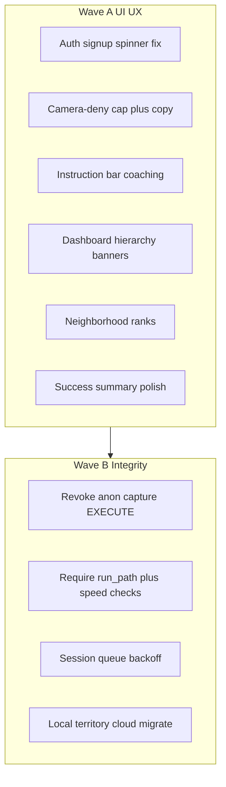

# UI/UX-first fix implementation

## Scope (this plan)

**Wave A (implement first):** UI/UX + journey-blocking bugs.
**Wave B (immediately after):** security/sync integrity (no UI redesign).
**Out of scope for now:** multi-exercise, IAP, fog-of-war, Watch/Health, package rename, offline pmtiles.

Locked product decisions for Wave A:
- Camera deny keeps an accessibility fallback, but **caps tap-reps** and pushes Settings harder (no accelerometer yet).
- Leaderboard adds a **neighborhood band (±5 ranks around the viewer)**; climb hint already exists and stays.
- Form coaching reuses existing FSM signals (`badForm`, `depthRatio`, out-of-frame) — no new ML model.

---

## Wave A — UI/UX + journey bugs

### 1. Fix email sign-up spinner lock

File: [`lib/features/auth/presentation/screens/auth_screen.dart`](lib/features/auth/presentation/screens/auth_screen.dart)

In `_submit` sign-up branch, today only the `currentUser == null` path clears loading. When signup creates an immediate session:

- set `_loading = false`
- `context.go(AppRoutes.dashboard)` (same as Google / email sign-in)

Add a small widget/unit-style test or auth screen test covering both confirm-email and immediate-session paths.

### 2. Harden camera-deny accessibility UX

Files:
- [`lib/features/alarm/presentation/screens/active_alarm_screen.dart`](lib/features/alarm/presentation/screens/active_alarm_screen.dart)
- [`lib/core/constants/app_constants.dart`](lib/core/constants/app_constants.dart)

Current: unlimited tap-to-count when permission denied.

Changes:
- Add `AppConstants.accessibilityMaxTapReps` (e.g. `3`) — after the cap, taps no longer increment; banner switches to **must open Settings** to continue.
- Update `_AccessibilityModeBanner` copy to state the cap and that verified squats require camera.
- Keep `OPEN CAMERA SETTINGS` as the primary CTA; instruction bar already shows `ACCESSIBILITY MODE — TAP TO COUNT` — update that string when capped.

### 3. Stress-moment form coaching polish

Same active-alarm screen + `_InstructionBar`.

Wire `outOfFrameProvider` into the instruction bar priority list:

1. success / failure feedback (keep `GO LOWER / KEEP SHOULDERS LEVEL`)
2. camera denied / loading
3. **out of frame** → `BODY OUT OF FRAME — STEP BACK`
4. no pose → `FULL BODY IN FRAME`
5. calibrate / squat / stand cues (existing)

Optional light depth cue when squatting and `depthRatio` is low: `GO DEEPER` (read from latest `SquatProcessResult` via a small `ValueNotifier` or provider — avoid full-tree rebuilds; prefer the existing pose `ValueListenable` path).

### 4. Dashboard hierarchy + permission UX

File: [`lib/features/dashboard/presentation/screens/dashboard_screen.dart`](lib/features/dashboard/presentation/screens/dashboard_screen.dart)

Align with PRODUCT.md (“primary action unmistakable”, anti-generic-dashboard):

- Make **next armed alarm** the visual hero (larger time / reps / “Wake tax” framing); demote weekly stats to secondary.
- Keep `_ExactAlarmWarningCard`; make it **dismissible for the session** (SharedPreferences or in-memory provider) with one-tap Settings still available.
- Guest header: short non-blocking sync prompt (“Sign in to sync streaks & leaderboard”) rather than only a Sign In chip.

### 5. Leaderboard neighborhood UX

File: [`lib/features/territory/presentation/screens/territory_leaderboard_screen.dart`](lib/features/territory/presentation/screens/territory_leaderboard_screen.dart)

Already has climb hint (“Claim X km² more…”). Add:

- When viewer is ranked, show a **Around you** section: ranks `myRank-5 … myRank+5` (clamp to list bounds), highlight self.
- Keep podium for top 3; if viewer is outside top 3, neighborhood still shows the neighborhood band so newcomers aren’t buried in a long global list.

### 6. Success screen polish

File: [`lib/features/success/presentation/screens/success_screen.dart`](lib/features/success/presentation/screens/success_screen.dart)

- Show streak as **delta** when possible (e.g. “Streak · 4 → 5” once stats load), not only absolute.
- If accessibility-mode session (optional flag set from active alarm), show a subtle footnote that reps were accessibility-counted — keeps honesty without shaming.

---

## Wave B — Integrity (after Wave A)

| Fix | Where | Action |
|---|---|---|
| Revoke `anon` EXECUTE on `capture_territory` | new Supabase migration | Match live grant cleanup (currently `anon` still has EXECUTE) |
| Stronger anti-cheat | `capture_territory` SQL + client payload | Require non-null `run_path`; add max segment speed / min duration checks |
| Session sync backoff | [`session_sync_service.dart`](lib/features/sessions/domain/services/session_sync_service.dart) + queue | Store attempt count / next-retry-at; skip until due |
| Territory local→cloud | new migration helper like `AlarmCloudMigration` | On sign-in, upload local territories then clear or mark migrated |

---

## Verification

Wave A:
- Manual: email signup with confirm-off → lands on dashboard (no stuck spinner).
- Manual: deny camera → tap up to cap → further taps blocked → Settings CTA.
- Manual: leave frame during alarm → instruction switches to out-of-frame copy.
- Manual: dashboard hero reads as next-alarm first; guest sees sync prompt.
- Manual: leaderboard shows Around you when ranked mid-list.
- `flutter analyze lib/` and targeted tests for auth signup branch + any new constants.

Wave B:
- SQL privilege check: `anon` has no EXECUTE on `capture_territory`.
- Forged/null path rejected by RPC.
- Offline session flush respects backoff.

---

## Implementation order

1. Auth signup fix (smallest, highest journey risk)
2. Camera-deny cap + copy
3. Instruction-bar out-of-frame / depth cues
4. Dashboard hero + banners + guest prompt
5. Leaderboard neighborhood band
6. Success streak delta / accessibility footnote
7. Wave B migrations + sync/migration services
