# Awaken — Full Codebase & Database Analysis Report

> Generated 2026-07-14 from a file-by-file read of `lib/` (145 Dart files, ~21,500 lines of hand-written code), `pubspec.yaml`, and a live review of the Supabase project `nankdbntvvopnfvvvaoo` (ap-southeast-1) via MCP. No existing documentation was consulted.

---

## 1. Project Overview

**Awaken** is a Flutter mobile app (Android-first, iOS secondary) that combines two gamified fitness products in one:

1. **Camera-verified fitness alarm ("Wake Up Tax")** — an alarm clock that cannot be dismissed by tapping. When it fires, the user must perform a set number of real exercise reps (squats, push-ups, jumping jacks, or high knees), verified live and on-device by Google ML Kit pose detection through the front camera. Skipping an alarm ("bailout") doubles the next day's rep tax. Squads of friends share bailout penalties and see each other's live rep progress during alarms.

2. **Territory capture running game** — GPS-tracked outdoor runs on a dark neon vector map. Closing a loop with your run path claims that land as a PostGIS polygon; running through a rival's turf steals it (`ST_Difference` server-side). Territory decays after 7 days undefended, bounty zones grant score multipliers, a fog-of-war layer charts exploration, and dual leaderboards (nearby / global, 24h / 7d / all-time) rank players by owned area.

**Tagline (pubspec):** "Camera-verified fitness alarm — pay your Wake Up Tax to conquer the morning."

**Architecture:** Feature-First Clean Architecture (`presentation → domain ← data`), Riverpod state management (mixed hand-written + `@riverpod` codegen), GoRouter with a `StatefulShellRoute` 3-tab shell, Supabase backend (Postgres + PostGIS + Auth + Realtime + Edge Functions), Firebase Cloud Messaging for push, dual local/cloud repositories with offline-first sync queues.

**Offline-first principle:** every repository (alarms, sessions, territory) has a SharedPreferences implementation for guests and a Supabase implementation for signed-in users, chosen reactively from auth state. Local save is always the source of truth until remote succeeds; failed writes go to retry queues with exponential backoff.

---

## 2. Tech Stack & Packages (pubspec.yaml)

| Category | Package | Purpose |
|---|---|---|
| State | `flutter_riverpod` 2.5, `riverpod_annotation` 2.3 | Providers, notifiers, partial codegen |
| Backend | `supabase_flutter` 2.5 | Auth, Postgres, Realtime, RPC |
| Computer vision | `google_mlkit_pose_detection` 0.15 | On-device pose landmarks (33 joints) |
| Camera | `camera` 0.12 | Front-camera image stream (NV21/BGRA) |
| Navigation | `go_router` 13.2 | Shell tabs + overlay routes |
| Map | `flutter_map` 7.0, `vector_map_tiles` 8.0, `vector_tile_renderer` 5.2, `flutter_map_cancellable_tile_provider` 3.0, `executor_lib` 1.1 | OpenFreeMap vector basemap, themed dark style, cancellable tile fetch |
| Geo | `latlong2` 0.9, `geolocator` 13.0 | Coordinates, GPS streams, permissions |
| Alarm engine | `flutter_local_notifications` 17.2, `timezone` 0.9, `flutter_timezone` 5.1 | Exact zoned scheduling, full-screen intents |
| Audio | `just_audio` 0.9 | Looping alarm sound + volume ramp |
| Device | `wakelock_plus` 1.6, `permission_handler` 11.3 | Screen-on during alarm, runtime permissions |
| Persistence | `shared_preferences` 2.3 | All local storage (alarms, sessions, queues, checkpoints, fog cells, prefs) |
| UI/Anim | `flutter_animate` 4.5, `google_fonts` 6.2 | Declarative animations, Space Grotesk/Mono |
| Push | `firebase_core` 4.11, `firebase_messaging` 16.4 | FCM turf-hit push notifications |
| Monetization | `in_app_purchase` 3.3 | Awaken Pro (monthly/yearly non-consumable) |
| Social/auth | `google_sign_in` 6.2, `share_plus` 13.2 | Native Google account picker, capture-result sharing |
| Geometry | `polybool` 0.2 | (declared; polygon boolean ops) |
| Util | `http` 1.6, `clock` 1.1 | TileJSON resolution, testable time |
| Dev | `flutter_lints` 6, `build_runner`, `riverpod_generator`, `riverpod_lint`, `custom_lint`, `fake_async` | Lints strict-casts/inference/raw-types, codegen |

**Assets:** `assets/audio/alarm.mp3` (in-app alarm sound; Android falls back to system alarm ringtone, iOS silent if missing), `assets/map_styles/awaken_dark.json` (re-themed fork of OpenFreeMap's dark style, generated by `tool/retheme_map_style.py`).

---

## 3. Features & Functionalities

### 3.1 Alarm / Wake Up Tax
- **Alarm setup** — time picker (themed Material picker), rep count 5–50 in steps of 5 with tier chips (≤15 "CHILL TAX" green, ≤35 "ENFORCED WAKEUP" blue, >35 "GRAVEYARD PROTOCOL" red), optional label, exercise mode **Fixed** (choose squats/push-ups/jumping jacks/high knees) or **Roulette** (deterministic daily pick seeded by alarm id + date).
- **Exact scheduling** via `flutter_local_notifications.zonedSchedule` with `exactAllowWhileIdle`, full-screen intent, ongoing/non-dismissable notification, custom vibration pattern, LED, timezone-aware. Notification id = `alarm.id.hashCode & 0x7FFFFFFF`; payload `id|reps|scheduledTime`.
- **Permission flows** at arm-time: notifications (Android 13+/iOS critical), Android 12+ exact-alarm dialog (Cancel / Save Anyway / Open Settings with re-check + warning snackbar), camera pre-request with rationale dialog (denial → tap-to-count fallback).
- **Launch-from-notification**: foreground tap navigates via global navigator key; background-isolate tap stashes route in SharedPreferences; cold start reads it in `main()` and overrides GoRouter's initial location to `/alarm/active?id=…&reps=…&scheduled=…`.
- **Active alarm session**: full camera lifecycle (`AlarmPosePipeline`) — permission → front camera `ResolutionPreset.medium` → image stream throttled to ~15 FPS (66 ms + `_isDetecting` guard) → NV21 conversion (handles 3-plane YUV_420_888 fallback with stride-aware interleave) → ML Kit `PoseDetector` (stream mode) → per-exercise FSM counter. Camera released on background, reopened on resume.
- **Exercise counters** (all implement `ExerciseCounter`, all EMA-filtered α=0.35, all with standing-calibration phases and coaching cues):
  - *Squats*: knee angle ≤100° down / ≥150° up, hip-to-knee depth ratio ≥0.6 vs calibrated standing gap, shoulder-tilt bad-form check (>0.18 of torso), ankle/hip/knee visibility gating, 8-frame calibration.
  - *Push-ups*: elbow angle ≤90° down / ≥150° up, shallow-rep detection (dip below 130° that returns without reaching 90° flags "TOO SHALLOW").
  - *Jumping jacks*: wrists-above-nose + ankle gap ≥1.35× standing baseline; asymmetry (arms XOR feet) held ~0.7 s → bad form.
  - *High knees*: alternating knee lift to within 15% of thigh length below hip, plant hysteresis at 60%, expects L/R alternation.
- **Session HUD**: neon skeleton overlay (`PoseOverlayPainter`, rotation-aware for all 4 `InputImageRotation` values, front-camera mirroring, glow+sharp two-pass strokes), static placeholder wireframe when no pose, scan-line sweep animation, live L/R knee-angle telemetry labels, oversized mono rep counter with expanding shockwave ring per rep, top instruction bar with state-driven cues, bottom "WAKE UP TAX — N LEFT" strip, border glow flashing green (success) / red (bad form), haptics per rep / calibration / completion.
- **Tax reveal stamp** — full-black overlay for 1.2 s at alarm start showing "TAX / SQUATS × 20" and bailout multiplier.
- **Out-of-frame penalty** — alarm volume ramps up +0.15 every 8 s while no pose is detected; resets when back in frame.
- **Accessibility fallback** — camera denied ⇒ tap-to-count up to 3 reps, then camera required; banner + settings deep link; usage flagged on the success screen.
- **Bailout system** — every fire is recorded locally (`AlarmTriggerRecord`); an unresolved trigger older than 2 h applies a 2× penalty multiplier (capped at 2×) to that alarm, reports the bailout to the user's squad (`report_squad_bailout` RPC), and consumes peer bailouts (`consume_squad_bailout_penalty` RPC) so a squadmate's failure also doubles your tax. Applied on app resume and dashboard load; dashboard banner + bottom-sheet explainer.
- **Squad taxes** — create squad (8-char invite code) / join by code; live squad-mate progress rail (up to 3 mates, magenta avatars + vertical progress bars) during active alarms via Realtime on `squad_alarms` with own-progress upsert per rep; "nudge the squad" (one row per mate in `squad_nudges`) surfaces as a dismissible dashboard banner for recipients.
- **Success screen** — animated streak badge (previous → current delta + 🔥), staggered count-up stat rows (reps / calories `reps×0.35` / duration) with haptic ticks, typewriter motivational quote (day-indexed), "Start My Day" CTA. Records the session (local-first), marks the alarm complete, resolves bailout triggers, refreshes dashboard stats. `PopScope(canPop:false)` on both alarm and success screens.

### 3.2 Sessions, Streaks & Stats
- `SessionEntity` (reps, duration, calories, alarmId, guest id `local`); `CompositeSessionRepository` = local-first write + remote attempt + `PendingSessionQueue` (dedup, exponential backoff 30 s→30 min) flushed on resume and sign-in.
- Cloud streak logic in `SupabaseSessionRepository._updateStreak` (consecutive-calendar-day, best-streak upsert into `streaks`); local streak computed from stored session dates.
- Sign-in migration: guest sessions re-attributed to the new user, local alarms uploaded (`AlarmCloudMigration`), local territories re-captured server-side (`TerritoryCloudMigration`), fog cells merged both ways.
- Dashboard stats: current/best streak, weekly reps, monthly calories, 4-week rep trend.

### 3.3 Dashboard
- Header (avatar with signed-in glow → profile, AWAKEN wordmark, greeting, add-alarm button), guest "sign in to sync" prompt, glassmorphic digital clock (updates once per minute via `clockDisplayProvider`), date line.
- Warning banners: exact-alarm permission missing (destructive card + settings CTA), bailout active (tappable explainer sheet), squad nudge inbox.
- Hero: `ArmedAlarmCard` (next alarm time, exercise chip incl. ROULETTE, effective reps = base × penalty, bailout callout) or dashed "Tap to set your alarm" card.
- "THIS WEEK": dual-ring `StreakRing` (blue outer progress + violet inner spinning arc + radar pulse), reps `StatCard`, calories `StatCard`, `WeekTrendCard` bar chart with week-over-week delta chip (hidden until ≥1 rep exists).
- Scheduled alarm list: swipe-to-delete `Dismissible` tiles with time, label, reps, active `Switch`.
- Collapsible "TERRITORY, RIVALS & MORE": `NemesisCard` (most-contested rival, disputed-m² tug-of-war bar, "Hunt on map" CTA), territory card (run CTA + details link), `HudThemePicker`, SQUAD TAXES sheet launcher.
- Debug-only "Test Active Alarm" button.

### 3.4 HUD Themes & Monetization
- 4 HUD themes as `ThemeExtension` (`HudTheme`): Cyan (default), Magenta (streak ≥7), Acid (streak ≥30 + Pro), Mono (streak ≥90 + Pro). Applied to alarm HUD accents (scanline, skeleton, rings). Selection persisted in prefs; debug preview bypass.
- **Awaken Pro** via `in_app_purchase`: products `awaken_pro_monthly` / `awaken_pro_yearly` (yearly preferred), purchase-stream listener, restore, entitlement cached in prefs, debug local unlock when store unconfigured. Advertised Pro features: multi-exercise dismiss, unlimited territory history, custom alarm sounds, friends leaderboard, extra HUD themes.

### 3.5 Territory Capture
- **Run tracking** (`ActiveRunNotifier`): permission gate (notifications for FGS + location with typed error kinds), Android foreground-service notification with wake lock / iOS background fitness location, `LocationAccuracy.best` + 5 m distance filter, Kalman-filtered fixes (position-only filter, accuracy-driven variance), per-second tick timer, live speed, GPS-quality chip (good ≤8 m / fair ≤20 m / poor).
- **Anti-cheat**: rolling 6-fix sustained speed cap 25 km/h (live "vehicle detected" HUD + run invalidation); server independently re-validates (min area, ≤80 m segment gaps → client densifies paths before RPC and never RDP-simplifies capture polygons).
- **Loop closure** (`LoopClosureTracker`, live + batch-consistent): anchor-based segments; closure requires armed state (left 30 m exit radius), ≥150 m segment distance, ≥50 m max excursion, return within 50 m of anchor, >6 fixes, GPS accuracy ≤ closure radius; up to 5 loops per session (anti-farming); overrun past start supported.
- **Grace pause**: auto-pause after 8 s stationary (≤2.5 m displacement and ≤0.4 m/s), full-screen "GRACE" dim, auto-resume on movement; manual pause/resume/finish controls.
- **Crash resilience**: debounced (2 s) SharedPreferences checkpoint of the entire run (points, loops, tracker state, timers); restored on cold start from `AwakenApp`; stream-error → paused + checkpoint; `ensureBackgroundTracking()` re-attaches on resume.
- **Finish flow**: RDP-simplify (ε 3 m) full path for storage, re-extract loops (fall back to live pending loops), classify (`territoryClaimed` / `loopNotClosed` / speed-cap / too-small / too-short), per-loop `capture_territory` RPC with densified points, rejection accounting (`loop_too_small`, `path_segment_too_fast`), bounty evaluation (highest-multiplier zone whose centroid is inside a captured loop → local badge + `bounty_claims` insert), `touch_territory_defense` for non-claim runs, `runs` insert always ("every run counts as a workout"), fog reveal along path + cloud push, leaderboard/territory invalidation. Network failure → `PendingCaptureQueue` retried on resume/sign-in, permanent rejections dropped.
- **Map** (`TerritoryRunScreen`): branded dark OpenFreeMap vector tiles (bundled style, raster-mode vector rendering, 30-day/50 MB file cache, OSM raster fallback engine), zoom 2–18 (native vector z14), Toronto fallback center; layers in order — basemap, territory polygons (rivals below own), pending-loop green polygons, run trail glow+core (decimated to 500 pts for display), segment-anchor flag marker, fog-of-war, bounty zones, Google-style animated blue-dot location marker (accuracy pulse + heading wedge), OSM attribution.
- **Territory polygons**: per-user unique profile color (`profiles.territory_color`, server-allocated golden-angle HSL palette), soft fill + wide glow + bright edge (glow skipped below z12), owned turf stronger alpha/stroke and drawn on top.
- **Run screen chrome**: status header (7 state-driven title/subtitle pairs), "N loops ready" pill, pulsing "Close loop" pill when within 4× closure radius, "Crossing rival territory" amber pill (live point-in-polygon vs rival turf), right rail (follow-me toggle, bounty visibility toggle, zoom ±), glass HUD stats card (distance/time/speed/loops/to-segment + GPS chip + loop-closure progress bar + guidance line), paused banner, safety strip, locating overlay (permission → acquiring → failed with settings/retry), map style/territory error overlay with retry, offline-run snackbar for guests, post-run result banners.
- **Capture result sheet**: cinematic minimap flyover (fit bounds → dive → waypoints along path → pull back, fake 3D pitch transform, animated fill and trail draw), then reveal: title (claimed/stolen/N territories), rivals-cut count, partial-failure note, bounty banner, distance/avg-speed/claimed/total-owned stat blocks, Share (share_plus) and Leaderboard CTAs.
- **Fog of war**: ~70 m grid cells in SharedPreferences (capped 8000), revealed along run paths (8-neighborhood) and around first fix; soft radial-hole dark veil painter with faint grid, viewport-coarsened when zoomed out; toggle + empty-state hint on the overview screen; synced via `explored_cells` table (`upsert_explored_cells` RPC, merge on sign-in).
- **Bounty zones**: time-limited server-defined polygons (seeded around Mirpur, Dhaka) with multiplier labels; dashed purple road-loop rendering, compact/full markers by zoom, dismissible legend card listing top zones.
- **Decay**: 7-day defense grace; `decaying_territories` RPC lists owned territories within 2 days of decay; overview screen risk list (urgent ≤2 days red) and once-per-session local notification.
- **Territory overview screen** (`/territory/overview`): total owned km², polygon count, fog toggle, decay-risk list, pull-to-refresh.
- **Turf-hit defense alerts**: DB trigger on rival capture inserts `turf_hit_notifications` → app-lifetime Realtime subscription shows "TURF HIT — you lost N m², reclaim within 24 h" local notification; `notify-turf-hit` Edge Function also sends FCM push (data `type: turf_hit`, route `/territory`); tap routes to the territory tab.

### 3.6 Leaderboard ("RANKS" tab)
- Scope toggle Nearby (default; viewer GPS + 5 km radius RPC) / Global (view over territory areas); window chips 24H / 7D (windowed "momentum" RPC over capture history, unique-area) / ALL (current ownership); metric badge explaining the ranking.
- Podium: top-3 medal pillars (gold/silver/bronze, claim-meter bars, featured center) or solo-champion card; "AROUND YOU" neighborhood window (my rank ±5) with YOU chip; climb hint ("Claim X km² more to pass Y"); full standings list with relative claim meters; tap an entry → focuses the territory map on that player's centroid; pull-to-refresh, tab-visibility refresh, empty states per mode/window.
- Local fallback for guests (current standings only; windowed board degrades to all-time).

### 3.7 Auth & Profile
- Supabase-owned sessions; email/password sign-in/up (validation, obscure toggle, email-confirmation notice) and native Google Sign-In (`google_sign_in` account picker → `signInWithIdToken`, web `serverClientId`, ephemeral Google session cleared after exchange, typed cancel exception); "Continue without account" skip.
- `isSignedInProvider` falls back to synchronously restored session during first auth event so cold starts don't flash the local repo.
- Profile screen: identity card (avatar image/silhouette, glow ring, CLOUD SYNCHRONIZED / LOCAL STORAGE ONLY status pill), guest sign-in CTA, 2×2/1×4 responsive performance grid (streak, best streak, weekly reps, monthly calories), destructive sign-out confirmation dialog.
- Every repository (alarms/sessions/territory) reacts to auth state and swaps local↔cloud automatically; sign-in triggers session flush + alarm/territory/fog migrations + pending-capture flush + push-token registration.

### 3.8 Onboarding
- 3-page `PageView` (Wake Up Tax / Camera + Alarms / Claim Territory) with dots, SKIP, and "SET FIRST ALARM" finishing into `/alarm/setup`; completion flag in prefs gates the initial route in `main()`.

### 3.9 Notifications (4 local channels + FCM)
| Channel | Id | Purpose |
|---|---|---|
| `awaken_alarm` | per-alarm | Full-screen wake-up alarm (max importance, ongoing) |
| `awaken_territory_decay` | 9001 | Grouped decay warning, once per session |
| `awaken_turf_hit` | 9002 | Rival stole your turf (Realtime + FCM paths) |
| Geolocator FGS | — | "Awaken territory run" ongoing tracking notification |

FCM: token registration/upsert into `push_tokens` (user_id+token PK, platform) on sign-in and refresh, stable random fallback device id, background handler, foreground turf-hit display, tap routing, initial-message navigation.

---

## 4. UI Inventory

### 4.1 Screens (11)
| Route | Screen | Notes |
|---|---|---|
| `/onboarding` | `OnboardingScreen` | first-run pager |
| `/dashboard` | `DashboardScreen` | shell tab 0 (default; `/` redirects) |
| `/territory` | `TerritoryRunScreen` | shell tab 1, map + run |
| `/leaderboard` | `TerritoryLeaderboardScreen` | shell tab 2 |
| `/territory/overview` | `TerritoryOverviewScreen` | overlay |
| `/auth` | `AuthScreen` | overlay, skippable |
| `/profile` | `ProfileScreen` | overlay |
| `/alarm/setup` | `AlarmSetupScreen` | overlay |
| `/alarm/active` | `ActiveAlarmScreen` | overlay, un-poppable; entity from extra / list / query params |
| `/alarm/success` | `SuccessScreen` | overlay, un-poppable |
| `/` | redirect → `/dashboard` | |

Shell: `_ShellScaffold` + `_AwakenBottomNav` (HOME / TERRITORY / RANKS, 60 px, animated pill highlight, red live dot on Territory during active runs; tab switches never stop GPS).

### 4.2 Widget / component catalog
**Core chrome:** `_AwakenBottomNav`, `_NavItem`, `_ShellScaffold`, `_ActiveAlarmRoute`.

**Alarm:** `CameraHudOverlay`, `_CameraLayer` (cover-fit preview), `PoseOverlayPainter`, `SkeletonWireframe` (+`_SkeletonPainter`), `ScanLineAnimation`, `RepCounterDisplay` (shockwave ring), `TaxRevealStamp` + `TaxRevealOverlay`, `_InstructionBar`, `_WakeUpTaxLabel`, `_TelemetryLabel`, `_AccessibilityModeBanner`, `SquadTaxRail` (+`_MateProgress`), `_SquadRailLayer`, `SquadSheet`; setup: `_TimeTile`, `_RepSelector` (tick visualizer + tier chip), `_RepButton`, `_LabelField`, `_ArmButton`, exact-alarm & camera dialogs.

**Dashboard:** `_Header`, `_GuestSyncPrompt`, `DigitalClock`, `_ExactAlarmWarningCard`, `_BailoutBanner` (+`_ExplainerRow`), `_SquadNudgeBanner`, `ArmedAlarmCard`, `_NoAlarmCard`, `_StreakCard`, `StreakRing` (+`_StreakRingPainter`), `StatCard`, `WeekTrendCard` (+`_TrendBar`), `_AlarmList`, `_AlarmTile`, `_MoreToggle`, `_TerritoryCard`, `NemesisCard`, `HudThemePicker` (+`_ThemeChip`), `_TestAlarmButton`.

**Success:** `StreakBadge`, `StatRevealItem`, `_MotivationalQuote` (typewriter).

**Territory map:** `_TerritoryMapView` (FlutterMap host), `TerritoryVectorTileLayer` (+ raster fallback), `TerritoryMapStyle` loader, `TerritoryPolygonLayer` + `TerritoryPaintStyle`, `_PendingLoopLayer`, `_RunTrailGlowLayer`/`_RunTrailCoreLayer`, `_RunStartMarkerLayer` + `_StartMarker`, `_MyLocationMarkerLayer` + `_MyLocationMarker` (+`_HeadingWedgePainter`), `TerritoryFogLayer` (+`_FogPainter`), `BountyZonesLayer` (+`_BountyZoneMarker`) + `BountyZonesLegendCard`, `TerritoryMapStatusOverlay` (+`_MapLoadingChip`), `_TerritoryMapLegend` (+`_LegendSwatch`), `RichAttributionWidget`.

**Run HUD:** `RunControls` (Start / Pause+Stop / Resume+Finish / Saving, pulsing stop glow), `RunStatsSheet` (+`_Stat`, `_GpsQualityChip`), `LoopClosureProgressBar`, `_RunHeader`, `_LoopClosedPill`, `_PulseCloseIndicator`, `_ConflictPill`, `_CircleIconButton`, `_ErrorBanner`, `_ResultBanner`, `_LocatingIndicator`, `CaptureResultSheet` (+`_CaptureFlyoverMap`, `_StatBlock`).

**Leaderboard:** `LeaderboardPodium` (+`_PodiumColumn`, `_SoloChampion`), `LeaderboardRankRow`, `LeaderboardScopeToggle`, `LeaderboardWindowChips`, `LeaderboardMetricBadge` (+`_SegChip`), `LeaderboardClimbHint`, `LeaderboardEmptyState`, `LeaderboardSectionLabel`, `LeaderboardAvatar`, `LeaderboardAreaLabel`, `LeaderboardClaimMeter`.

**Overview:** `_OwnershipStats` (+`_StatColumn`), `_DecayRiskList` (+`_DecayRiskTile`), `_CardSkeleton`, `_LoadErrorCard`.

**Auth/Profile:** `_GoogleSignInButton` (+ custom-painted `_GoogleIcon`), form fields with themed `InputDecoration`, `_StatItem`.

---

## 5. Design System

### 5.1 Colors (`app_colors.dart` — OKLCH tokens hand-mapped to hex; raw hex forbidden outside this file)
| Token | Hex | OKLCH / role |
|---|---|---|
| `background` | `#000000` | oklch(0 0 0) — absolute black canvas |
| `card` | `#282828` | oklch(0.16) — raised surfaces |
| `secondary` | `#383838` | oklch(0.22) — chips, inactive tabs |
| `muted` | `#333333` | oklch(0.20) — subtle fills |
| `foreground` | `#FAFAFA` | oklch(0.985) — primary text |
| `mutedForeground` | `#9E9E9E` | oklch(0.62) — labels/eyebrows |
| `primary` | `#4A9EFF` | oklch(0.68 0.18 247) — electric blue |
| `accent` | `#A259FF` | oklch(0.62 0.22 295) — electric purple (gamified HUD) |
| `success` | `#34D399` | perfect rep / streak green |
| `destructive` | `#F87171` | bad form / failure red |
| `border` | `#FFFFFF` @10% | hairline separators |
| Medals | `#E8C547` / `#B8C0CC` / `#C47A3A` | gold / silver / bronze |
| Glows | 40%-alpha variants of primary/accent/success/destructive | BlurMaskFilter shadows |
| `territoryOwned` | `#2EE6C5` (+glow) | aurora teal own-turf fallback |
| `territoryRivalAlert` | `#FFB020` | crossing-rival amber |
| Rival palette | 8 hues: coral ember, sun amber, hot rose, periwinkle, frost sky, orchid, tangerine, lime signal | deterministic rival territory tints |
| HUD themes | cyan `#4A9EFF`, magenta `#E040FB`, acid `#76FF03`, mono `#FAFAFA` | each with 40%-alpha glow and 10%-alpha scanline |
| Fog | fill `#08080C` @85%, grid white @8% | fog-of-war painter |
| Blue dot | `#4285F4` | location marker (Google-style) |

### 5.2 Typography (`app_typography.dart`)
- **Space Grotesk** (body/sans, Geist stand-in) + **Space Mono** (HUD numerics, Geist Mono stand-in); all mono styles carry `FontFeature.tabularFigures()` to prevent layout shift on ticking digits. Swap point documented: `GoogleFonts.geist`/`geistMono` in this one file if Geist lands on Google Fonts.
- Material `TextTheme`: display 80/56/36 mono bold (tight −2/−1.5/−0.5 tracking); headlines 32/24/20 sans; titles 18/16/14; body 16/14/12 (1.6/1.6/1.5 line-height); labels 12/11/10 semibold with wide 2.5/2/1.5 tracking.
- `AwakenTypography` ThemeExtension (via `Theme.of(context).extension<AwakenTypography>()!`): `hudClock` 80 mono bold, `hudRepCounter` 72 mono bold, `hudRepFraction` 36 mono, `eyebrow` 11 sans semibold tracking 3, `statValue` 28 mono bold, `statLabel` 11 sans tracking 1.5. Eyebrow-style ALL-CAPS micro-labels are the signature text pattern throughout.

### 5.3 Theme & components (`app_theme.dart`)
Material 3, dark-only (forced `ThemeMode.dark`, no light theme anywhere). ColorScheme mapped from tokens. Cards: `card` fill, radius 24, 1 px border, zero elevation. AppBar transparent, no scrim, left-aligned. ElevatedButton: primary fill, black foreground, 56 h, radius 16. OutlinedButton: border hairline, 56 h. Chips radius 16 with border. Dialogs/snackbars: card fill, radius 24/12, floating. Transparent edge-to-edge system bars; Android 14 predictive-back + Cupertino iOS page transitions. Theme extensions injected at runtime: `AwakenTypography` + active `HudTheme`.

### 5.4 Layout & grid (`AppConstants`)
- Screen padding 20 H / 24 V; radii: card 24, chip 16, control 12; ring stroke 10; glow blur 12; skeleton stroke 2.5 / joint 4.
- Anim durations: 150 / 300 / 600 ms; scanline 2000 ms; staggered success reveals at 100/220/340/460 ms with 120 ms stagger.
- Layout idioms: single-column scrolling screens, `IntrinsicHeight` split rows for stat pairs, responsive `GridView.count` (2↔4 columns at 400 px) on profile, glassmorphism (`BackdropFilter` blur 12–20 over 25–35% black) for hero cards / HUD sheets / clock, `Positioned` overlay stacking on map and camera screens, thumb-zone pinned primary CTAs, `RepaintBoundary` isolation around every animated painter.
- Signature aesthetic: pure-black canvas, neon glow (two-pass blurred + sharp strokes in every CustomPainter), tabular mono numerals, ALL-CAPS tracked eyebrows, hairline borders, tier/status pill chips.

### 5.5 Notable rendering/perf decisions
Vector tiles rendered in raster mode with 4-way concurrency + file cache; map shell widget avoids watching GPS state so tile renders aren't cancelled per fix; trail decimated to 500 display points; polygon glow culled below z12; fog coarsens beyond ~900 cells; clock stream emits once per minute; expected `CancellationException`s from tile rendering globally swallowed; deferred non-critical startup (decay/turf-hit/FCM init) to post-first-frame.

---

## 6. Supabase Database Review (project `nankdbntvvopnfvvvaoo`)

Extensions: **PostGIS** enabled (hence `spatial_ref_sys`). 25 migrations applied (2026-07-07 → 2026-07-13) covering: enable_postgis, core schema, territory tables/views/RPCs/grants, realtime publication, perf fixes, anon-RPC revocation, security-invoker views, server-side capture validation & anti-cheat hardening, unique-area windowed leaderboard, alarm exercise & triggers, squads/bounty, fog sync, turf-hit FCM webhook, squad_members RLS recursion fix, Mirpur/Dhaka bounty seeds, unique territory colors, squad nudges.

### 6.1 Tables (all RLS-enabled except PostGIS's `spatial_ref_sys`)
| Table | Key columns | RLS policy summary |
|---|---|---|
| `profiles` | id (→auth.users), display_name, hud_theme ('cyan'), territory_color (unique, `^#[0-9a-f]{6}$`) | select: all authenticated; update: own |
| `alarms` | id text PK, user_id, scheduled_time, required_reps (10), is_active, label, exercise_mode (fixed/roulette), exercise_type (squats/pushUps/jumpingJacks/sitUps or null), penalty_multiplier (1–4) | ALL: own |
| `sessions` | id uuid, user_id, alarm_id→alarms, completed_at, reps_completed, duration_seconds, calories_burned | ALL: own |
| `streaks` | user_id PK, current_streak, best_streak, last_completed_date | ALL: own |
| `alarm_triggers` | id, user_id, alarm_id, fired_at, resolved_at, required_reps, exercise_type | ALL: own |
| `territories` | id, user_id, **geom (geometry)**, health (100), last_defended_at | select: all authenticated (writes via RPC only) |
| `runs` | id, user_id, **path (geometry)**, distance_meters, duration_seconds, is_closed_loop, territory_claimed, area_claimed_sqm, invalidated_reason | insert/select: own |
| `territory_captures` | id, user_id, **geom**, area_sqm, rivals_affected, captured_at | select: all authenticated (history for windowed board) |
| `territory_steals` | id, attacker_id, victim_id, area_sqm | select: attacker or victim |
| `turf_hit_notifications` | id, victim_user_id, attacker_user_id, claimed_area_sq_meters, read_at | select/update: victim |
| `bounty_zones` | id, label ('BOUNTY'), multiplier (1.5), **geom**, expires_at | select: anon+auth where not expired |
| `bounty_claims` | id, user_id, bounty_id→bounty_zones, label, multiplier | insert: own; select: all auth |
| `push_tokens` | (user_id, token) PK, platform | ALL: own |
| `explored_cells` | user_id PK, cells text[] | ALL: own |
| `squads` | id, name, invite_code (unique, md5-random 8), created_by | insert: creator; select: creator or member |
| `squad_members` | (squad_id, user_id) PK | insert/delete: self; select: self or member (via `is_squad_member` to avoid recursion) |
| `squad_alarms` | id, squad_id, user_id, rep_count, required_reps (20), exercise_type | upsert: own; select: squad members |
| `squad_bailouts` | id, squad_id, failed_user_id, applied_at | insert: self-as-failed; select: members |
| `squad_nudges` | id, squad_id, from_user, to_user, seen | insert: member→other member; select: sender/recipient; update seen: recipient |

### 6.2 Views (security-invoker)
- `leaderboard_global` — sum of `ST_Area(geom::geography)` per user joined to profiles, ranked desc.
- `territories_geojson` — territories + owner display name/color with `ST_AsGeoJSON(geom)` and area (the client's map read path).

### 6.3 Custom RPC functions
`capture_territory(new_geom, run_path)` (server validation + FOR-UPDATE-ordered locking, steal via difference, self-union, returns claimed/total/rivals), `touch_territory_defense(run_path)`, `leaderboard_nearby(lon, lat, radius)`, `leaderboard_windowed(window_hours, lon, lat, radius)` (unique-area momentum), `decaying_territories()`, `get_nemesis()`, `list_active_bounty_zones()`, `upsert_explored_cells(p_cells)`, `report_squad_bailout()`, `consume_squad_bailout_penalty()`, `is_squad_member(uuid)`, `allocate_territory_color()` + `hsl_to_hex()` + `profiles_lock_territory_color()` (unique per-user map colors), `handle_new_user()` (profile bootstrap trigger), `trg_notify_turf_hit_push()` (webhook trigger to Edge Function), `rls_auto_enable()` (client execute revoked). Anon RPC grants revoked.

### 6.4 Realtime & Edge Functions
- Realtime publication used by the client for: `territories` (map refresh, debounced refetch), `turf_hit_notifications` (victim-filtered inserts), `squad_alarms` (squad-filtered live rep progress).
- Edge Function **`notify-turf-hit`** (v3, `verify_jwt: false` — invoked by DB webhook/trigger): sends FCM push to the victim's registered `push_tokens`.

### 6.5 Security advisory (must fix / acknowledge)
⚠️ **`public.spatial_ref_sys` has RLS disabled.** This is the PostGIS-managed SRID reference table (8,500 rows of public coordinate-system metadata, created by the extension). Supabase flags it as exposed to anon/authenticated roles. It contains no user data, but you may choose to run `ALTER TABLE public.spatial_ref_sys ENABLE ROW LEVEL SECURITY;` — note that PostGIS owns this table, some PostGIS operations read it, and enabling RLS without a select policy could break `ST_Transform`-style calls. The safer conventional remediation is revoking write privileges from anon/authenticated instead of enabling RLS. **Decision left to the project owner — not auto-applied.**

Also noteworthy: the Supabase anon key and Google OAuth client IDs are committed in `supabase_config.dart` (anon keys are designed to be public and RLS-guarded, but worth an explicit sign-off), and `sessions`/`streaks` calorie/streak writes are client-trusted.

---

## 7. ERD

```mermaid
erDiagram
    AUTH_USERS ||--o| PROFILES : "has profile"
    AUTH_USERS ||--o{ ALARMS : owns
    AUTH_USERS ||--o{ SESSIONS : logs
    AUTH_USERS ||--o| STREAKS : tracks
    AUTH_USERS ||--o{ ALARM_TRIGGERS : fires
    AUTH_USERS ||--o{ TERRITORIES : owns
    AUTH_USERS ||--o{ RUNS : records
    AUTH_USERS ||--o{ TERRITORY_CAPTURES : captures
    AUTH_USERS ||--o{ TERRITORY_STEALS : "attacks / is victim of"
    AUTH_USERS ||--o{ TURF_HIT_NOTIFICATIONS : "receives / causes"
    AUTH_USERS ||--o{ PUSH_TOKENS : registers
    AUTH_USERS ||--o| EXPLORED_CELLS : "fog grid"
    AUTH_USERS ||--o{ SQUADS : creates
    AUTH_USERS ||--o{ SQUAD_MEMBERS : "joins"
    AUTH_USERS ||--o{ BOUNTY_CLAIMS : earns

    ALARMS ||--o{ SESSIONS : "dismissed by"
    ALARMS ||--o{ ALARM_TRIGGERS : "fired as"

    SQUADS ||--o{ SQUAD_MEMBERS : has
    SQUADS ||--o{ SQUAD_ALARMS : "live progress"
    SQUADS ||--o{ SQUAD_BAILOUTS : "shared penalties"
    SQUADS ||--o{ SQUAD_NUDGES : "peer nudges"

    BOUNTY_ZONES ||--o{ BOUNTY_CLAIMS : "claimed as"

    PROFILES {
        uuid id PK
        text display_name
        text hud_theme
        text territory_color UK
    }
    ALARMS {
        text id PK
        uuid user_id FK
        timestamptz scheduled_time
        int required_reps
        bool is_active
        text label
        text exercise_mode
        text exercise_type
        int penalty_multiplier
    }
    SESSIONS {
        uuid id PK
        uuid user_id FK
        text alarm_id FK
        timestamptz completed_at
        int reps_completed
        int duration_seconds
        int calories_burned
    }
    STREAKS {
        uuid user_id PK
        int current_streak
        int best_streak
        date last_completed_date
    }
    ALARM_TRIGGERS {
        uuid id PK
        uuid user_id FK
        text alarm_id FK
        timestamptz fired_at
        timestamptz resolved_at
        int required_reps
        text exercise_type
    }
    TERRITORIES {
        uuid id PK
        uuid user_id FK
        geometry geom
        int health
        timestamptz last_defended_at
    }
    RUNS {
        uuid id PK
        uuid user_id FK
        geometry path
        float distance_meters
        int duration_seconds
        bool is_closed_loop
        bool territory_claimed
        float area_claimed_sqm
        text invalidated_reason
    }
    TERRITORY_CAPTURES {
        uuid id PK
        uuid user_id FK
        geometry geom
        float area_sqm
        int rivals_affected
        timestamptz captured_at
    }
    TERRITORY_STEALS {
        uuid id PK
        uuid attacker_id FK
        uuid victim_id FK
        float area_sqm
    }
    TURF_HIT_NOTIFICATIONS {
        uuid id PK
        uuid victim_user_id FK
        uuid attacker_user_id FK
        float claimed_area_sq_meters
        timestamptz read_at
    }
    BOUNTY_ZONES {
        uuid id PK
        text label
        numeric multiplier
        geometry geom
        timestamptz expires_at
    }
    BOUNTY_CLAIMS {
        uuid id PK
        uuid user_id FK
        uuid bounty_id FK
        text label
        numeric multiplier
    }
    PUSH_TOKENS {
        uuid user_id PK
        text token PK
        text platform
    }
    EXPLORED_CELLS {
        uuid user_id PK
        text_array cells
    }
    SQUADS {
        uuid id PK
        text name
        text invite_code UK
        uuid created_by FK
    }
    SQUAD_MEMBERS {
        uuid squad_id PK
        uuid user_id PK
    }
    SQUAD_ALARMS {
        uuid id PK
        uuid squad_id FK
        uuid user_id FK
        int rep_count
        int required_reps
        text exercise_type
    }
    SQUAD_BAILOUTS {
        uuid id PK
        uuid squad_id FK
        uuid failed_user_id FK
        timestamptz applied_at
    }
    SQUAD_NUDGES {
        uuid id PK
        uuid squad_id FK
        uuid from_user FK
        uuid to_user FK
        bool seen
    }
```

**Local (device) stores, SharedPreferences:** `awaken_alarms`, `awaken_local_sessions`, `awaken_pending_session_sync_queue` (+meta), `awaken_alarm_triggers`, `awaken_local_territories`, `awaken_local_runs`, `awaken_pending_capture_sync_queue`, `awaken_active_run_checkpoint`, `territory_explored_cells_v1`, `awaken_selected_hud_theme`, `awaken_pro_unlocked`, `awaken_onboarding_complete`, `awaken_pending_alarm_route`, `awaken_device_push_id`, `awaken_last_bounty_badge`.

---

## 8. User Stories

### Epic A — Wake Up Tax (alarm)
1. **Set an alarm** — As a user, I set a wake-up time, choose 5–50 reps, pick a fixed exercise or Roulette, and optionally label the alarm, so my morning tax is defined. *(AC: next-occurrence scheduling; tier chip feedback; permissions requested at arm time, not at wake time.)*
2. **Guaranteed ring** — As a user, my alarm fires exactly on time even when the phone is locked/idle. *(AC: exact-allow-while-idle scheduling; full-screen intent; ongoing non-swipeable notification; dashboard warns when the exact-alarm permission is missing.)*
3. **Camera-verified dismissal** — As a user, I can only dismiss the alarm by performing real reps verified by the camera. *(AC: per-exercise FSM with calibration; partial/bad-form reps rejected with cues like GO DEEPER / KEEP SHOULDERS LEVEL / TOO SHALLOW; back navigation blocked; screen kept awake; alarm audio loops until done.)*
4. **Roulette wake** — As a user, Roulette picks my exercise at wake so I can't game the tax. *(AC: deterministic per alarm+day; only camera-implemented exercises; revealed via TAX stamp.)*
5. **Out-of-frame pressure** — As a user, if I hide from the camera, the alarm gets louder every 8 seconds. *(AC: volume ramp; reset on return.)*
6. **Accessibility fallback** — As a user without camera access, I can tap to count up to 3 reps and I'm told how to enable the camera. *(AC: cap enforced; usage disclosed on the success screen.)*
7. **Bailout penalty** — As a user who abandons a fired alarm for 2+ hours, my next tax doubles until I complete it. *(AC: 2× cap; dashboard banner + explainer; cleared on completion.)*
8. **Success celebration** — As a user, after paying my tax I see my streak grow, reps/calories/duration count up, and a motivational quote. *(AC: session recorded local-first; streak updated; alarm deactivated.)*
9. **Squad accountability** — As a user, I create/join a squad by invite code; during alarms I see up to 3 mates' live rep bars; a mate's bailout doubles my tax too; I can nudge the squad. *(AC: Realtime progress; shared-penalty RPCs; nudge inbox banner.)*

### Epic B — Sessions, streaks & dashboard
10. **Streaks** — As a user, consecutive workout days build a streak shown as a dual-ring gauge, with best-streak memory.
11. **Never lose a workout** — As a user, workouts done offline or that fail to sync are queued and retried with backoff until they reach the cloud. *(AC: local write first; dedup; flush on resume/sign-in.)*
12. **Weekly trend** — As a user, I see reps this week, calories this month, and a 4-week bar trend with a week-over-week delta.
13. **HUD themes** — As a user, streak milestones (7/30/90) unlock HUD color themes; Acid and Mono also require Pro.
14. **Awaken Pro** — As a user, I can buy Pro (monthly/yearly) to unlock premium cosmetics/features, restore purchases, and keep entitlement cached offline.

### Epic C — Territory capture
15. **Claim by loop** — As a runner, when my GPS path returns to where a segment started, the enclosed area becomes my territory. *(AC: ≥150 m segment, ≥50 m excursion, 50 m closure radius, ≥6 fixes, GPS-accuracy gate; up to 5 loops/session; server re-validates area ≥50 m².)*
16. **Anti-cheat** — As a fair player, runs at sustained vehicle speed (>25 km/h over 6 fixes) are saved as workouts but claim nothing; the server independently rejects forged/sparse paths. *(AC: live "vehicle detected" warning; `path_segment_too_fast` / `loop_too_small` handling.)*
17. **Steal turf** — As a runner, enclosing a rival's land cuts it out of their territory and into mine; I'm warned live when crossing rival turf. *(AC: rivals-affected count; steal haptics; steals logged.)*
18. **Turf-hit defense** — As a victim, I get a push/local notification telling me how much I lost and that I should reclaim it. *(AC: Realtime + FCM paths; tap opens map.)*
19. **Defend or decay** — As an owner, territory undefended for 7 days starts decaying; I see a risk list and a warning notification, and running through my turf resets its clock. *(AC: `touch_territory_defense`; urgency styling ≤2 days.)*
20. **Every run counts** — As a runner, non-claiming runs (open loop, too short, too small) are still saved as workouts with a clear explanation, including a patchy-GPS excuse when fix density was low.
21. **Run resilience** — As a runner, tab switches, backgrounding, GPS drops, and even process death never lose my run. *(AC: FGS notification; checkpoint restore; auto pause/resume grace; pending-capture queue.)*
22. **Bounty zones** — As a runner, I can see time-limited dashed bounty loops on the map and earn a multiplier by enclosing one. *(AC: legend card; toggle; claim recorded; multiplier on the result sheet.)*
23. **Fog of war** — As an explorer, the map is veiled until I run through areas; exploration syncs across devices when signed in.
24. **Capture celebration** — As a runner, a cinematic minimap flyover of my claim plays before the stats, and I can share the result or jump to the leaderboard.
25. **Map UX** — As a user, I get a branded dark vector map with my live blue-dot, follow-me, zoom rail, territory color legend, loading/error overlays with retry, and graceful raster fallback.

### Epic D — Competition
26. **Leaderboards** — As a competitor, I can rank by land owned (nearby-5 km or global) or by unique area claimed in the last 24 h / 7 days; I see a medal podium, my ±5 neighborhood, and exactly how many km² I need to pass the next player.
27. **Locate a rival** — As a competitor, tapping a leaderboard entry flies the map to that player's territory.
28. **Nemesis** — As a competitor, I see the rival I've traded the most land with and a disputed-area tug-of-war bar, with a shortcut to hunt them on the map.

### Epic E — Identity & onboarding
29. **Guest-first** — As a new user, everything (alarms, workouts, local territory) works without an account; I'm gently nudged, never blocked, to sign in.
30. **Sign in** — As a user, I sign in with email/password or native Google; my guest alarms, sessions, territories, and fog merge into my cloud account exactly once.
31. **Profile** — As a user, I see my identity, sync status, and lifetime stats, and can sign out safely (local data retained).
32. **Onboarding** — As a first-time user, three screens teach the Wake Up Tax, required permissions, and territory capture before I set my first alarm.

---

## 9. Observations & Risks (from code reading)

1. **`spatial_ref_sys` RLS advisory** — surface to owner (see §6.5).
2. `alarm_exercise_type.dart` includes `sitUps` (not camera-implemented, routed to squat counter) and `highKnees` (implemented client-side) — but the DB check constraint on `alarms.exercise_type` allows `sitUps` and **not** `highKnees`; a fixed high-knees alarm would fail to save to Supabase.
3. `TerritoryDecayNotificationService._hasNotifiedThisSession` and the dashboard listen are once-per-session by design; fine, but decay warnings can be missed if the app stays resident for days.
4. Client-trusted writes: `sessions` reps/calories and streak upserts are enforceable only by RLS ownership, not plausibility — leaderboard for streaks/reps would be gameable (territory is server-validated, sessions aren't).
5. `AlarmSupabaseDatasource.saveAlarm` upserts without `onConflict` — relies on `id` PK default, OK.
6. `_TestAlarmButton` and debug Pro/theme unlocks are correctly `kDebugMode`-gated.
7. The `polybool` package is declared but no import of it was found in `lib/` — likely a leftover dependency.
8. `firebase_options.dart` contains real Android/iOS Firebase API keys (normal for client apps, but note the file is committed).
9. Local territory capture (`TerritoryLocalRepositoryImpl`) approximates `ST_Difference`/`ST_Union` with vertex-run heuristics — intentionally rough, guest-only.
10. Roulette pick uses `Object.hash(alarmId, y, m, d)` — hash is randomized per Dart isolate run, so the "same alarm + date → same exercise" guarantee only holds within one app session; across restarts the pick can change on the same day.

---

# How the Wake Up Tax (Alarm) Actually Works

## 1. Setting up an alarm

`AlarmSetupScreen` ([alarm_setup_screen.dart](lib/features/alarm/presentation/screens/alarm_setup_screen.dart)) lets the user pick a time, a rep count (5–50, step 5, with tier chips), a label, and an **exercise mode**:
- **Fixed** — pick one of squats / push-ups / jumping jacks / high knees (`AlarmExerciseTypeX.implemented`)
- **Roulette** — the exercise is picked at wake time, not now

On "ARM ALARM" (`_save`), in order:
1. `AlarmNotificationService.requestPermissions()` — notification permission
2. `_ensureCameraPermission()` — camera permission requested **now**, with a rationale dialog, so the wake-up moment is friction-free ([alarm_setup_screen.dart:294-314](lib/features/alarm/presentation/screens/alarm_setup_screen.dart#L294))
3. Android 12+ exact-alarm permission check/dialog
4. Builds an `AlarmEntity` and calls `alarmListProvider.addAlarm()`, which persists it (local or Supabase depending on sign-in) **and** calls `AlarmNotificationService.scheduleAlarm()`

## 2. Scheduling & firing

`AlarmNotificationService.scheduleAlarm` ([alarm_notification_service.dart:98](lib/core/services/alarm_notification_service.dart#L98)) uses `flutter_local_notifications.zonedSchedule` with `AndroidScheduleMode.exactAllowWhileIdle`, a full-screen intent, `Importance.max`/`Priority.max`, `ongoing: true, autoCancel: false` — the notification literally cannot be swiped away. The payload is `id|reps|scheduledTime`.

## 3. What happens when the user "turns off" the alarm

There is **no dismiss/snooze button anywhere**. Tapping the notification (or its "Complete Squats" action) only *opens* `ActiveAlarmScreen` — it does not stop the alarm. The screen is wrapped in `PopScope(canPop: false)` ([active_alarm_screen.dart:293](lib/features/alarm/presentation/screens/active_alarm_screen.dart#L293)), so back-gesture/back-button are inert. The only way out is completing the required reps.

When the screen opens (`initState`):
- Resolves the exercise (`resolveSessionExercise` — honors Roulette's daily deterministic pick)
- Resets rep-session Riverpod state (`resetAlarmSession`)
- Records an `AlarmTriggerRecord` (bailout tracking) via `AlarmBailoutService.recordFire`
- Shows the `TaxRevealStamp` full-black overlay ("TAX / SQUATS × 20") for 1.2 s
- Calls `WakeLockService.enable()` (screen stays on), `AlarmAudioService.start()` (looping alarm sound), and `_pipeline.start()` (camera)

Once `repCount >= requiredReps`, `_onRepCompleted` fires haptics and, after a short delay, navigates to `/alarm/success` with `_router.go(...)` — replacing the route, so the alarm screen is gone and can't be popped back into. `SuccessScreen` is also `PopScope(canPop:false)`; the actual dismissal — audio stop, wake-lock release, alarm marked complete, bailout trigger resolved — happens in `_ActiveAlarmScreenState.dispose()` and `SuccessScreen._recordSession()`.

## 4. The camera pipeline — how ML Kit detects the workout

Owned entirely by `AlarmPosePipeline` ([alarm_pose_pipeline.dart](lib/features/alarm/presentation/services/alarm_pose_pipeline.dart)), separate from the screen so pose updates don't rebuild the whole widget tree:

1. **Permission + open**: requests `Permission.camera`, picks the front camera (`ResolutionPreset.medium`, `nv21` on Android / `bgra8888` on iOS, no audio).
2. **Image stream throttle**: `_onCameraImage` is called on every camera frame but is gated to ~15 FPS via a 66 ms timestamp check plus an `_isDetecting` re-entrancy guard, so ML Kit never gets backed up.
3. **Frame conversion**: `_buildInputImage` computes the correct `InputImageRotation` (device-orientation-aware on Android, sensor-orientation on iOS) and builds an ML Kit `InputImage`. If the platform delivers 3-plane YUV_420_888 instead of a single NV21 plane, `_yuv420ToNv21` manually interleaves U/V respecting row/pixel strides.
4. **Detection**: `PoseDetector(options: PoseDetectorOptions(mode: PoseDetectionMode.stream))` — ML Kit's streaming mode, tuned for continuous video rather than single-shot analysis. Returns up to 33 body landmarks (x, y, likelihood) per frame.
5. **Fan-out**: the first detected pose (or `null`) is pushed to a `ValueNotifier<PoseFrame>` (drives the skeleton overlay) and to the `onPoseResult` callback, which routes into the exercise counter's FSM.
6. **Lifecycle**: camera is torn down on `AppLifecycleState.inactive/paused/hidden` and reopened on `resumed` — required on Android, where holding the camera open in the background breaks it on many devices.

## 5. What's on the camera UI screen

`ActiveAlarmScreen.build` stacks, in order (all inside `CameraHudOverlay` + siblings):

1. **Camera preview**, cover-fit, mirrored for front-facing
2. **Radial + edge vignette** tinted by the active `HudTheme` accent
3. **Pose overlay**: `PoseOverlayPainter` draws the skeleton (glow pass + sharp pass, joint dots) directly from live ML Kit landmarks, colored green while mid-rep, theme-accent otherwise, correctly transformed for all 4 rotation cases and camera mirroring. Before any pose is detected, a static placeholder `SkeletonWireframe` (fixed "partial squat" pose) fills the space instead.
4. **Scan-line animation** — a glowing horizontal bar sweeping top-to-bottom on a 2 s loop, purely decorative HUD chrome
5. **Live L/R knee-angle telemetry labels** (only shown for squats) — raw degree readout from `getLeftKneeAngle`/`getRightKneeAngle`
6. **Rep counter** — centered, oversized mono `12 / 20`, with an expanding "shockwave ring" animation on each increment
7. **Top instruction bar** — state-driven cue text (see below), the exercise's tax-stamp label, bailout-penalty line if `penaltyMultiplier > 1`
8. **Accessibility banner** — only if camera permission was denied, explaining the tap-to-count fallback and its cap
9. **Bottom "WAKE UP TAX — N SQUATS LEFT" strip**
10. **Tax reveal stamp overlay** — fades out after 1.2 s
11. **Squad rail** — right-edge column of up to 3 squadmates' live progress (only if the user is in a squad), fed by Supabase Realtime on `squad_alarms`

The whole card has an animated border that flashes **green** on a good rep and **red** on bad form/failure, plus a glow shadow.

Whole-screen tap is wired to `_onTap`, but it's a no-op unless camera permission is denied — that's the accessibility fallback.

## 6. Available exercises & how each is counted

All four implement a shared `ExerciseCounter` interface, each with an EMA smoothing filter (α=0.35) and a standing-calibration phase before rep counting begins:

| Exercise | Landmarks used | Rep trigger | Bad-form check |
|---|---|---|---|
| **Squats** | hip, knee, ankle, shoulder | Knee angle drops ≤100° then rises ≥150°, AND achieved hip-to-knee depth ratio ≥0.6 of calibrated standing gap | Shoulder tilt >18% of torso height while squatting → "KEEP SHOULDERS LEVEL" |
| **Push-ups** | shoulder, elbow, wrist | Elbow angle drops ≤90° then rises ≥150° | Dips below 130° (elbow starting to bend) but returns to ≥150° without ever reaching 90° → "TOO SHALLOW — CHEST TO FLOOR" |
| **Jumping jacks** | wrist, ankle, hip, nose | Wrists rise above nose level AND ankle gap reaches ≥1.35× standing baseline simultaneously, then both return to closed | Arms up but feet still together (or vice-versa) held ~0.7 s (10 frames) → "ARMS AND FEET TOGETHER" |
| **High knees** | hip, knee | Alternating: knee rises to within 15% of calibrated thigh length below hip, then plants back down past 60% — L/R must alternate | No explicit bad-form flag; wrong-leg lift just doesn't register a rep (`_expectLeft` gate) |
| **Sit-ups** | — | *Not implemented.* `AlarmExerciseType.sitUps.isImplemented == false`; if selected it silently routes to the `SquatExerciseCounter` instead (see Issues). |

**Calibration** — every counter requires the user to hold a "ready" pose (standing tall for squats/high-knees/jacks, arms extended for push-ups) for 6–8 consecutive qualifying frames before it starts counting. During calibration the instruction bar shows cues like "STAND TALL — HOLD TO CALIBRATE." This establishes a per-session baseline (standing hip-knee gap, standing thigh length, standing ankle gap, extended elbow angle) so thresholds are relative to *that user's* body/distance from camera rather than fixed pixel values.

**How a user performs a rep, concretely (squats example):**
1. Stand in frame, full body visible (ankles + hips + knees all above 0.5 confidence) — otherwise "STEP BACK — FEET/FULL BODY IN FRAME"
2. Hold standing for 8 frames → calibrated ("STAND UPRIGHT TO CALIBRATE" clears)
3. Squat down until knee angle < 100° → phase becomes `squatting`, tracker records the deepest depth reached
4. Stand back up until knee angle > 150° → the FSM evaluates the deepest depth reached during the squat:
   - depth ≥ 0.6 of standing baseline AND shoulders stayed level → `repCompleted: true`, "PERFECT REP", counter increments, green flash, haptic
   - depth < 0.6 → `badForm: true`, "GO DEEPER", red flash, no increment
   - shoulders tilted too much → `badForm: true`, "KEEP SHOULDERS LEVEL", no increment

Every processed frame also emits a `depthRatio` (drives the "GO DEEPER" vs "HOLD... STAND BACK UP" cue while mid-squat) and an `hasPose` flag (drives "FULL BODY IN FRAME" / "BODY OUT OF FRAME — STEP BACK" and the out-of-frame audio-ramp penalty).

## 7. Roulette

If the alarm's mode is Roulette, `pickRouletteExercise` seeds `Object.hash(alarmId, year, month, day)` and picks from the implemented list — meant to give a "same alarm, same day → same exercise" guarantee (see Issues, #3).

---

# Issues found while tracing this flow

1. **Sit-ups are advertised but not implemented, and silently mis-execute.** `AlarmExerciseType.sitUps` exists in the enum and the Supabase check constraint allows it, but `AlarmExerciseTypeX.implemented` excludes it and `ExerciseCounterRouter._create` explicitly comments `// deferred` and routes it to `SquatExerciseCounter`. If a user could ever select sit-ups as a fixed exercise (the setup screen's `Wrap` only iterates `implemented`, so it's not reachable via normal UI), they'd be shown squat-style cues while thinking they're doing sit-ups. Low practical risk today since the picker filters it out, but it's dead/misleading enum surface.

2. **High knees can't actually be saved as a fixed alarm to Supabase.** The client implements `highKnees` as a full counter and offers it in the setup screen's exercise chips (`AlarmExerciseTypeX.implemented` includes it). But the DB check constraint on `alarms.exercise_type` is `ANY (ARRAY['squats','pushUps','jumpingJacks','sitUps'])` — **`highKnees` is not in that list.** A signed-in user picking "High Knees" and tapping ARM ALARM would get a Postgres constraint violation on `AlarmSupabaseDatasource.saveAlarm`'s upsert (caught by the generic `try/catch` in `_save`, surfacing a raw "Failed to save alarm: ..." SnackBar). This is a real, reachable bug for any signed-in user.

3. **Roulette's "same alarm + same day" guarantee doesn't survive an app restart.** `pickRouletteExercise` uses `Object.hash(alarmId, y, m, d)`. Dart's `Object.hash`/`hashCode` on Strings is not stable across VM/isolate restarts (it's salted per-run for hash-flooding protection). So a roulette alarm firing twice on the same day in two different app sessions (e.g., user force-closes and reopens between the initial notification tap and a later cold-start reopen) can pick two *different* exercises, contradicting the "no negotiating" pitch in the setup screen's copy.

4. **The out-of-frame penalty and bad-form flashes have no cooldown against camera noise.** A momentary tracking glitch (frame where `hasPose` briefly reads false, e.g. hand crosses the face) will trip `_setOutOfFrame(true)` and start the volume-ramp timer even mid-rep; it self-clears next good frame, but on marginal lighting/framing this could produce an unwanted audio ramp during a real workout rather than genuine frame-abandonment.

5. **Bad-form squat rejection has no partial credit or retry guidance loop beyond text.** A user who repeatedly does shallow squats (common when tired right after waking) gets "GO DEEPER" every time with no adaptive threshold — the 0.6 depth ratio is fixed (`AppConstants.squatDepthThreshold`), not calibrated per-user beyond the standing-gap baseline. This is a design choice, not a bug, but worth flagging as a friction point for the exact half-asleep moment the feature targets.

6. **Push-up and jumping-jack "shallow"/"asymmetry" detection windows are frame-count-based (10 frames ≈ 0.7 s at the ~15 FPS this pipeline runs), not time-based.** If the actual sustained frame rate drops below the assumed ~15 FPS (e.g., slower device, thermal throttling), these thresholds silently tighten (less real time before a bad-form flag fires), since nothing in `JumpingJackCounterService`/`PushUpCounterService` reads wall-clock time.

7. **Camera permission is requested twice, at different times, with different fallback paths.** Once proactively at alarm-arm time (`AlarmSetupScreen._ensureCameraPermission`), and again inside `AlarmPosePipeline.start()` at wake time (`Permission.camera.request()`). If the user granted it at arm time but later revoked it in system settings, the wake-time request will show the OS dialog again *while the alarm is actively ringing* — the exact worst-moment scenario the arm-time pre-request was designed to avoid.

---
