# Awaken — Project Overview

*A camera-verified fitness alarm with GPS territory capture, built in Flutter for Android.*

---

## 1. What Awaken Is

Awaken is a mobile app that solves a simple problem: alarms are too easy to snooze. Instead of just making noise, Awaken **requires you to physically prove you got up** — by performing a set number of real exercise reps (squats, push-ups, jumping jacks, or high knees) in front of your phone's front camera. The app uses on-device pose detection to count your reps and verify your form; you cannot dismiss the alarm until you've genuinely done the work.

Beyond the alarm, Awaken has a second, independent game layer: **territory capture**. Users go for a GPS-tracked run or walk, and if they trace a closed loop on the map, that enclosed area becomes "their territory" — visible to other nearby/global players, defendable, stealable by rivals, and rankable on a leaderboard.

A lightweight social layer ("Squads") lets small groups of friends see each other's wake-up progress in real time and apply shared "penalty tax" consequences when someone skips their alarm.

The app works fully offline/signed-out (local device storage), and reactively upgrades to cloud sync (Supabase) the moment a user signs in with Google or email — with automatic migration of any local history into the cloud account.

**Platform status:** Android is the fully supported, actively developed target. iOS code paths exist in places but are explicitly deferred/secondary.

---

## 2. Features & Functionality

### 2.1 Camera-Verified Alarm (core feature)

- **Create an alarm**: pick a time, a rep count (5–50, in steps of 5), and an exercise mode:
  - *Fixed* — you choose one exercise: Squats, Push-ups, Jumping Jacks, or High Knees.
  - *Roulette* — the app picks an exercise for you at wake time (deterministically, so the same alarm always rolls the same exercise on the same calendar day).
  - Higher rep counts are labeled with escalating tiers: "Chill Tax" (≤15), "Enforced Wakeup" (≤35), "Graveyard Protocol" (>35).
- **When the alarm fires**: a full-screen, non-dismissible ringing screen opens (cannot be swiped away or backed out of) showing your live front-camera feed with a pose skeleton overlay, a rep counter, and real-time coaching ("go deeper," "keep shoulders level"). The app uses Google ML Kit pose detection to track your joints ~15 times per second and a dedicated state machine per exercise type to decide when a rep counts:
  - **Squats** — counts a rep when your knee angle drops below ~100° and returns above ~150°, and only if you squatted deep enough (form check).
  - **Push-ups** — elbow-angle based, with a "too shallow" warning if you don't dip far enough.
  - **Jumping Jacks** — requires arms and legs to move together within a short window, or it's flagged as bad form.
  - **High Knees** — alternating left/right knee lift height, so you can't just wiggle one leg.
- **Accessibility fallback**: if the camera fails or permission is denied, you can tap the screen to count reps manually (capped at 3 taps per session) so no one is ever permanently trapped by a broken camera.
- **Emergency stop**: a hidden, 10-second long-press "SOS" control lets you bail out of a session entirely — but it applies the same penalty as ignoring the alarm.
- **Wake-Up Tax / bailout penalty**: if an alarm rings and is never completed within a grace window (2 hours), the *next* time that alarm fires its required reps effectively double (up to 4× the original, capped at 99 reps) — an escalating consequence for skipping.
- **Success screen**: after finishing, you see your current streak, an animated stat reveal (reps, estimated calories, time-to-complete), and a motivational quote.

### 2.2 Squads (social accountability)

- Create a squad (generates a shareable invite code) or join one with a code.
- While an alarm is ringing, your live rep progress streams in real time to your squad-mates (and theirs to you) via a small progress rail on the alarm screen.
- "Nudge the squad" — ping your squad-mates.
- If a squad member bails on their alarm, the group is notified, and a "shared suffering" mechanic can increase your own next penalty too.

### 2.3 Territory Capture (GPS running/walking game)

- Start a tracked run/walk from the Territory tab. Your GPS path is smoothed (Kalman filter) and drawn live on a custom dark-themed map.
- If you trace a loop back to (approximately) where you started — meeting minimum distance, size, and speed-sanity checks — that enclosed shape becomes your claimed territory. Multiple loops can be captured in a single run.
- **Anti-cheat / validity checks**: sustained speeds over ~25 km/h (i.e., driving) invalidate a loop; too-short or too-small loops don't count; GPS path segments are checked for plausibility.
- **Owning & defending territory**: each player has a unique color on the map. Territory left undefended for 7 days starts to decay/shrink; simply running through your own land resets the clock. Running a loop that overlaps a rival's territory "steals" that overlap from them (you get notified — "Turf Hit" — when it happens to you).
- **Bounty zones**: time-limited, developer-placed zones on the map award a multiplier (e.g. 2×) bonus if your captured loop encloses them.
- **Nemesis**: the app tracks whichever rival you've stolen from / been stolen from most, surfacing a head-to-head rivalry stat on the dashboard.
- **Leaderboards**: ranked by area owned, filterable by Nearby (GPS-radius) vs. Global, and by All-Time totals vs. 24-hour/7-day "momentum" (area captured recently).
- **Fog of War**: an optional overlay that hides the map except where you've physically explored, revealed as you move.
- Tracking continues in the background (a persistent Android notification, indicated by a red dot on the Territory tab) even if you switch tabs — only pressing Stop ends a run, and the app can resume an interrupted run after a crash or forced app-kill.

### 2.4 Account & Sync

- Sign in with Google (native account picker) or email/password, or skip and use the app fully offline as a guest.
- All features work signed-out using on-device storage; signing in transparently upgrades the app to sync alarms, sessions, streaks, and territory to the cloud, and migrates any existing local (guest) history into the new account automatically.
- Offline actions (e.g. a workout completed with no signal) are queued and retried with backoff until they sync successfully.

### 2.5 Dashboard (home screen)

Shows: the next armed alarm, a streak ring, weekly reps / monthly calories stats, a 4-week trend chart, your full alarm list, permission-health warning banners (exact-alarm, battery optimization), the bailout/tax banner, squad nudges, the Nemesis rivalry card, a territory summary shortcut, and cosmetic HUD theme selection.

### 2.6 Pro (planned monetization)

A "Pro" entitlement (in-app purchase, monthly/yearly) is wired up to unlock: extra cosmetic HUD color themes, and (per in-app marketing copy) planned future perks like unlimited territory history and custom alarm sounds. As of this review, this is functionally implemented in the app but not yet fully configured with real store products.

---

## 3. Key User Flows

**A. First-time onboarding**
1. Install & open app → 3-screen pitch carousel (wake-up tax, camera+alarms, territory) → tap "Set First Alarm."
2. Land on alarm creation. Setting an alarm is the first point real permissions are requested: notifications, exact-alarm scheduling, and (separately) camera — each with a plain-language explanation first.
3. Alarm is armed; user returns to dashboard.

**B. The core loop (daily use)**
1. Alarm fires → full-screen camera verification screen (cannot be dismissed by any gesture).
2. User performs the required exercise; live pose overlay + rep counter track progress.
3. On completing all reps → success screen (streak, stats) → dashboard.
4. If ignored for 2+ hours → next time that alarm fires, required reps double.

**C. Territory run**
1. Open Territory tab → tap Start → grant location permission if first time.
2. Run/walk; live stats (distance, time, speed) and a "loop-closing" progress indicator update.
3. Close a loop (return near the start point) → Finish → app validates and (if valid) shows a cinematic capture result (area claimed, bounty hit, rivals affected) with Share/Leaderboard options.
4. If invalid (too fast, too short, not closed), a plain-language explanation is shown instead — the run/workout is still recorded either way.

**D. Signing in / going cloud**
1. From Dashboard's guest banner or the Profile screen → "Continue with Google" (or email).
2. On success, the app silently migrates existing local alarms, sessions, and territory into the new cloud account, and starts syncing future activity automatically.

**E. Squad accountability**
1. Create or join a squad via invite code (Dashboard → Squad Taxes).
2. During any squad member's alarm, everyone's live rep progress is visible to the group in real time.
3. A member who bails triggers a shared-penalty notification to the rest of the squad.

---

## 4. User Stories

**Waking up / alarms**
- As a user, I want my alarm to require real physical proof I'm awake, so I can't just tap "snooze" and go back to sleep.
- As a user, I want the app to coach my exercise form in real time, so my reps actually count toward waking me up.
- As a user with a broken/blocked camera, I want a fallback way to still dismiss my alarm, so I'm never physically trapped by the app.
- As a user who ignores an alarm, I want to feel an escalating consequence the next time it rings, so I have an incentive to not skip it repeatedly.
- As a user, I want to choose how hard my alarm is (rep count, exercise, fixed vs. random), so I can tune the challenge to my fitness level.

**Squads**
- As a user, I want to see my friends' rep progress live while my alarm rings, so I feel accountable to a group, not just myself.
- As a user, I want to nudge a squad-mate who hasn't gotten up, so I can help keep the group honest.

**Territory**
- As a user, I want to claim map territory just by running a loop, so my regular exercise route becomes a game.
- As a user, I want to know when my territory is at risk of decaying or being stolen, so I know when to go defend it.
- As a user, I want to see how I rank against nearby and global players, so I have a reason to keep running.
- As a user, I want bonus rewards for running through special zones, so there's variety in my usual routes.

**Account**
- As a new user, I want to try the whole app without creating an account, so I can decide if I like it before committing.
- As a returning user, I want my guest history preserved when I finally sign in, so I don't lose my streak or territory by signing up late.

**General**
- As a user, I want a clear dashboard showing my streak, stats, and any permission problems, so I always know the app is actually going to wake me up tomorrow.

---

## 5. Entity Relationship Diagram (Supabase / Postgres)

All user-owned tables are protected by Row-Level Security, scoped to `auth.uid()`. Geometry columns (`path`, `geom`) use PostGIS.

```mermaid
erDiagram
    auth_users ||--o| profiles : "has"
    auth_users ||--o{ alarms : "owns"
    auth_users ||--o{ alarm_triggers : "fires"
    auth_users ||--o{ sessions : "records"
    auth_users ||--o| streaks : "tracks"
    auth_users ||--o{ squads : "creates"
    auth_users ||--o{ squad_members : "joins"
    auth_users ||--o{ squad_alarms : "reports progress"
    auth_users ||--o{ squad_bailouts : "fails as"
    auth_users ||--o{ squad_nudges : "sends/receives"
    auth_users ||--o{ runs : "logs"
    auth_users ||--o{ territories : "owns"
    auth_users ||--o{ territory_captures : "captures"
    auth_users ||--o{ territory_steals : "attacks/is victim"
    auth_users ||--o{ turf_hit_notifications : "attacks/is victim"
    auth_users ||--o{ bounty_claims : "claims"
    auth_users ||--o| explored_cells : "reveals"
    auth_users ||--o{ push_tokens : "registers device"

    alarms ||--o{ sessions : "completed via"
    alarms ||--o{ alarm_triggers : "fires as"
    squads ||--o{ squad_members : "has members"
    squads ||--o{ squad_alarms : "tracks live progress"
    squads ||--o{ squad_bailouts : "records penalties"
    squads ||--o{ squad_nudges : "carries"
    bounty_zones ||--o{ bounty_claims : "awarded via"

    profiles {
        uuid id PK
        text display_name
        text hud_theme
        text territory_color
    }
    alarms {
        text id PK
        uuid user_id FK
        timestamptz scheduled_time
        int required_reps
        bool is_active
        text label
        text exercise_mode
        text exercise_type
        int penalty_multiplier
    }
    alarm_triggers {
        uuid id PK
        uuid user_id FK
        text alarm_id FK
        timestamptz fired_at
        timestamptz resolved_at
        int required_reps
        text exercise_type
    }
    sessions {
        uuid id PK
        uuid user_id FK
        text alarm_id FK
        timestamptz completed_at
        int reps_completed
        int duration_seconds
        int calories_burned
    }
    streaks {
        uuid user_id PK
        int current_streak
        int best_streak
        date last_completed_date
    }
    squads {
        uuid id PK
        text name
        text invite_code
        uuid created_by FK
    }
    squad_members {
        uuid squad_id PK,FK
        uuid user_id PK,FK
        timestamptz joined_at
    }
    squad_alarms {
        uuid id PK
        uuid squad_id FK
        uuid user_id FK
        int rep_count
        int required_reps
        text exercise_type
    }
    squad_bailouts {
        uuid id PK
        uuid squad_id FK
        uuid failed_user_id FK
        timestamptz applied_at
    }
    squad_nudges {
        uuid id PK
        uuid squad_id FK
        uuid from_user FK
        uuid to_user FK
        bool seen
    }
    runs {
        uuid id PK
        uuid user_id FK
        geometry path
        float distance_meters
        int duration_seconds
        bool is_closed_loop
        bool territory_claimed
        float area_claimed_sqm
        text invalidated_reason
    }
    territories {
        uuid id PK
        uuid user_id FK
        geometry geom
        int health
        timestamptz last_defended_at
    }
    territory_captures {
        uuid id PK
        uuid user_id FK
        geometry geom
        float area_sqm
        int rivals_affected
    }
    territory_steals {
        uuid id PK
        uuid attacker_id FK
        uuid victim_id FK
        float area_sqm
    }
    turf_hit_notifications {
        uuid id PK
        uuid victim_user_id FK
        uuid attacker_user_id FK
        float claimed_area_sq_meters
        timestamptz read_at
    }
    bounty_zones {
        uuid id PK
        text label
        numeric multiplier
        geometry geom
        timestamptz expires_at
    }
    bounty_claims {
        uuid id PK
        uuid user_id FK
        uuid bounty_id FK
        text label
        numeric multiplier
    }
    explored_cells {
        uuid user_id PK,FK
        text_array cells
    }
    push_tokens {
        uuid user_id PK,FK
        text token PK
        text platform
    }
```

Server-side logic lives in Postgres functions/RPCs, including `capture_territory` (true polygon union/difference + area validation), `touch_territory_defense`, `leaderboard_nearby`, `leaderboard_windowed`, `allocate_territory_color`, and `is_squad_member`.

---

## 6. Functional Requirements

**Alarms & exercise verification**
- FR1. Users can create, edit, enable/disable, and delete alarms with a scheduled time, rep target, exercise mode (fixed/roulette), and (fixed mode) exercise type.
- FR2. An armed alarm must fire a full-screen, non-dismissible verification experience at its scheduled time, using the device's front camera and on-device pose detection.
- FR3. The system must count reps per exercise-specific rules (angle/position thresholds) and reject reps with insufficient form, providing on-screen feedback.
- FR4. If camera access is unavailable, the system must provide a capped manual/tap fallback so the alarm remains dismissible.
- FR5. If an alarm is not completed within a grace period after firing, its required reps must increase (up to a defined cap) the next time it fires.
- FR6. On successful completion, the system must record a session (reps, duration, estimated calories) and update the user's streak.

**Squads**
- FR7. Users can create a squad (receiving a shareable invite code) or join an existing squad via code.
- FR8. While any squad member's alarm is active, their live rep progress must be visible to other squad members in near-real time.
- FR9. Users can send a "nudge" notification to their squad.
- FR10. A squad member's unresolved alarm bailout must be reported to the squad and may increase other members' penalties.

**Territory capture**
- FR11. Users can start, pause, resume, and finish a GPS-tracked run, viewed live on a map.
- FR12. The system must smooth raw GPS input and detect when the tracked path forms a closed loop meeting minimum distance/size and maximum-speed rules.
- FR13. A validated closed loop must be submitted for territory capture, updating ownership, area, and any rival territory overlap.
- FR14. Territory must decay (shrink/expire) if not defended (re-visited or re-captured) within a defined period.
- FR15. The system must support timed bounty zones that award a claim multiplier when enclosed by a captured loop.
- FR16. The system must provide leaderboards filterable by proximity (nearby/global) and time window (all-time/24h/7d).
- FR17. Users must be notified when a rival captures territory that was previously theirs.
- FR18. GPS tracking must persist across app tab switches and survive app backgrounding/process death via checkpoint/restore.

**Accounts & sync**
- FR19. Users can use all core features signed out, with data stored locally on-device.
- FR20. Users can sign in via Google or email/password; on first sign-in, existing local alarms, sessions, and territory must be migrated to the cloud account.
- FR21. Once signed in, subsequent activity must sync to the cloud, with offline actions queued and retried until they succeed.
- FR22. Users can sign out without losing locally-cached data.

**Dashboard & general**
- FR23. The dashboard must surface the next scheduled alarm, streak, recent stats/trends, and any permission problems that would prevent alarms from firing correctly (exact-alarm scheduling, battery optimization).
- FR24. Users can view and edit their profile, sync status, and (Android) toggle Pro-gated cosmetic HUD themes.

---

## 7. Non-Functional Requirements

- **NFR1 — Platform**: Primary target is Android; the codebase enforces Android-only strict linting and Android-specific permission flows. iOS support is present but explicitly deferred/secondary.
- **NFR2 — Performance**: Camera pose-detection frame processing is throttled to ~15 FPS to balance responsiveness against battery/CPU load; map rendering degrades to a simpler raster mode on low-end devices.
- **NFR3 — Reliability of alarms**: Alarm scheduling must gracefully degrade (exact → inexact) rather than silently failing to fire when the OS denies exact-alarm permission; an alarm is only marked "active" once successfully registered with the OS scheduler.
- **NFR4 — Offline-first data integrity**: Workout sessions and territory captures must never be lost due to lack of connectivity — local storage is always written first, with cloud sync as a best-effort, retried background operation.
- **NFR5 — Resilience to interruption**: An in-progress territory run must be recoverable after an app crash, forced-kill, or OS reclaim, resuming tracking state rather than silently losing the run.
- **NFR6 — Security / data isolation**: All user-owned cloud data must be protected by Row-Level Security scoped to the authenticated user; territory/leaderboard read paths that need cross-user visibility (nearby players, rivals) must go through controlled server-side functions rather than open table access.
- **NFR7 — Accessibility**: No core flow may leave a user permanently unable to proceed (e.g., camera denial must not permanently block alarm dismissal).
- **NFR8 — Visual consistency**: The app enforces a single dark theme with no light-mode variant, using a centralized color/typography system.
- **NFR9 — Anti-cheat / fairness**: Territory capture must reject GPS behavior consistent with vehicular travel (sustained high speed) and implausibly small/short claims, without over-penalizing normal single-point GPS noise.
- **NFR10 — Battery/back-of-device impact**: Background GPS tracking during a run must use a foreground service with an explicit ongoing notification so the user is always aware tracking is active.

---

## 8. Database Security & Health Notes (from live Supabase review)

A live scan of the Supabase project (`Awaken`, region ap-southeast-1, Postgres 17) surfaced the following, worth addressing:

**Security**
- 🔴 **RLS disabled** on `public.spatial_ref_sys` (a PostGIS reference table) — currently readable/writable by anyone with the anon key. This is a low-sensitivity system table (SRID definitions, not user data), but should still have RLS enabled to close the exposure.
- 🟡 The PostGIS extension is installed in the `public` schema rather than a dedicated schema — a hygiene best-practice issue, not an active vulnerability.
- 🟡 Several `SECURITY DEFINER` functions (`allocate_territory_color`, `capture_territory`, `is_squad_member`, `leaderboard_nearby`, `leaderboard_windowed`, `touch_territory_defense`, and PostGIS's own `st_estimatedextent`) are callable directly via the REST RPC endpoint by any authenticated (or in `st_estimatedextent`'s case, anonymous) user. This is likely intentional (these are the app's controlled write/read paths around RLS), but each should be reviewed to confirm it only performs actions appropriate for its caller.
- 🟡 Leaked-password protection (HaveIBeenPwned check) is disabled in Supabase Auth — recommended to enable.

**Performance**
- Several foreign keys lack covering indexes (`alarm_triggers.alarm_id`, `bounty_claims.bounty_id`, `squad_alarms.user_id`, `squad_bailouts.*`, `squad_members.user_id`, `squad_nudges.*`, `squads.created_by`, `territory_steals.victim_id`, `turf_hit_notifications.attacker_user_id`) — worth adding as the squad/territory tables grow, to avoid slow joins.
- A handful of existing indexes have never been used in production query patterns yet (informational only, given the tables are still low-volume).

---

## 9. Known Gaps & Risks (from code review)

These were identified by direct code inspection and are worth prioritizing:

- **Camera permission recovery bug**: if camera permission is denied mid-alarm, backgrounding the app to grant it in Settings and returning does **not** re-enable the camera for that session — the pipeline never rechecks the flag, silently leaving the user stuck in tap-to-count fallback.
- **Alarm ID collisions**: alarm IDs are derived from the scheduled time in milliseconds; two alarms saved for the exact same instant could silently overwrite one another.
- **Bailout penalty sweep**: no confirmed call site was found for the periodic job that actually doubles penalties for missed alarms — if it isn't wired up somewhere, the core "Wake-Up Tax" consequence may not be enforced.
- **Battery-optimization exemption** is implemented but not requested anywhere in the onboarding/alarm-setup flow, only reactively surfaced as a dashboard banner — meaning some OEM devices could still kill the alarm process in the background.
- **Local (offline) territory geometry math** is a hand-rolled approximation of true polygon union/difference, and can diverge from the server's PostGIS-backed logic in edge cases (self-intersecting or fully-enclosing loops).
- **No discard-run confirmation**: leaving an in-progress territory run never prompts for confirmation; only the explicit Stop button ends tracking.
- **No analytics or crash-reporting** integration currently exists anywhere in the app.
- **Pro/IAP store products** are not yet confirmed as configured in the Play Store/App Store — the purchase flow currently falls back to a debug-only unlock.
- **`lib/features/shell/`** is an empty placeholder; the real navigation shell logic lives inline in the router file, which is a structural inconsistency versus the rest of the codebase's feature-folder convention.

---

*Generated from a full review of the `lib/` Flutter codebase and the live Supabase (Postgres 17, PostGIS) backend for the Awaken project.*
