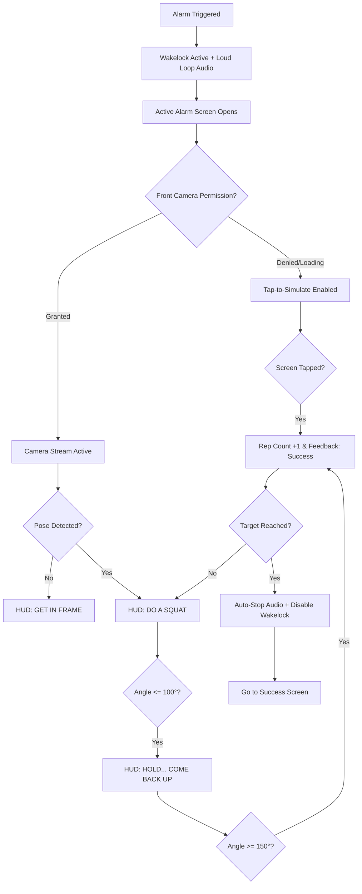
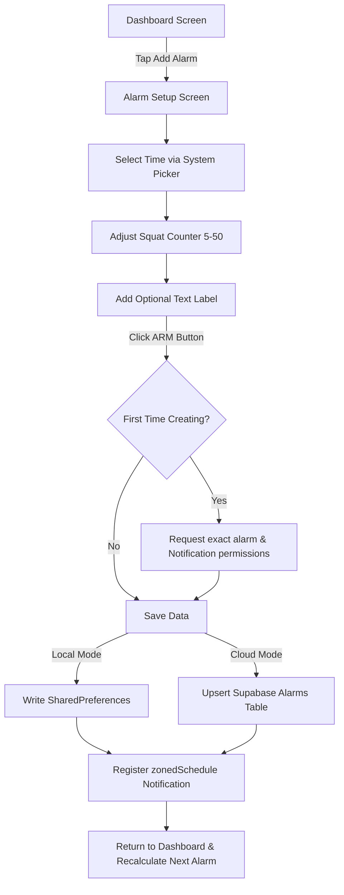
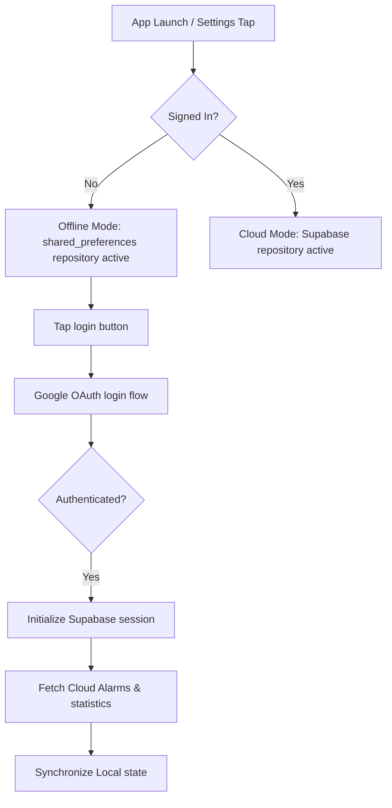

# Awaken Codebase Review & Architectural Document

This document provides a comprehensive analysis of the **Awaken** project (a camera-verified fitness alarm). It covers dependencies, codebase architecture, database layout, screen implementations, user flows, and requirements.

---

## 1. Tech Stack & Dependencies (`pubspec.yaml`)

The project is built on Flutter with forced Dark Mode styling and leverages native features for exact alarm scheduling, on-device machine learning, and cloud syncing.

### Core Framework & State Management
*   **Flutter SDK**: `^3.12.2` (Locked to portrait mode, edge-to-edge layout).
*   **State Management**: `flutter_riverpod ^2.5.1` (with `riverpod_annotation ^2.3.5` prepared for code generation).
*   **Navigation**: `go_router ^13.2.0` (using a global navigator key to prevent circular imports).

### Backend & Cloud Sync
*   **Database & Auth**: `supabase_flutter ^2.5.0` (Client connection, Google OAuth integration, Row-Level Security).
*   **Social Sign-In**: `google_sign_in ^6.2.1`.

### Local Alarm & Hardware APIs
*   **Alarm Engine**: `flutter_local_notifications ^17.2.1` (Exact alarm scheduling using `zonedSchedule`, background task isolates, full-screen intents).
*   **Timezone Localization**: `timezone ^0.9.4` and `flutter_timezone ^3.0.0` (Required for absolute-time calculations).
*   **Audio Playback**: `just_audio ^0.9.36` (Plays alarm sound in-app with system ringtone fallbacks on Android).
*   **Display Wakelock**: `wakelock_plus ^1.2.0` (Prevents screen from sleeping while the alarm is active).
*   **Permissions**: `permission_handler ^11.3.1` (For system notification, exact alarm, and camera access).
*   **Local Storage**: `shared_preferences ^2.3.2` (Local CRUD operations for offline mode).

### Computer Vision & ML
*   **Pose Tracking**: `google_mlkit_pose_detection ^0.12.0` (On-device neural network that tracks 33 body landmarks in real-time).
*   **Camera Integration**: `camera ^0.11.0` (Configured for high frame rate, low latency nv21/bgra8888 streams).

### UI, Animations & Styling
*   **Typography**: `google_fonts ^6.2.1` (Space Grotesk and Space Mono configured for tech-inspired UI).
*   **Motion**: `flutter_animate ^4.5.0` (Used for scan lines, staggered fade-in stats, and scale pops).

---

## 2. Architecture & File Structure

The project follows a **Feature-First Clean Architecture** format where dependencies flow inward:
`UI (Presentation) ➔ Application/Domain (Entities/Services) ➔ Data (Repositories/Data Sources)`.

```
lib/
├── app.dart                                # MaterialApp.router setup (ThemeMode.dark forced)
├── main.dart                               # Initialization: timezone, Supabase, notifications
├── core/                                   # Shared configuration and helpers
│   ├── constants/
│   │   ├── app_constants.dart              # UI sizes, padding, and animation delays
│   │   └── supabase_config.dart            # Supabase API endpoints and Client IDs
│   ├── router/
│   │   ├── app_router.dart                 # Route definitions and redirection rules
│   │   └── navigator_key.dart              # Global key to avoid notification-to-router cycles
│   ├── services/
│   │   ├── alarm_audio_service.dart        # just_audio wrapper for alarm sound loops
│   │   ├── alarm_notification_service.dart # Notification channel and intent triggers
│   │   └── wake_lock_service.dart          # Screen-on control
│   └── theme/
│       ├── app_colors.dart                 # Color constants mapped from OKLCH values
│       ├── app_theme.dart                  # Global ThemeData
│       └── app_typography.dart             # Custom fonts and extensions (tabular figures for clocks)
└── features/                               # Self-contained product domains
    ├── alarm/                              # Core alarm setting, detection, and HUD logic
    │   ├── data/
    │   │   ├── datasources/                # Local (SharedPreferences) & Cloud (Supabase) providers
    │   │   ├── models/
    │   │   └── repositories/
    │   ├── domain/
    │   │   ├── entities/
    │   │   ├── repositories/
    │   │   └── services/                   # SquatCounterService (squat detection math)
    │   └── presentation/
    │       ├── providers/                  # repCountProvider, repFeedbackProvider, alarmListProvider
    │       ├── screens/                    # AlarmSetupScreen, ActiveAlarmScreen
    │       └── widgets/                    # CameraHudOverlay, PoseOverlayPainter, SkeletonWireframe
    ├── auth/                               # Login and profile syncing
    │   ├── data/repositories/
    │   ├── domain/entities/
    │   ├── domain/repositories/
    │   └── presentation/screens/           # AuthScreen (Google Login + Offline Skip)
    ├── dashboard/                          # Alarm list, main timer, statistics
    │   ├── data/models/
    │   ├── domain/entities/
    │   └── presentation/
    │       ├── providers/                  # clockDisplayProvider, dashboardStatsProvider
    │       ├── screens/                    # DashboardScreen
    │       └── widgets/                    # StreakRing, StatCard, ArmedAlarmCard
    ├── sessions/                           # Exercise session tracking
    │   ├── data/repositories/              # SupabaseSessionRepository (cloud write/fetch)
    │   ├── domain/entities/                # SessionEntity (caloric math)
    │   └── domain/repositories/
    └── success/                            # Post-alarm celebration screen
        └── presentation/
            ├── screens/                    # SuccessScreen
            └── widgets/                    # StreakBadge, StatRevealItem
```

---

## 3. Database Schema (Supabase)

All tables use **Row-Level Security (RLS)**, ensuring users can only read, write, or modify rows associated with their authenticated `auth.users.id`.

### `alarms` (Alarm Schedule Setup)
Cloud synchronization table for scheduled alarms.
*   `id` (`text`, primary key): Custom identifier (local timestamp).
*   `user_id` (`uuid`, references `auth.users`, not null): Owner of the alarm.
*   `scheduled_time` (`timestamptz`, not null): The exact time the alarm triggers.
*   `required_reps` (`int`, not null, default 10): Target squat count.
*   `is_active` (`bool`, not null, default true): Status of the alarm.
*   `label` (`text`, nullable): Optional label for the alarm.
*   `created_at` (`timestamptz`, default `now()`): Row creation stamp.

### `sessions` (Completed Workouts)
Logs completed exercises after dismissing an alarm.
*   `id` (`uuid`, primary key, default `gen_random_uuid()`): Identifier.
*   `user_id` (`uuid`, references `auth.users`, not null): Performed by user.
*   `alarm_id` (`text`, nullable, references `alarms.id` on delete set null): Triggering alarm.
*   `completed_at` (`timestamptz`, not null): When the workout was finished.
*   `reps_completed` (`int`, not null): Number of squats.
*   `duration_seconds` (`int`, not null): Seconds taken to dismiss the alarm.
*   `calories_burned` (`int`, not null): Estimated calorie expenditure (formula: `(reps * 0.35).round()`).
*   `created_at` (`timestamptz`, default `now()`): Row creation stamp.

### `streaks` (Consecutive Days Tracking)
Calculated continuously upon workout completion.
*   `user_id` (`uuid`, primary key, references `auth.users`): Owner.
*   `current_streak` (`int`, default 0): Current consecutive day streak.
*   `best_streak` (`int`, default 0): Highest streak ever recorded.
*   `last_completed_date` (`date`, nullable): Calendar date of the last completed alarm.
*   `updated_at` (`timestamptz`, default `now()`): Last modified stamp.

---

## 4. UI/UX Screens & Implementations

### A. Authentication Screen (`AuthScreen`)
A premium, minimal onboarding screen prioritizing biometric styling:
*   **Visual Assets**: Animated large scale fade-in "AWAKEN" logo with the subtitle "The alarm you can't skip."
*   **Functionality**:
    *   OAuth Button: Custom-drawn Google branding icon (`_GoogleIconPainter` drawing vector path) initiating Google Sign-In.
    *   Offline Skip Link: "Continue without account" allows local operation storing alarms in SharedPreferences.
    *   Error Banner: Dynamic container revealing network or configuration problems with smooth opacity fades.
*   **Navigation**: Reacts to `authStateProvider` streams; immediately pushes the user to the Dashboard once authenticated.

### B. Dashboard Screen (`DashboardScreen`)
The main center of the application:
*   **Header**: Displays username ("Good morning, [Name]") alongside quick action circular buttons: "Add Alarm" (electric blue glow) and "Auth status" (green account icon when cloud synced, grey login icon when offline).
*   **Time & Date Displays**:
    *   `DigitalClock` widget: Monospaced HH:MM text with non-shifting tabular numerals and a blinking colon divider.
    *   Underneath, current date string formatted as: `Weekday, Month Day, Year` in all-caps Space Grotesk.
*   **Next Alarm Card**: Shows time, required squats (e.g. "15 SQUATS REQUIRED"), and a warning label. If no alarm is armed, shows a stylized dashed box prompting "Tap to set your alarm".
*   **Streak ring & Stats**:
    *   `StreakRing`: Custom painter drawing two overlapping arcs (subtle grey track + electric blue progress bar with an OKLCH glow filter). Renders current and maximum consecutive day streaks.
    *   `StatCard`: Two grids displaying weekly squat totals (in-hand dumbbell icon) and monthly calorie values (burning flame icon).
*   **Swipe-to-Delete List**: Lists scheduled alarms. Swiping left reveals a red trash-can layout, deleting local/cloud records and canceling exact operating system intents.

### C. Alarm Setup Screen (`AlarmSetupScreen`)
A screen built around form settings:
*   **Time Picker**: Integrates system native picker, mapping selection to upcoming times (rolls to tomorrow if selected hour/minute has elapsed).
*   **Wake Up Tax Slider**: Tap-to-step rep counter (adjusts in increments of 5 between 5 and 50 reps).
*   **Save CTA**: Animates and saves configurations, requesting OS permissions (exact alarms + background tasks) dynamically.

### E. Active Alarm Screen (`ActiveAlarmScreen`)
A complex layout combining background system routines, overlay renders, and streams:
*   **Hardware Initialization**:
    *   Fires `WakeLockService.enable()` to keep the screen bright.
    *   Plays loud alarm audio via `AlarmAudioService.start()` using local loop file `alarm.mp3`.
    *   Initializes the front camera feed inside `_CameraLayer`, automatically rotating output matrices depending on Android/iOS sensors (using custom calculations within `PoseOverlayPainter._toScreen`).
*   **Neural Overlay**:
    *   Translates native coordinates to fit dimensions.
    *   Renders a skeletal frame highlighting joints. Confident connections shine blue, turning green during a successful deep squat.
*   **HUD Banner**: Shows prompts: "GET IN FRAME", "DO A SQUAT", "HOLD... COME BACK UP", or "PERFECT REP ✓" (flashes green).
*   **State Machine (`SquatCounterService`)**:
    *   Triggers when the knee joint angle is $\le 100^{\circ}$.
    *   Resets and counts a rep when the knee angle extends back to $\ge 150^{\circ}$.
*   **Fallbacks**: If the camera is denied or loading, tapping anywhere simulates a squat (ensuring users are never trapped). On reaching target reps, stops audio, releases screen lock, and forwards to Success.

### F. Success Screen (`SuccessScreen`)
Celebration layout prioritizing high-end visual feedback:
*   **Badge Animation**: Large streak icon scaling up with `Curves.easeOutBack`.
*   **Session Summary**: Staggered slide-in lists displaying squats completed, calories burned, and total duration.
*   **Daily Quote**: Displays motivational phrases dynamically selected based on the day.
*   **Dismissal Button**: Clicking "Start My Day" resets the session state and returns to the Dashboard.

---

## 5. User Story & Personas

### Persona: "The Snoozer" (Target User)
*   *Profile*: Struggles to wake up, constantly hits snooze, and needs physical activity to break morning fatigue.
*   *Goal*: Needs an alarm that forces them out of bed, requiring dynamic movement instead of simple touchscreen taps.

### Core User Stories
1.  **Setting an Alarm**:
    *   *As a* user, *I want to* schedule an alarm and select a specific number of squats, *so that* I can customize my morning difficulty.
2.  **Dismissing the Alarm**:
    *   *As a* sleeping user, *I want to* wake up to a loud sound that cannot be turned off until I perform the required squats in front of the camera, *so that* I am physically awake.
3.  **Streaks & Accountability**:
    *   *As a* fitness-focused user, *I want to* see my consecutive wake-up streaks and stats, *so that* I stay motivated to maintain my routine.
4.  **Cloud Sync**:
    *   *As a* user with multiple devices, *I want* my alarms and logs synced automatically via Google Sign-In, *so that* I don't lose my statistics.

---

## 6. User Flows

### A. Core Alarm Lifecycle (Wake-Up)


### B. Alarm Setup & Creation Flow


### C. Authentication & Repository Selection


---

## 7. Functional & Non-Functional Requirements

### Functional Requirements
1.  **Exact Alarm Intents**: Alarms must trigger precisely on schedule, even when the device is locked or in low-power modes.
2.  **Un-dismissible UI**: The active alarm screen must bypass system dialogs and overlays, locking interface focus.
3.  **Pose Tracking**: Must use local ML Kit models to calculate real-time joint angles.
4.  **Local/Cloud Database Hybrid**: Alarms must save to local storage when offline, and sync to Supabase when logged in.
5.  **Exercise Session Logging**: Every completed alarm must log reps, calories, and duration, then calculate daily streaks.

### Non-Functional Requirements
1.  **Low Latency Frame Analysis**: Image stream parsing must run at $\ge 15\text{ FPS}$ without blocking the main rendering loop.
2.  **No Cloud Latency Dependency**: Squat detection must happen entirely on-device (offline support).
3.  **Strict Security (RLS)**: User records must remain strictly inaccessible to other authenticated users via Supabase RLS.
4.  **Device Compatibility**: Must support rotation compensation for standard Android and iOS front-facing cameras.
5.  **High-Contrast Tech Aesthetics**: A dark-theme-only interface designed with tabular fonts to prevent layout shifts.
