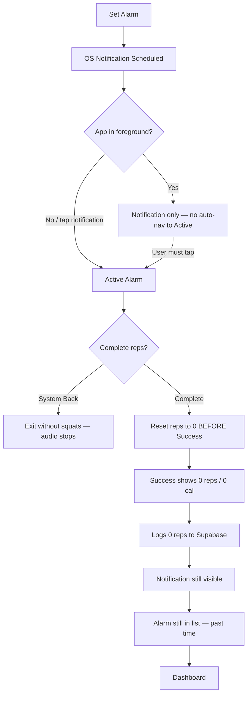

# Project overview and features
_Exported on 7/2/2026 at 08:05:00 EDT from Cursor (3.9.16)_

---

**User**

Review the codebase @c:\Users\afsan\Workspace\awaken\ list down all the existing features, UI screens, widgets, componenets. Understand the whole project overview. Check the existing tech stack and all the installed packages. along with database with supabase  mcp

---

**Cursor**

Exploring the codebase structure, dependencies, and Supabase schema to produce a full project overview.


# Awaken — Project Overview

**Awaken** is a Flutter mobile app (Android primary, iOS secondary) that combines two core loops:

1. **Wake Up Tax** — alarms that cannot be dismissed until you complete real squats, verified on-device via ML Kit pose detection.
2. **Territory Capture** — GPS-tracked runs that close loops on a map to claim territory, compete on leaderboards, and defend against decay.

Tagline from `pubspec.yaml`: *"Camera-verified fitness alarm — pay your Wake Up Tax to conquer the morning."*

---

## Tech Stack

| Layer | Technology |
|-------|------------|
| **Framework** | Flutter SDK `^3.12.2`, Dart 3 |
| **State** | `flutter_riverpod` (hand-written providers; codegen deps present but unused) |
| **Navigation** | `go_router` with `StatefulShellRoute` (3-tab bottom nav) |
| **Backend** | Supabase (`supabase_flutter`) — Auth, Postgres + PostGIS, Realtime |
| **Auth** | Google Sign-In → Supabase OAuth |
| **ML / Camera** | `google_mlkit_pose_detection`, `camera` |
| **Maps / GPS** | `flutter_map`, `vector_map_tiles`, `geolocator`, `latlong2` |
| **Alarms** | `flutter_local_notifications`, `timezone`, `just_audio`, `wakelock_plus` |
| **UI** | Dark-only theme, `google_fonts`, `flutter_animate` |
| **Local storage** | `shared_preferences` (offline alarms + territory) |
| **Linting** | `flutter_lints` + strict casts/inference/raw-types |

**Project:** `fsdfqcnjcjtdmdjshrvu` · Region: ap-northeast-1 · URL: `https://fsdfqcnjcjtdmdjshrvu.supabase.co`

---

## Architecture

Feature-first **Clean Architecture**: `presentation → domain ← data`

```
lib/
├── main.dart, app.dart
├── core/
│   ├── constants/     app_constants, supabase_config
│   ├── router/        app_router, navigator_key
│   ├── services/      alarm notifications/audio, wake lock, territory decay notifications
│   └── theme/         app_colors, app_typography, app_theme (dark only)
└── features/
    ├── alarm/         squat-verified alarm flow
    ├── auth/          Google OAuth
    ├── dashboard/     home hub
    ├── sessions/      workout session logging
    ├── success/       post-alarm celebration
    ├── territory/     GPS map runs, capture, leaderboard
    └── shell/         legacy AppShell (unused; shell lives in app_router.dart)
```

**Repository switching:** Alarms and territory repos swap between **SharedPreferences (offline)** and **Supabase (cloud)** based on `isSignedInProvider`.

---

## Navigation & Screens

### Shell (bottom nav — 3 tabs)

| Tab | Route | Screen |
|-----|-------|--------|
| HOME | `/dashboard` | `DashboardScreen` |
| TERRITORY | `/territory` | `TerritoryRunScreen` |
| RANKS | `/leaderboard` | `TerritoryLeaderboardScreen` |

### Overlay routes (full-screen, no bottom nav)

| Route | Screen | Purpose |
|-------|--------|---------|
| `/territory/overview` | `TerritoryOverviewScreen` | Owned territory stats, decay risk |
| `/auth` | `AuthScreen` | Google sign-in (skippable) |
| `/alarm/setup` | `AlarmSetupScreen` | Schedule alarm (time, reps, label) |
| `/alarm/active` | `ActiveAlarmScreen` | Camera + squat verification |
| `/alarm/success` | `SuccessScreen` | Post-alarm stats & streak reveal |

**Special launch:** If opened from an alarm notification, `main.dart` overrides `initialLocationProvider` to boot directly into `/alarm/active`.

---

## Features (by domain)

### 1. Alarm Engine
- CRUD for scheduled alarms (`alarmListProvider`, local ↔ Supabase)
- Exact alarm scheduling via `flutter_local_notifications` + timezone
- Full-screen intent notifications (`AlarmNotificationService`)
- In-app audio (`AlarmAudioService`) + wakelock during active alarm
- **Squat detection:** `SquatCounterService` — knee-angle state machine (≤100° squat, ≥150° standing)
- **Active alarm UI:** live camera, pose overlay, rep counter, scan-line HUD, out-of-frame penalty (volume ramp)
- **Fallback:** tap-to-simulate rep if camera denied/unavailable

### 2. Dashboard (Home)
- Live digital clock (`clockDisplayProvider` — emits only on minute change)
- Next armed alarm card, alarm list, streak ring
- Stats cards (sessions, calories, etc. via `dashboardStatsProvider`)
- Territory summary card + decay warnings
- Sign in/out, add alarm, test alarm button
- Triggers `TerritoryDecayNotificationService` when territories are decaying

### 3. Auth
- Google Sign-In via Supabase (`SupabaseAuthRepository`)
- Providers: `authStateProvider`, `isSignedInProvider`, `currentUserProvider`
- OAuth client IDs via `--dart-define` / `SupabaseConfig`

### 4. Sessions
- Logs completed alarm workouts to Supabase (`SessionEntity`, `SupabaseSessionRepository`)
- Fields: reps, duration, calories, linked `alarm_id`

### 5. Success Screen
- Animated stat reveals, streak badge, motivational quote
- Written after completing required reps on active alarm

### 6. Territory Capture (major feature)
- **Run tracking:** GPS with Kalman filter, RDP path simplification, anti-cheat (speed cap 25 km/h, min distance/duration, closed-loop validation)
- **Map:** Vector tiles (OpenFreeMap dark style) + polygon overlays for owned/rival territory
- **Capture:** Closed-loop runs call `capture_territory` RPC on Supabase
- **Decay:** Territories lose health if not defended; `decay_stale_territories` cron + local notifications
- **Leaderboard:** Nearby vs global, day/week/all-time windows via `leaderboard_nearby` / `leaderboard_windowed` RPCs
- **Realtime:** Territories table enabled for live map updates
- Local repo for unsigned-in users (`TerritoryLocalRepositoryImpl`)

---

## UI Widgets & Components

### Shared / reusable widgets (`features/*/presentation/widgets/`)

| Widget | Feature | Role |
|--------|---------|------|
| `DigitalClock` | Dashboard | Live HH:MM clock |
| `ArmedAlarmCard` | Dashboard | Next alarm countdown card |
| `StatCard` | Dashboard | Metric stat tile |
| `StreakRing` | Dashboard | Circular streak progress |
| `RepCounterDisplay` | Alarm | HUD rep counter |
| `CameraHudOverlay` | Alarm | Camera + HUD frame |
| `PoseOverlayPainter` | Alarm | ML Kit skeleton overlay |
| `SkeletonWireframe` | Alarm | Animated wireframe |
| `ScanLineAnimation` | Alarm | Scanner sweep effect |
| `StatRevealItem` | Success | Staggered stat animation |
| `StreakBadge` | Success | Streak celebration badge |
| `RunControls` | Territory | Start/stop/finish run FABs |
| `RunStatsSheet` | Territory | Live run stats bottom sheet |
| `CaptureResultSheet` | Territory | Post-capture result modal |
| `TerritoryPolygonLayer` | Territory | GeoJSON polygon rendering |
| `TerritoryVectorTileLayer` | Territory | Vector map tiles + raster fallback |
| `TerritoryMapStatusOverlay` | Territory | GPS/permission status overlay |
| `TerritoryMapStyle` | Territory | Dark map theme loader |

### Inline / screen-private components (not separate files)

**Dashboard:** `_Header`, `_StreakCard`, `_NoAlarmCard`, `_TerritoryCard`, `_AlarmList`, `_AlarmTile`, `_TestAlarmButton`

**Alarm Setup:** `_TimeTile`, `_RepSelector`, `_RepButton`, `_LabelField`, `_ArmButton`

**Active Alarm:** `_InstructionBar`, `_WakeUpTaxLabel`

**Auth:** `_GoogleSignInButton`, `_GoogleIcon`

**Success:** `_MotivationalQuote`

**Territory Run:** `_TerritoryMapView`, trail/marker layers, `_RunHeader`, `_ConflictPill`, `_PulseCloseIndicator`, etc. (large screen ~1100 lines)

**Territory Leaderboard:** `_Podium`, `_LeaderboardTile`, mode/window segmented controls

**Territory Overview:** `_OwnershipStats`, `_DecayRiskList`, skeleton/error cards

**Router shell:** `_ShellScaffold`, `_AwakenBottomNav`, `_NavItem`

### Core services (non-UI)

| Service | Purpose |
|---------|---------|
| `AlarmNotificationService` | Schedule/cancel alarms, full-screen intents, initial route |
| `AlarmAudioService` | Loop alarm audio |
| `WakeLockService` | Keep screen on during alarm |
| `TerritoryDecayNotificationService` | Local notification for decaying territories |

### Design system
- `AppColors` — OKLCH-mapped dark tokens
- `AwakenTypography` — Space Grotesk (body) + Space Mono (HUD numerics) via `ThemeExtension`
- `AppTheme.dark` — forced; no light mode

---

## Installed Packages (`pubspec.yaml`)

### Production dependencies

| Package | Version | Purpose |
|---------|---------|---------|
| `flutter_riverpod` | ^2.5.1 | State management |
| `riverpod_annotation` | ^2.3.5 | Codegen (prepared, unused) |
| `supabase_flutter` | ^2.5.0 | Backend client |
| `google_sign_in` | ^6.2.1 | OAuth |
| `google_mlkit_pose_detection` | ^0.12.0 | Squat pose detection |
| `go_router` | ^13.2.0 | Routing |
| `flutter_map` | ^7.0.2 | Map widget |
| `vector_map_tiles` | ^8.0.0 | Vector tile rendering |
| `http` | ^1.6.0 | TileJSON fetch |
| `vector_tile_renderer` | ^5.2.1 | Map theme rendering |
| `latlong2` | ^0.9.1 | Lat/lng math |
| `geolocator` | ^13.0.1 | GPS |
| `clock` | ^1.1.2 | Testable time |
| `flutter_animate` | ^4.5.0 | Animations |
| `google_fonts` | ^6.2.1 | Typography |
| `camera` | ^0.11.0 | Live camera feed |
| `flutter_local_notifications` | ^17.2.1 | Alarm scheduling |
| `timezone` | ^0.9.4 | TZ-aware scheduling |
| `flutter_timezone` | ^3.0.0 | Device timezone |
| `just_audio` | ^0.9.36 | Alarm sound |
| `wakelock_plus` | ^1.2.0 | Screen wake lock |
| `permission_handler` | ^11.3.1 | Runtime permissions |
| `shared_preferences` | ^2.3.2 | Local persistence |
| `share_plus` | ^13.2.0 | Share functionality |
| `cupertino_icons` | ^1.0.8 | Icons |

### Dev dependencies
`flutter_test`, `fake_async`, `flutter_lints`, `build_runner`, `riverpod_generator`, `custom_lint`, `riverpod_lint`

### Assets
- `assets/audio/` (alarm sound; README present)
- `assets/map_styles/awaken_dark.json`

---

## Supabase Database (via MCP)

### Tables (app data)

| Table | RLS | Rows* | Purpose |
|-------|-----|-------|---------|
| `alarms` | ✅ | 0 | Scheduled alarms per user |
| `sessions` | ✅ | 0 | Completed workout logs |
| `streaks` | ✅ | 0 | Current/best streak per user |
| `profiles` | ✅ | 2 | User display names |
| `territories` | ✅ | 1 | Owned territory polygons (PostGIS `geometry`) |
| `runs` | ✅ | 3 | GPS run history |
| `territory_captures` | ✅ | 2 | Capture event history |
| `spatial_ref_sys` | ❌ | 8500 | PostGIS system table |

*Row counts from live MCP query at review time.

### Key columns

**alarms:** `id` (text), `user_id`, `scheduled_time`, `required_reps`, `is_active`, `label`

**sessions:** `id`, `user_id`, `alarm_id` → `alarms`, `completed_at`, `reps_completed`, `duration_seconds`, `calories_burned`

**streaks:** `user_id` (PK), `current_streak`, `best_streak`, `last_completed_date`

**territories:** `id`, `user_id`, `geom`, `health`, `last_defended_at`

**runs:** `id`, `user_id`, `path` (geometry), `distance_meters`, `duration_seconds`, `is_closed_loop`, `territory_claimed`, `area_claimed_sqm`, `invalidated_reason`

**territory_captures:** `id`, `user_id`, `geom`, `area_sqm`, `rivals_affected`, `captured_at`

**profiles:** `id` → `auth.users`, `display_name`

### Views
- `territories_geojson` — GeoJSON export for map rendering
- `leaderboard_global` — Global rankings
- `geography_columns`, `geometry_columns` — PostGIS metadata

### Custom RPCs / functions (app-specific)
| Function | Purpose |
|----------|---------|
| `capture_territory` | Claim territory from a closed GPS loop |
| `decay_stale_territories` | Cron job to reduce territory health |
| `decaying_territories` | Query territories at decay risk |
| `leaderboard_nearby` | Location-based rankings |
| `leaderboard_windowed` | Time-windowed rankings |
| `touch_territory_defense` | Update last defended timestamp |
| `handle_new_user` | Trigger: sync profile on signup |

### Migrations (16 applied)
`initial_schema` → PostGIS/pg_cron → territories/runs → capture RPC → profiles → leaderboard → decay cron → realtime → security fixes → GeoJSON view → RLS perf → capture history → windowed leaderboard

### Extensions
PostGIS (spatial), pg_cron (decay scheduling), Supabase Realtime on `territories`

### Security note
MCP advisor flagged `spatial_ref_sys` with RLS disabled — this is a standard PostGIS catalog table, not app data. All **app tables** have RLS enabled and are scoped to `auth.users`.

---

## Riverpod Providers (summary)

| Provider | Feature | Role |
|----------|---------|------|
| `repCountProvider`, `repFeedbackProvider`, `requiredRepsProvider`, `outOfFrameProvider`, `sessionStartTimeProvider` | Alarm | Active squat session state |
| `alarmRepositoryProvider`, `alarmListProvider`, `nextAlarmProvider` | Alarm | CRUD + next alarm |
| `authRepositoryProvider`, `authStateProvider`, `isSignedInProvider`, `currentUserProvider` | Auth | Auth state |
| `clockProvider`, `clockDisplayProvider`, `dashboardStatsProvider` | Dashboard | Clock + stats |
| `sessionRepositoryProvider` | Sessions | Session logging |
| `territoryRepositoryProvider`, `territoryListProvider`, `leaderboardProvider`, `decayWarningsProvider`, `territoryMapStyleProvider`, `myLocationProvider`, `mapEngineProvider` | Territory | Map, capture, leaderboard |
| `activeRunProvider`, `rivalConflictProvider` | Territory | Live GPS run session |
| `appRouterProvider`, `initialLocationProvider` | Core | Navigation |

---

## Tests

Small territory test suite exists (contrary to older docs):
- `test/territory/territory_e2e_test.dart`
- `test/territory/mocks/` (fake repo, mock geolocator)
- `test/widget_test.dart` (default Flutter stub)

---

## User Flow (high level)

```mermaid
flowchart TD
    A[App Launch] --> B{Notification tap?}
    B -->|Yes| C[/alarm/active]
    B -->|No| D[/dashboard]
    D --> E[Set alarm / Sign in]
    E --> F[/alarm/setup]
    F --> G[Alarm fires]
    G --> C
    C --> H{Reps complete?}
    H -->|Yes| I[/alarm/success]
    H -->|No| C
    D --> J[/territory]
    J --> K[GPS run + closed loop]
    K --> L[capture_territory RPC]
    L --> M[/leaderboard]
    D --> N[/territory/overview]
```

---

## Notable gaps / legacy

1. **`AppShell`** in `features/shell/` is unused — shell nav is inlined in `app_router.dart`.
2. **Google OAuth IDs** in `supabase_config.dart` still use placeholder defaults; real IDs needed for production sign-in.
3. **`alarm.mp3`** may be missing from assets (only README in `assets/audio/`).
4. **Riverpod codegen** deps are installed but no `@riverpod` annotations in use yet.
5. **CLAUDE.md** is slightly behind the codebase (no territory feature documented there).

---

## Docs in repo

- `CLAUDE.md` — agent/dev guide
- `docs/awake_full_detail.md` — full product/architecture history
- `docs/codebase_review.md` — prior architectural review (partially outdated re: territory)
- `docs/territory_backend_verification_checklist.md` — backend QA checklist
- `docs/ui_mockup.html`, `docs/index.html` — design references

If you want to go deeper next, I can map each screen to its providers/repositories, trace the territory capture RPC end-to-end, or audit RLS policies on the Supabase tables.

---

**User**

Identify all the issues. Also the user flow needs to be fixed. Tell me what you have find out

---

**Cursor**

Investigating user flows, navigation, and codebase issues systematically.


Verifying the critical findings in the key flow files.


# Issues Found & User Flow Analysis

Static analysis passes (`flutter analyze lib/` — no issues), but several **runtime and UX flows are broken or incomplete**. Below is what I verified in the code and Supabase.

---

## Intended vs. Actual User Flows

### Alarm flow (core product loop)

**Intended:**
```
Dashboard → Set Alarm → OS schedules → Alarm fires → Active (camera/squats)
→ Success (stats + streak) → Dashboard (alarm cleared, notification gone)
```

**Actual (broken at multiple steps):**



---

## Critical Issues (must fix)

### 1. Success screen always shows 0 reps
`ActiveAlarmScreen` resets session state **before** navigating to success:

```261:265:c:\Users\afsan\Workspace\awaken\lib\features\alarm\presentation\screens\active_alarm_screen.dart
    if (next >= required) {
      Future.delayed(AppConstants.mediumAnim, () {
        if (!mounted) return;
        _resetSession();
        _router.go(AppRoutes.success);
```

`SuccessScreen` reads `repCountProvider` in `initState` — already 0:

```32:36:c:\Users\afsan\Workspace\awaken\lib\features\success\presentation\screens\success_screen.dart
    _repsCompleted = ref.read(repCountProvider);
    final startTime = ref.read(sessionStartTimeProvider);
    _durationSeconds =
        startTime != null ? DateTime.now().difference(startTime).inSeconds : 0;
    _caloriesBurned = SessionEntity.estimateCalories(_repsCompleted);
```

**Impact:** Broken celebration UI, 0-rep Supabase sessions, streak logic runs but records meaningless data.

---

### 2. Auth screen traps user after sign-in
Comment claims router auto-navigates — **it does not**:

```44:46:c:\Users\afsan\Workspace\awaken\lib\features\auth\presentation\screens\auth_screen.dart
      await ref.read(authRepositoryProvider).signInWithGoogle();
      // Router will react to authStateProvider change and navigate automatically
```

There is no auth redirect in `app_router.dart`. On success, `_loading` stays `true` and the screen never pops. Same for email/password sign-in (lines 86–89).

**Impact:** Sign-in appears to hang forever on a spinner.

---

### 3. Active alarm can be dismissed with system back
Only `TerritoryRunScreen` uses `PopScope`. `ActiveAlarmScreen` has no back guard. Disposing the screen stops audio/wakelock, so the user can bypass squats entirely — contradicts the core product promise.

---

### 4. Alarm notification never cleared on completion
`cancelAlarm` is only called on delete/toggle-off. Completing squats does not cancel the ongoing notification (`ongoing: true`, `autoCancel: false` in `alarm_notification_service.dart`).

**Impact:** User finishes workout but still sees “Wake Up Tax Due!”.

---

### 5. Notification launch loses alarm metadata
Cold start / tap navigates to `/alarm/active` with `alarm: null`. Required reps fall back to default `10`, not the scheduled alarm’s value. Rep count from the notification body is never parsed or stored.

---

### 6. No in-app navigation when alarm fires in foreground
Navigation to active alarm only happens on:
- Cold start from notification tap
- Foreground notification tap

If the app is open on the dashboard when the alarm fires, the user gets sound/notification but **not** the camera/HUD until they tap.

---

## High Issues (user flow / data integrity)

### 7. Completed alarms are never cleaned up
After success, nothing:
- Deactivates the fired alarm
- Removes it from the list
- Reschedules for the next day

`nextAlarmProvider` hides past alarms, but `_AlarmList` shows **all** alarms including stale past ones.

---

### 8. Alarms loaded from storage are not synced to the notification scheduler
`AlarmListNotifier.build()` only calls `getAlarms()`. `scheduleAlarm()` runs on add/toggle-on only.

**Impact:**
- Sign in on a new device → cloud alarms appear in UI but **won’t fire** until toggled
- Sign out/in → orphaned OS notifications may remain
- Local ↔ cloud switch has **no migration** and no notification resync

---

### 9. Offline alarm completion is invisible
`sessions` repo is Supabase-only (no local fallback). Signed-out users get success UI but no session history, streak, or stats update — despite the app supporting offline alarms via SharedPreferences.

---

### 10. Google OAuth not configured
`supabase_config.dart` still has placeholder client IDs (`your-web-client-id.apps.googleusercontent.com`). Google sign-in will fail until real IDs + platform config are set.

---

### 11. Missing alarm audio asset on iOS
`assets/audio/` contains only a README — no `alarm.mp3`. Android falls back to system ringtone; **iOS will be silent** during active alarm.

---

## Medium Issues (UX / navigation)

| # | Issue | Location |
|---|-------|----------|
| 12 | **“Test Active Alarm”** dev button shipped on dashboard | `dashboard_screen.dart` ~160, 535–557 |
| 13 | **Territory tab back arrow** calls `context.pop()` on a shell tab root — may no-op or exit app | `territory_run_screen.dart` ~238–245 |
| 14 | **Capture → Leaderboard** uses `push` instead of shell tab `go` | `capture_result_sheet.dart` ~162 |
| 15 | **Success streak badge stale** on first paint — stats invalidated after async write | `success_screen.dart` |
| 16 | **Tap-to-simulate reps** active during camera startup, not just when denied | `active_alarm_screen.dart` ~295–298 |
| 17 | **Decay notification re-shown** every dashboard visit while warnings exist | `dashboard_screen.dart` ~33–38 |
| 18 | **Sign-out is one tap**, no confirmation | `dashboard_screen.dart` ~65 |
| 19 | **Territory capture errors hidden** — generic “Run saved” banner when cloud write fails | `active_run_providers.dart`, `territory_run_screen.dart` |
| 20 | **Alarm setup has no error handling** — always pops even if save/scheduling fails | `alarm_setup_screen.dart` ~143–147 |
| 21 | **Duplicate discard-run dialog** in shell scaffold and territory run screen | `app_router.dart`, `territory_run_screen.dart` |

---

## Low / Maintenance Issues

| # | Issue |
|---|-------|
| 22 | Legacy `app_shell.dart` unused — shell lives in `app_router.dart` |
| 23 | Hardcoded `'/alarm/active'` in notification service instead of `AppRoutes.activeAlarm` |
| 24 | `AppRoutes.shell = '/'` unused; docs say `/` is dashboard but code uses `/dashboard` |
| 25 | `clockDisplayProvider` emits every second (no `.distinct()`) — doc claim in CLAUDE.md is wrong; minor perf issue |
| 26 | `dashboardStatsProvider` stub includes fake `nextAlarm: now + 8h` for signed-out users |
| 27 | `CLAUDE.md` outdated — missing territory feature, wrong routes, says no test suite (tests exist under `test/territory/`) |
| 28 | Bottom nav colors hardcoded in router vs `AppColors` elsewhere |

---

## Supabase / Backend Issues (MCP advisors)

| Level | Issue |
|-------|-------|
| ERROR | `spatial_ref_sys` — RLS disabled (PostGIS system table; low app risk) |
| WARN | PostGIS extension in `public` schema |
| WARN | Several `SECURITY DEFINER` RPCs callable by anon/authenticated (`capture_territory`, `leaderboard_*`, PostGIS helpers) — review intentional exposure |
| WARN | Leaked password protection disabled in Auth settings |

App tables (`alarms`, `sessions`, `streaks`, `territories`, `runs`, etc.) all have RLS enabled.

---

## What Works Correctly

- Shell vs overlay routing structure (3-tab nav + overlay routes)
- Cold-start notification → initial route override in `main.dart`
- Success “Start My Day” → `context.go('/dashboard')`
- Tab-switch discard confirmation during active GPS run
- Alarm audio/wakelock lifecycle in `ActiveAlarmScreen.dispose()`
- Territory leaderboard → map focus handoff
- Repository switching on auth state (mechanism works; sync/migration does not)

---

## Recommended User Flow Fixes (priority order)

1. **Fix success data** — snapshot reps/duration before reset, or pass via route `extra` / dedicated completion provider; reset only after success screen reads values.
2. **Fix auth navigation** — `context.pop()` or `go(dashboard)` on successful sign-in; clear `_loading`.
3. **Lock active alarm** — `PopScope(canPop: false)` on active alarm and success screens.
4. **Complete alarm lifecycle** — on success: cancel notification, stop audio, deactivate/remove fired alarm (or reschedule daily if that’s the product intent).
5. **Pass alarm context from notification** — persist firing alarm ID/reps (SharedPreferences or notification payload) so cold start uses correct rep count.
6. **Foreground alarm handling** — listen for scheduled notification display and auto-navigate to `/alarm/active`.
7. **Resync notifications on alarm list load** — schedule all active future alarms after repo fetch (especially after sign-in).
8. **Remove or gate dev “Test Active Alarm” button** behind debug flag.
9. **Add local session storage** for offline users, or clearly gate stats behind sign-in.
10. **Bundle `alarm.mp3`** and configure real Google OAuth IDs.

---

## Summary

The app’s **architecture is sound**, but the **primary user journeys are broken in practice**:

- **Alarm loop** breaks at completion (0 reps), dismissal (back button), notification cleanup, and foreground firing.
- **Auth loop** breaks after sign-in (stuck spinner, no navigation).
- **Data sync** breaks across sign-in/out (alarms/notifications out of sync, no local sessions).

`flutter analyze` is clean, so these are **logic/flow bugs**, not compile errors.

If you want me to implement the fixes, say the word and I’ll start with items 1–4 (success data, auth nav, back trap, alarm completion lifecycle) — those unblock the core flows fastest.

---


